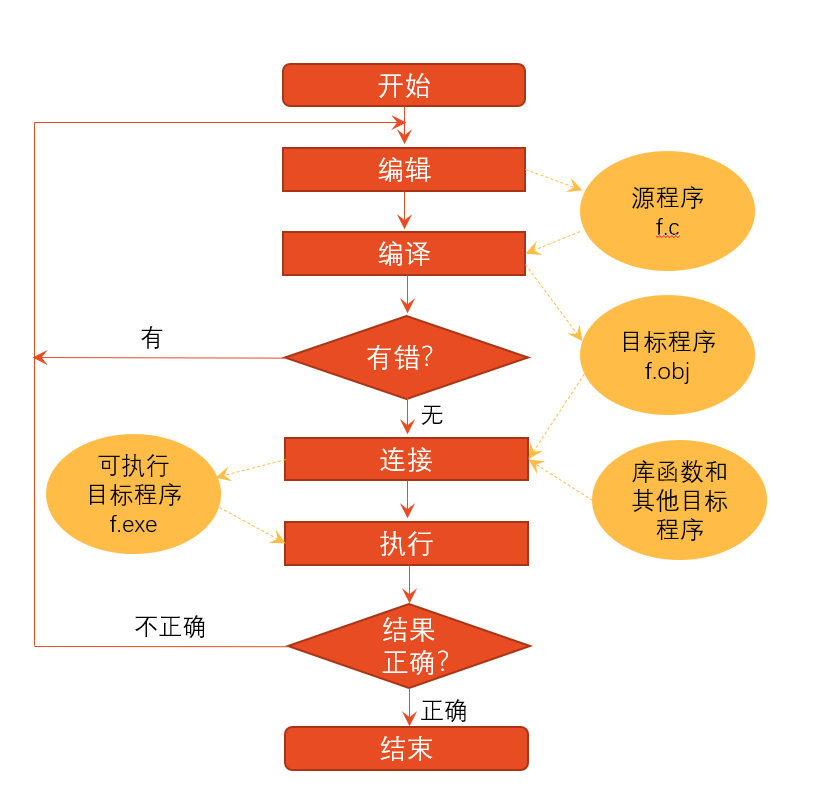

# 第 1 章 程序设计和C语言

## 1.1 计算机程序

计算机运行时的每一个操作都是根据人们事先指定的指令进行的。为了使计算机执行一系列操作，必须事先编好一条条指令，输入到计算机。

1. 指令  
   可以被计算机理解并执行的基本操作命令。
2. 程序  
   一组计算机能识别和执行的指令。一个特定的指令序列用来完成一定的功能。
3. 软件  
   与计算机系统操作有关的计算机程序、规程、规则，以及可能有的文件、文档及数据。

## 1.2 计算机语言

为了解决人与计算机交流信息的问题从而创造的一种计算机与人都能识别的语言，就是计算机语言。

1. 机器语言  
   计算机能直接识别和接受的二进制代码称为**机器指令**。机器指令的集合就是该计算机的**机器语言**。  
   特点：难学，难记，难检查，难修改，难以推广使用。依赖具体机器难以移植。

    ```text
    B8  7F 01
    BB  21 02
    03   D8
    B8  1F 04
    2B  C3
    ```

2. 汇编语言  
   机器语言的符号化。用英文字母和数字表示指令的**符号语言**。  
   特点：相比机器语言简单好记，但仍然难以普及。汇编指令需通过**汇编程序**转换为机器指令才能被计算机执行。依赖具体机器难以移植。

   ```text
   MOV  AX  383
   MOV  BX  545
   ADD  BX  AX
   MOV  AX  1055
   SUB  AX  BX
   ```

3. 高级语言
   1. 高级语言更接近于人们习惯使用的自然语言和数学语言。  
      特点：功能强大，不依赖于具体机器。用高级语言编写的**源程序**需要通过**编译程序**转换为机器指令的**目标程序**。

      ```text
      S=1055-(383+545) 
      ```

   2. 高级语言的发展
      1. 非结构化的语言
         * 规定：编程风格随意，只有符合语法规则即可，程序中的流程可以随意跳转。
         * 特点：为了追求程序执行效率，不同的人用不同的技巧，使得程序难以阅读和维护。
         * 语言：早期的BASIC、FORTRAN和ALGOL等。
      2. 结构化的语言
         * 规定：程序必须由具有良好特性的基本结构(顺序结构、选择结构、循环结构)构成，程序中的流程不允许随意跳转，程序总是由上而下顺序执行各个基本结构。
         * 特点：程序结构清晰，易于编写、阅读和维护。
         * 语言：QBASIC、FORTRAN 77和C等。
      3. 面向对象的语言
         * 规定：支持面向对象程序设计方法。
         * 特点：处理规模较大的问题。
         * 语言：C++,C#,Visual Basic和Java等。

## 1.3 C语言的发展

D.M.Ritchie


* 1972—1973年间，美国贝尔实验室的D.M.Ritchie 在B语言的基础上设计出了C语言。
* 最初的C语言只是为描述和实现UNIX操作系统提供一种工作语言而设计的。
* 随着UNIX的日益广泛使用，C语言也迅速得到推广。1978年以后，C语言先后移植到大、中、小和微型计算机上。C语言便很快风靡全世界，成为世界上应用最广泛的程序设计高级语言。
* 以UNIX第7版中的C语言编译程序为基础，1978年，Brian W.Kernighan和Dennis M.Ritchie 合著了影响深远的名著The C Programming Language，这本书中介绍的C语言成为后来广泛使用的C语言版本的基础，它是实际上第一个C语言标准。
* 1983年，美国国家标准协会(ANSI)，根据C语言问世以来各种版本对C语言的发展和扩充，制定了第一个C语言标准草案(’83 ANSI C)。
* 1989年，ANSI公布了一个完整的C语言标准——ANSI X3.159—1989(常称为ANSI C或C 89)。
* 1990年，国际标准化组织ISO(International Standard Organization)接受C 89作为国际标准ISO/IEC 9899: 1990，它和ANSI的C 89基本上是相同的。
* 1999年，ISO又对C语言标准进行了修订，在基本保留原来的C语言特征的基础上，针对应用的需要，增加了一些功能，尤其是C++中的一些功能，并在2001年和2004年先后进行了两次技术修正，它被称为C 99，C 99是C 89的扩充。  
**目前由不同软件公司所提供的一些C语言编译系统并未完全实现C 99建议的功能，它们多以C 89为基础开发。**

## 1.4 C语言的特点

1. 语言简洁、紧凑，使用方便、灵活
2. 运算符丰富
3. 数据类型丰富
4. 具有结构化的控制语句  
   用函数作为程序的模块单位，便于实现程序的模块化  
   C语言是完全模块化和结构化的语言
5. 语法限制不太严格，程序设计自由度大
6. 允许直接访问物理地址  
   能进行位(bit)操作  
   能实现汇编语言的大部分功能  
   可以直接对硬件进行操作  
   因此C语言既具有高级语言的功能，又具有低级语言的许多功能，可用来编写系统软件
7. 程序可移植性好
8. 生成目标代码质量高，程序执行效率高

## 1.5 最简单的C语言程序

1. 在屏幕上输出：This is a C program.

   ```c
    #include <stdio.h>                       //这是编译预处理指令
    int main()                               //定义主函数 
    {                                        //函数开始的标志 
        printf("This is a C program.\n");    //输出所指定的一行信息 
        return 0;                            //函数执行完毕时返回函数值0
    }                                        //函数结束的标志
   ```

   程序分析
   * main是函数的名字，表示“主函数”；每一个C语言程序都必须有一个 main 函数。
   * main前面的int表示此函数的类型是int类型(整型)，即在执行主函数后会得到一个值(即函数值)，其值为整型。
   * return 0;的作用是当main函数执行结束前将整数0作为函数值，返回到调用函数处。
   * 函数体由花括号{}括起来。
   * printf是C编译系统提供的函数库中的输出函数(详见第4章)。printf函数中双引号内的字符串″This is a C program.″按原样输出。\n是换行符，即在输出″This is a C program.″后，显示屏上的光标位置移到下一行的开头。
   * 每个语句最后都有一个分号，表示语句结束。
   * 在使用函数库中的输入输出函数时，编译系统要求程序提供有关此函数的信息，程序第1行“#include <stdio.h>”的作用就是用来提供这些信息的。stdio.h是系统提供的一个文件名，stdio是standard input & output的缩写，文件后缀.h的意思是头文件(header file)，因为这些文件都是放在程序各文件模块的开头的。输入输出函数的相关信息已事先放在stdio.h文件中。
   * `//`表示从此处到本行结束是“注释”，用来对程序有关部分进行必要的说明。在写C程序时应当多用注释，以方便自己和别人理解程序各部分的作用。在程序进行预编译处理时将每个注释替换为一个空格，因此在编译时注释部分不产生目标代码，注释对运行不起作用。注释只是给人看的，而不是让计算机执行的。

     **说明**：C语言允许用两种注释方式：
     1. 以//开始的单行注释  
     这种注释可以单独占一行，也可以出现在一行中其他内容的右侧。此种注释的范围从//开始，以换行符结束。如果注释内容一行内写不下，可以用多个单行注释。

        ```text
        //第一行注释
        //继续注释
        ```

     2. 以/*开始，以*/结束的块式注释  
     这种注释可以包含多行内容。它可以单独占一行（在行开头以/*开始，行末以*/结束），也可以包含多行。编译系统在发现一个/*后，会开始找注释结束符*/，把二者间的内容作为注释。

        ```text
        /*一整块都是
        注释*/
        ```

     注意：在字符串中的//和/*都不作为注释的开始。而是作为字符串的一部分。
2. [求两个整数之和](examples\c1-2.c)

## 1.6 C语言程序的结构

* 一个程序由一个或多个源程序文件组成
  * 源程序文件包括：预处理指令、全局声明、函数定义
* 函数是C程序的主要组成部分
  * 一个C语言程序是由一个或多个函数组成的，其中必须包含唯一一个main函数
  * 程序中被调用的函数可以是系统提供的库函数，也可以是用户根据需要自己编制设计的函数
* 一个函数包括两个部分：函数首部和函数体，函数体一般包括声明部分和执行部分
* 程序总是从main函数开始执行
* 程序中的操作是由函数中的C语句完成的
* 在每个数据声明和语句的最后必须有一个分号
* C语言本身不提供输入输出语句，输入输出操作由函数完成
* 程序应当包含注释

## 1.7 运行C程序的步骤与方法

一个C源程序的编译和运行

1. 编辑以.c作为后缀的源程序文件；
2. 对源程序进行编译，先用C编译系统提供的预处理程序对源程序中的预处理指令进行编译预处理，把源程序转换为二进制形式以.obj作为后缀的目标程序；
3. 进行连接处理，把所有编译后得到的目标模块连接，再与函数库相连接，生成以.exe为后缀的可执行程序；
4. 运行可执行程序，得到结果。



## 1.8 程序设计的任务

程序设计是指从确定任务到得到结果、写出文档的全过程。


