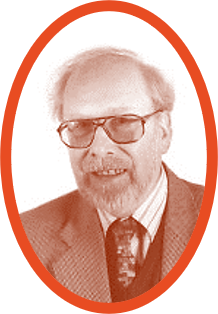
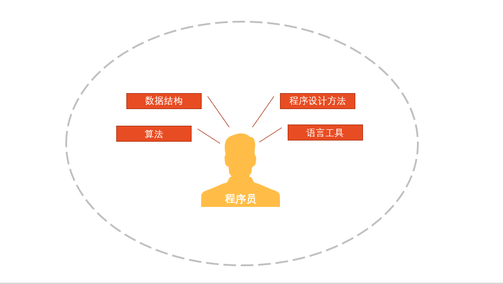
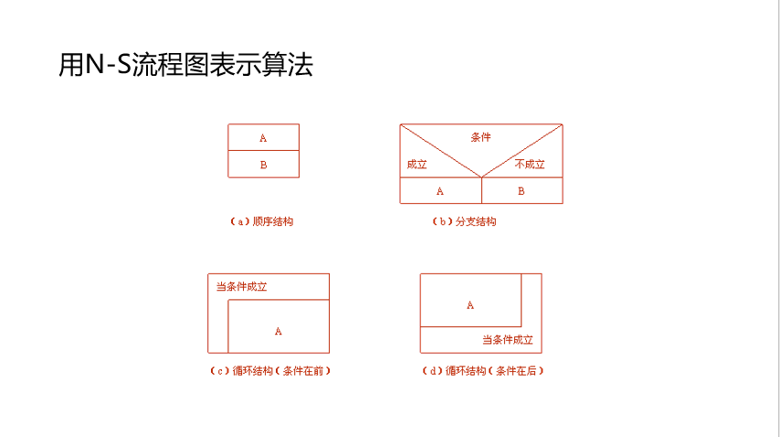

# 第 2 章 算法——程序的灵魂

一个程序主要包括两方面信息：

1. 数据结构（data structure）：对数据的描述。  
即在程序中要指定用到哪些数据，以及这些数据的类型和数据的组织形式。
2. 算法（algorithm）：对操作的描述。  
即要求计算机进行操作的步骤

著名计算机科学家沃思（Nikiklaus Wirth）提出一个公式：
***算法+数据结构=程序***

Nikiklaus Wirth



Programmer



## 2.1 算法

广义地说，为解决一个问题而采取的方法和步骤，就称为算法。  
对同一个问题，可以有不同的解题方法和步骤。  
为了有效地进行解题，不仅需要保证算法正确，还要考虑算法的质量，选择合适的算法。

计算机算法可分为两大类别：数值运算算法、非数值运算算法  

* 数值运算算法

  数值运算的目的是求数值解。  
  由于数值运算往往有现成的模型，可以运用数值分析方法，因此对数值运算的算法的研究比较深入，算法比较成熟。
* 非数值运算算法

  计算机在非数值运算方面的应用远超在数值运算方面的应用。  
  非数值运算的种类繁多，要求各异，需要使用者参考已有的类似算法，重新设计解决特定问题的专门算法。

## 2.2 简单的算法举例

* 例2.1 求1×2×3×4×5。

  ```text
  S1:1=>p
  S2:2=>i
  S3:p*i=>p
  S4:i+1=>i
  S5:如果i不大于5，返回重新执行S3及其后的步骤；否则算法结束。
  ```

* 例2.2 有50个学生，要求输出成绩在80分以上的学生的学号和成绩。

  ```text
  S1：1=>i
  S2: 如果gi≥80，则输出ni和gi，否则不输出
  S3：i+1=>i
  S4：如果i≤50，返回S2，继续执行，否则，算法结束。
  ```

* 例2.3 判断2000——2500年中的每一年是否为闰年，并将结果输出。

  ```text
  S1：2000=>year
  S2：若year能被4整除，但不能被100整除，则输出year的值和“是闰年”，转到S6  
  S3：若year能被400整除，则输出year的值和“是闰年”，转到S6  
  S4：若year不能被4整除，则输出year的值和“不是闰年”，转到S6  
  S5：输出year的值和“不是闰年”。  
  S6：year+1=>year  
  S7：当year≤2500时，转S2继续执行，否则算法停止。
  ```

* 例2.4 求1-1/2+1/3-1/4+...+1/99-1/100。

  ```text
  用sign代表当前项的数值符号，term代表当前项的值，sum代表累加和，deno代表当前项的分母。
  S1：sign=1
  S2：sum=1
  S3：deno=2
  S4：sign=(-1)*sign
  S5：term=sign*(1/deno)
  S6：sum=sum+term
  S7：deno=deno+1
  S8：若deno≤100，返回S4，否则算法结束
  ```

* 例2.5 给出一个大于或等于3的正整数，判断它是不是一个素数。

  ```text
  S1：输入n的值
  S2：i=2
  S3：r=n/i
  S4：如果r=0，则输出n“不是素数”，算法结束；否则执行S5
  S5：i+1=>i
  S6：如果i≤n-1，返回S3；否则输出n的值和“是素数”，算法结束。
  ```

## 2.3 算法的特性

1. 有穷性  
一个算法应包含有限的操作步骤，而不能是无限的；
2. 确定性  
算法中的每一个步骤都应当是确定的，而不应当是含糊的、模棱两可的；
3. 有零个或多个输入  
所谓输入是指在执行算法时需要从外界取得必要的；
4. 有一个和多个输出  
算法的目的是为了求解，“解” 就是输出；
5. 有效性  
算法中的每一个步骤都应当能有效地执行，并得到确定的结果。

## 2.4 表示一个算法

### 2.4.1 用自然语言表示算法

汉语、英语或其他语言，通俗易懂但文字冗长且要根据上下文才能判断其正确含义，一般不用其表示算法。

### 2.4.2 用流程图表示算法

流程图是用一些图框来表示各种操作。用图形表示算法，直观形象，易于理解。美国国家标准化协会ANSI（American National Standard Institute）规定了一些常用的流程符合，已为世界各国普遍采用。


### 2.4.3 三种基本结构和改进的流程图

1. 传统流程图的弊端

   传统的流程图用流程线指出各框的执行顺序，对流程线的使用没有严格限制。因此，使用者可以不受限制地使流程随意地转来转去，使流程图变得毫无规律，阅读时要花很大精力去追踪流程，使人难以理解算法的逻辑。这种算法被称为**BS型算法**，意为如同一碗面条（a bowl of spaghetti），毫无有头绪。

2. 三种基本结构

   1966年，Bohra和Jacopini提出了以下3种基本结构：

   1. 顺序结构
   2. 选择结构
   3. 循环结构
      * 当型（while型）循环结构
      * 直到型（until型）循环结构

   共同特点：

   1. 只有一个入口
   2. 只有一个出口
   3. 结构内的每一部分都有机会被执行到
   4. 结构内不存在“死循环”

### 2.4.4 用N-S流程图表示算法

既然用基本结构的顺序组合可以表示任何复杂的算法，那么基本结构之间的流程线就多余了。1973年，美国学者I.Nassi和B.Shneiderman提出的新的流程图形式，这种流程图中，完全去掉了带箭头的流程线。又称**N-S结构化流程图**



### 2.4.5 用伪代码（pseudo code）表示算法

伪代码是用介于自然语言和计算机语言之间的文字和符号来描述算法。它如同一篇文章一样，自上而下地写下来。每一行(或几行)表示一个基本操作。它不用图形符号，因此书写方便，格式紧凑，修改方便，容易看懂，也便于向计算机语言算法(即程序)过渡。

例如，求5!:


### 2.4.6 用计算机语言表示算法

计算机无法识别流程图华人伪代码，要用计算机实现算法只有用计算机语言编写的程序才能实现算法。

例如，求1−1/2+1/3−1/4+⋯+1/99−1/100的值用C语言表示。

1. 算法步骤

   ```text
   S1: sign=1
   S2: sum=1
   S3: deno=2
   S4: sign=(-1)* sign
   S5: term=sign*(1/deno)
   S6: sum=sum+term
   S7: deno=deno+1
   S8: 若deno≤100返回S4；否则算法结束
   ```

2. 说明

   ```text
   sign：表示当前项的数值符号
   term：表示当前项的值
   sum：表示当前项的累加和
   deno：表示当前项的分母
   ```

3. 用C语言表示

   ```c
    #include <stdio.h>
    int main()
    {
        int sign=1;
        double deno=2.0,sum=1.0,term;
        while(deno<=100)
            {
                sign=-sign;
                term=sign/deno;
                sum=sum+term;
                deno=deno+1;
            }
        printf(″%f\n″,sum);
        return 0;
    }
   ```

## 2.5 结构化程序设计方法

一个结构化程序就是用计算机语言表示的结构化算法，这种程序便于编写、阅读、修改和维护，降低了程序出错率，提供了程序可靠性，保证了程序的质量。

结构化程序设计强调程序设计风格和程序结构的规范化，提倡清晰的结构。

结构化程序设计方法的基本思路是：把一个复杂问题的求解过程分阶段进行，每个阶段的问题都控制在人们能够理解和处理的范围内。

具体来说，采取以下方法来保证得到结构化的程序：  

1. 自顶而下；
2. 逐步细化；
3. 模块化设计；

   程序的子模块在C语言中通常用函数来实现，一般不超过50行，即把它打印输出时不超过一页，便于组织与阅读。  
   划分子模块时应注意模块的独立性，即使用一个模块完成一项功能，耦合性愈小愈好。
4. 结构化编码。

   结构化编码（coding），所谓编码就是将已设计好的算法用计算机语言来表示，即编写计算机程序。

结构化程序设计方法用来解决人脑思维能力的局限性和被处理问题的复杂性之间的矛盾。
