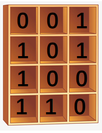
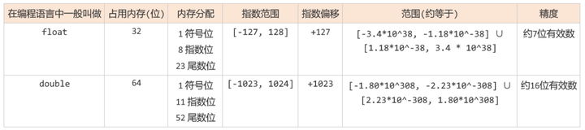
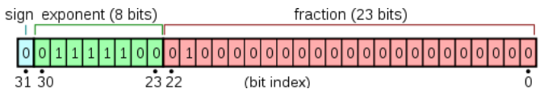
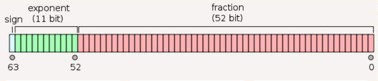
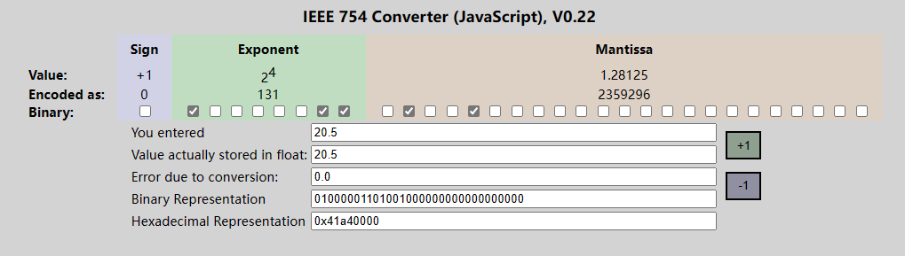
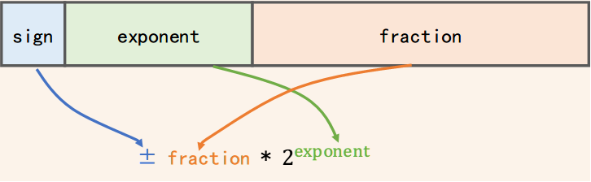

# 一、浮点数在内存中的存储方式

## 1.1 IEEE 754标准

在计算机只能存储或识别二进制，文档、图片、数字等在储存时，都是以二进制的形式存放在内存或硬盘中，内存或硬盘就好像是一个被划分为许多小格子的容器，其中每个小格子都只能盛放**0**或**1**......

我们日常使用的**浮点数**也不例外，最终也要被存储到这样的二进制小格子中。这就涉及到了应该怎么存的问题，比如，对于浮点数20.5，是应该存储为`0100011`呢，还是应该存储为`1100110`呢?
事实上直到20世纪80年代，计算机厂商还是各自为战，每家都在设计自己的浮点数存储规则，彼此之间并不兼容。直到1985年，**IEEE754**标准问世，浮点数的存储问题才有了一个通用的工业标准。

1985年电气电子工程师学会（**IEEE**）发布了IEEE754标准，该标准提供了如何在计算机内存中以二进制的方式存储十进制浮点数的具体标准，包括 javascript，Java，C在内的许多编程语言在实现浮点数时，都遵循IEEE754标准。IEEE754的最新标准是IEEE754-2008，但本篇文章主要参考的是IEEE754-1985，好在两者相差并不大，而参照1985的标准可以让我们对一些基础概念有更好的理解。

IEEE754提供了四种精度规范，其中最常用的是**单精度浮点型**和**双精度浮点型**，但IEEE754并没有规定32位浮点数类型需要叫做`float`，或64位浮点数需要叫做`double`。 它只是提供了一些关于如何存储不同精度浮点数的规范和标准。不过一般情况下，如果我们提到`float`，其实指的就是IEEE754标准中的**32位单精度浮点数**，如果我们提到`double`，其实指的就是IEEE754标准中的**64位双精度浮点数**。

下面是单精度浮点数和双精度浮点数的一些信息：

## 1.2 32位单精度浮点数在内存中的存储方式

以32位浮点数或者说单精度浮点数或者说float类型为例，研究其在计算机中的存储方式，其他精度（如64位浮点数）则大同小异。

IEEE754标准中规定存储一个32位浮点数，比如20.5，在内存或硬盘中要占用32个二进制位 (32个比特位)，这32个二进制位的内存编号从高到低 (从31到0)被划分为3部分，用途各不相同:

* sign: 符号位，即图中蓝色的方块
* biased exponent: 偏移后的指数位，即图中绿色的方块
* fraction: 尾数位，即图中红色的方块

64位双精度浮点数只是占位数量不同：
以32位单精度浮点数为例，依次介绍这三个部分的概念和用途：

1. 符号位: sign
   * 占据最高位(第31位)这一位，用于表示这个浮点数是正数还是负数，为0表示正数，为1表示负数。
   * 例如，对于十进制数20.5，存储在内存中时，符号位应为0，因为这是个正数。
2. 偏移后的指数位: biased exponent
   * 指数位占据第30位到第23位这8位. 也就是上图的绿色部分。
   * 用于表示以2位底的指数，8位二进制可以表示256种状态，
   * IEEE754规定，指数位用于表示 $[-127，128]$ 范围内的指数。
     * 为了表示负数，浮点型的指数位都有一个固定的偏移量(bias)，用于使 $指数 + 这个偏移量 = 一个非负整数$ 。 这样指数位部分就可以表示负数了。
     * 规定: 在32位单精度类型中，这个偏移量是127。 在64位双精度类型中，偏移量是1023。
     * 如果你运算后得到的指数是 -127，那么偏移后，在指数位中就需要表示为: $-127 + 127(偏移量) = 0$ 。
     * 如果你运算后得到的指数是 -10，那么偏移后，在指数位中需要表示为: $-10 + 127(偏移量) = 117$ 。
     * 有了偏移量，指数位中始终都是一个非负整数.
3. 尾数位:fraction
   * 占据剩余的22位到0位这23位. 用于存储尾数。
   * **规范化(normalized)**：在以二进制格式存储十进制浮点数时，表示为 $尾数\times指数$ 的形式，并把尾数的小数点放在第一位和第二位之间，然后保证第一位数**非0**。
     * 首先需要把十进制浮点数表示为二进制格式，例如十进制数20.5，其二进制形式为`10100.1`;
     * 然后，把这个二进制数转换为以2为底的指数形式:二进制 $10100.1=1.01001\times2^4$，其中`1.01001`是尾数 。
     * **4就是偏移前的指数(unbiased exponent)**，IEEE754标准中32位单精度浮点数的偏移量(bias)为127，这里偏移后指数(biased exponent)需要加上偏移量，即 $4+127=131$，指数位就是131转换为二进制的`1000 0011`。
   * 特殊处理：
     1. 隐藏高位1：  
     规范化的浮点数表示形式中，尾数部分的最高位始终为1。 比如这里的`1.01001`，而二进制中，每一位可能的取值只有0或1，如果第一位非0，则第一位只能为1。所以在存储尾数时，可以省略前面的**1和小数点**。只记录尾数中小数点之后的部分，这样就节约了一位内存. 所以这里只需记录剩余的尾数部分: `01001`。所以尾数如无特殊说明，指的是隐藏了整数部分**1.**之后剩下的小数部分。
     2. 低位补0：  
     尾数中存储的本质上是二进制的小数部分，当尾数不够填满尾数位时，为了不影响原数值而填满23位，就在**低位补0**，比如此时的尾数`01001`是省略了整数部分1.之后剩余的小数部分，不够23位，需要在低位补0:  
     原尾数是: `01001`(不到23位)  
     补零之后是: `0100 1000 0000 0000 000` (补至23位)

## 1.3 实例: 表示十进制浮点数20.5

1. 十进制浮点数 20.5 的:
   * 符号位是: `0`
   * 偏移后指数位是: `1000 0011`
   * 补零后尾数位是: `0100 1000 0000 0000 000`
   * 把这三部分按顺序放在32位浮点数容器中，就是 `0 1000 0011 0100 1000 0000 0000 000`
   * 在[IEEE-754 Floating Point Converter](https://www.h-schmidt.net/FloatConverter/IEEE754.html)中验证：
2. 假设现在有一个用二进制表示的32位浮点数: `0 1000 0011 0100 1000 0000 0000 000`，求它所代表的十进制浮点数是多少?
   * 符号位是0: 所以这是个正数；
   * 偏移后的指数位为：`1000 0011`，转换为十进制为131，减去偏移量127，得到真正的指数是4；
   * 尾数是: `0100 1000 0000 0000 000`去掉后面的补零，再加上隐藏的整数部分1. 得到完整的尾数(含隐藏的整数部分)为: `1.01001`。
   * 计算方法示意图：
   * 最后得到的浮点数为尾数(含隐藏的整数部分)乘上以2为底的指数次幂（把小数点向右移动指数幂个位）。所以32位浮点数: `0 1000 0011 0100 1000 0000 0000 000`转换为十进制： $1.01001\times2^4=10100.1=20.5$ 。注意，直到最后一步才把二进制转换为十进制。
   * 在进制转换网站[OSChina](https://tool.oschina.net/hexconvert)上验证，可以看到二进制的10100.1，确实等于十进制的20.5。

   
