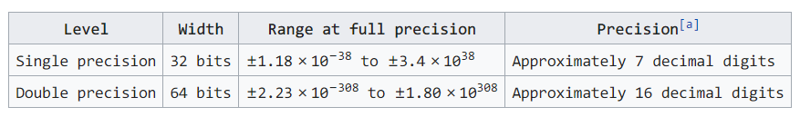
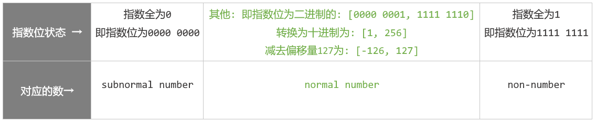
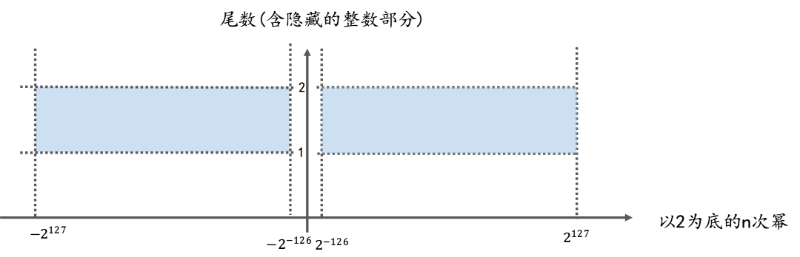
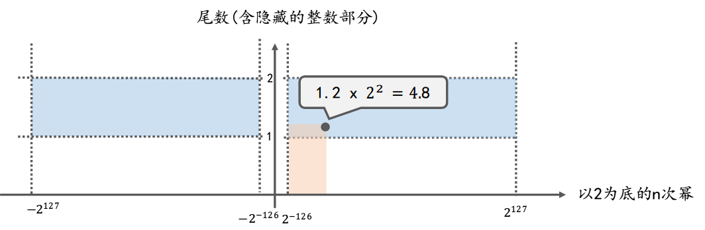

# 二、32位浮点数的取值范围

由维基百科[wikipedia](en.wikipedia.org/wiki/IEEE_754-1985)上浮点数的取值范围 可见

* 32位浮点数或者说float类型的取值范围：
  $$\pm1.18\times 10^{-38} to \pm3.4\times 10^{38}$$
* 或者说是：
  $$
  [-3.4\times10^{38}，-1.18\times 10^{-38}]
  \cup
  [1.18\times 10^{-38}，3.4\times10^{38}]
  $$
* 更直观的表示：
  $$
  [-340000000000000000000000000000000000000，-0.0000000000000000000000000000000000000118]
  \cup
  [0.0000000000000000000000000000000000000118，340000000000000000000000000000000000000]
  $$

## 2.1 IEEE754对浮点数的分类

根据IEEE754的规定，将浮点数划分normal number(规格数) 、 subnormal number(非规格数)和non-number(特殊数)。

1. normal number(规格数)  
   就是尾数位隐藏的整数部分是1.的数，可以理解为"正常的数"。一般来说，我们遇到的都是normal number，例如20.5在内存中表示为`0 1000 0011 0100 1000 0000 0000 000`，其中尾数部分去掉后面补的零之后为`01001`，但真实的尾数部分是 `1.01001`，即前面省略了整数部分`1.`。
2. subnormal number(非规格数)
   * IEEE754规定: subnormal number是将指数位全部填充为0，尾数位隐藏的整数部分为`0.`的数，也叫作denormal number，可以理解为"低于正常数的数"。
   * 引入subnormal number这个概念，是为了在浮点数下溢时可以逐位的损失精度，以尽可能精确的表示0附近的极小数。
   * 举例: 以32位浮点数为例，类似于 `* 00000000 ***********************` 这样内存状态的数时，(即指数位全部为0的数)，就应该知道，这是个subnormal number，此时这个数的尾数位隐藏的整数不是1. 而是0.
3. non-number(特殊数)
   * 和subnormal number类似，IEEE754对于指数位全为1的状态也做了特殊规定：当指数位全部被1填充，即指数位表示的值为255时，用于表示这个浮点数处在一种非正常数(non-number)的状态: 即这个数可能是±infinity或NaN。
   * Infinity和NaN是两个特殊数，分别表示无穷和Not a Number。[HandWiki](https://handwiki.org/wiki/IEEE_754-1985)上的介绍为：The biased-exponent field is filled with all 1 bits to indicate either infinity or an invalid result of a computation.
   * 所以类似于 `* 11111111 ***********************` 这样内存状态的数时，(即指数位全部为1的数)，就应该知道，这是个non-number，它用于表示特殊数。

## 2.2 单精度浮点数取值范围的计算方法

IEEE754规定，当指数位全部为0或者全部为1时，用于表示两种特殊状态的数: subnormal number 和 non-number，以32位单精度浮点数为例，可以得到如下示意图:
这就是理解浮点数取值范围的关键: 当讨论浮点数的取值范围时，实际上讨论的是: normal number (上图中绿色部分)的范围。

1. 指数部分
   * 可以看出32位浮点数的指数无法取到-127和128：
     * 表示-127的`0000 0000`被用来表示subnormal number
     * 表示128的`1111 1111`被用来表示non-number
   * 所以实际上32位浮点数的指数部分只能取到只能取到 $[-126，127]$
2. 尾数部分
   * 对于normal number，尾数前隐藏的整数部分始终保持为`1.`
   * 所以尾数(含隐藏的整数部分)所表示的值的范围其实是 $[1.00...00,1.11...11]$ ，这个二进制数，约等于十进制的 $[1，2)$ ，因为`1.11..11`非常逼近十进制的2。

对于32位float而言: 尾数(含隐藏的整数部分)的可取值为: $[1 ，2)$，指数位可取值 $[-126，127]$，且浮点数可正可负，则根据运算规则，32位float的取值范围

$$
=\pm尾数\times2^{指数}
$$

$$
=\pm[1,2)\times2^{[-126,127]}
$$

$$
=(-2\times2^{127},-1\times2^{-126}]\cup[1\times2^{-126},2\times2^{127})
$$

把上式的以2为底，替换为以10为底:

$=$

$$
(-3.4028236692093846346337460743177\times10^{38},
-1.1754943508222875079687365372222\times10^{-38}]
$$

$\cup$

$$
[1.1754943508222875079687365372222\times10^{-38},
3.4028236692093846346337460743177\times10^{38})
$$

从这个集合中取一个更容易表示的子集，就是我们常见的32位float的取值范围了:

$$
[-3.4\times10^{38},-1.18\times10^{-38}]
\cup
[1.18\times10{-38},3,4\times10^{38}]
$$

**注意**：虽然上面这个集合其实是32位float取值范围的子集，但和真正的取值范围相差不多，且没有冗长的小数位，还能写成闭区间的形式，这样表示起来更简洁，所以在各种资料中，我们常看到的取值范围就是上面这个。

下图是32位单精度浮点数的取值范围示意图，x轴代表以2为底的n次幂(即内存中的指数部分)，y轴代表尾数(含隐藏的整数部分1.)，可以参照此图更好的理解坐标系中任意一点(x，y)就代表一个浮点数，这一点到x轴y轴所围成的矩形的面积(即上图中橙色区域的面积)，就是这个浮点数的值 (即 $浮点数的值 = 尾数(含隐藏的整数部分) * 以2为底的n次幂$ )

* 蓝色部分: 表示normal number的取值范围，即normal number类型的浮点数对应的坐标点只能出现在坐标系中的蓝色区域。
* 坐标点: 一个坐标点对应一个浮点数
* 橙色部分的面积: 表示该浮点数的值。

这就是32位浮点数取值范围的计算方法。
