# 三、为什么32位浮点数的精度是"7位有效数"

维基百科的IEEE754标准中标注着单精度浮点数的精度是*Approximately 7 decimal digits*。

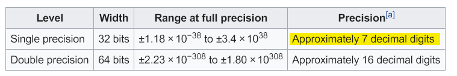

这里 "decimal的" 含义应该是 "十进制的" ，即32位浮点数的精度是 "大约7位十进制数"。

## 3.1 浮点数在计算机中存储的是"离散"的值

现在的计算机能存储 $[1,2]$ 之间的所有小数吗?

答案肯定是不能，因为计算机的内存或硬盘容量是有限的，而1到2之间小数的个数是无限的。极端一点，计算机甚至无法存储1到2之间的某一个小数，比如对于小数 1.00000.....一万亿个零.....00001，恐怕很难用计算机去存储它。不过计算机却能存储 $[1，10000]$ 之间的所有整数。因为整数是"离散"的，$[1，10000]$ 之间的整数只有10000个,即10000种状态很容易就能存储到计算机中，而且还能进行运算，比如计算 $10000+10000$ ，也只是要求计算机能存储20000种状态而已。因此可以得知计算机可以进行数学概念中的整数运算，但却难以进行数学概念中的小数运算。小数这种"连续"的东西，当前的计算机很难应对。

事实上，计算机为了进行小数运算，不得不将小数也当成"离散"的值，一个一个的，就像整数那样：

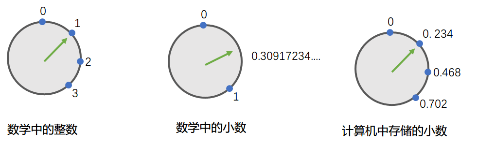

如上图所示，数学中的整数是一个一个的，绿色指针必须一次走一格，数学中的小数是连续的，绿色指针可以无极调节，想走到哪儿走到哪儿，计算机中存储的小数是一个一个的，绿色指针必须一次走一格，就像整数那样。这就引发了精度的问题：比如上图中，无法在计算机中存储0.3，因为绿色指针只能一次走一格，要么在0.234，要么就到了0.468。当然，也可以增加计算机存储小数的精度，或者说缩小点与点之间的间隔:

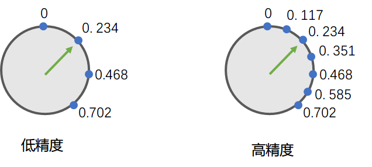

IEEE754中的单精度浮点数和双精度浮点数大体也是如此：双精度浮点数中的蓝色小点更密集。

## 3.2 从“间隔”的角度理解32位浮点数的精度是"7位有效数"

### 3.2.1 “间隔”与精度的关系

想象一个类似于上图的圆形表盘，表盘上有一些蓝点作为刻度，有一个绿色的指针用于指向蓝点，绿色指针只能一次走一格：即只能从当前蓝点移动到下一个蓝点。不能指向两个蓝点之间的位置。假如表盘上用于表示刻度的蓝点如下所示:

```text
0.0000

0.0012

0.0024

0.0036

0.0048

0.0060

0.0072

0.0084

0.0096

0.0108

0.0120 (注意这里，前一个数是108，这个数是120。)

0.0132

0.0144
...
```

这是一组十进制数，这组数以`0.0012`的步长逐渐递增。

假设这个表盘就就是计算机所能表示的所有小数：

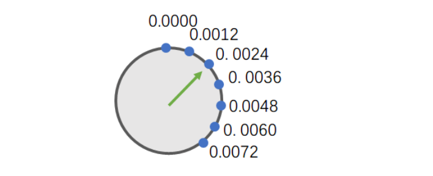

问：能说这个表盘，或者说这组数的精度达到了4位十进制数吗(比如，可以精确到1位整数+3位小数)?

分析：如果说可以精确点1位整数+3位小数，那就应该可以说出下面这样的话:

```text
可以说，当前指针正位于0.001x：而指针确实可以位于0.0012，属于0.001x (x表示这一位是任意数，或说这对该位的精度不做限制)
可以说，当前指针位于0.002x：而指针确实可以位于0.0024，属于0.002x
可以说，当前指针位于0.003x：而指针确实可以位于0.0036，属于0.003x
...
可以说，当前指针位于0.009x：而指针确实可以位于0.0096，属于0.009x
可以说，当前指针位于0.010x：而指针确实可以位于0.0108，属于0.010x
可以说：当前指针位于0.011x...但，注意，指针始终无法指向0.011x...在表盘中，指针可以指向0.0108，或指向0.0120，但始终无法指向0.011x
...
```

这就意味着对于当前表盘 (或者说对于这组数) 来说，4位精度太高了。4位精度所能描述的状态中，有一些是无法用这个表盘表示的。

那把精度要求降低一些，能说这个表盘或者说这组数的精度达到了3位十进制数吗(比如可以精确到1位整数+2位小数)?

再来分析一下，如果说可以精确点1位整数+2位小数，那就应该可以说出下面这样的话:

```text
可以说，当前指针位于0.00xx：而指针确实可以位于0.0012，0.0024，0.0036...0.0098，这些都属于0.00xx
可以说，当前指针位于0.01xx：而指针确实可以位于0.0108，0.0120...这些都属于0.01xx
...
```

可以看出，对于当前这个表盘 (或者说对于这组数) 来说，它完全能“hold住”3位精度。或者说3位精度所能描述的所有状态在该表盘中都可以得到表示。如果的机器使用这个表盘作为浮点数的取值表盘的话，那就可以说：机器的浮点数精度 (或者说这个表盘的浮点数精度)，能精确到3位十进制数(无法精确到4位十进制数)。而这个精度，本质上是由表盘间隔决定的，本例中的表盘间隔是0.0012，如果把表盘间隔缩小到0.00000012，那相应的表盘能表示的精度就会提升(能提升到 7 位十进制数，无法达到 8 位十进制数)

用一句简单的话来解释：假设浮点数表盘能提供4位精度控制，比如能控制到1位整数+3位小数，这就要求它必须能控制到0.001这个粒度，而0.001这个值小于该表盘的实际间隔0.0012，所以该表盘不能提供4位精度。通过这个例子能够直观的认识到“表盘的间隔”和“表盘的精度”之间存在着密切的关系。

事实上，IEEE754标准中的32位浮点数，也可以被想象为一个 “蓝点十分密集的浮点数表盘”，如果能分析出这个表盘中蓝点之间的间隔，那就能分析出这个表盘的精度。

### 3.2.2 32位浮点数的“间隔”

分析32位浮点数的间隔与精度有一个很笨的方法：把32位浮点数能表示的所有小数都罗列出来，计算间隔。

$$
间隔
=差值/移动次数
=(终点对应的值-起点对应的值)/2^{23}
$$

然后分析精度。（此处只分析规格数normal number，且先不考虑负数情况，也就是说不考虑符号位为1的情况。）

1. 差值

   32位浮点数能表示的最小规格数是：  
   `0 00000001 00000000000000000000000`  
   （注意：规格数指数位最小为00000001，不能为00000000。）  紧邻的下一个数是：  
   `0 00000001 00000000000000000000001`  
   紧邻的下一个数是：  
   `0 00000001 00000000000000000000010`  
   紧邻的下一个数是：  
   `0 00000001 00000000000000000000011`  
   ...  
   这样一步一步的往下走，$2^{23}-1$ 步之后，将指向  
   `0 00000001 11111111111111111111111`  
   再走一步，也就是 $2^{23}$ 步之后，将指向  
   `0 00000010 00000000000000000000000`  
   总结一下：$2^{23}$ 次移动之后，从起点  
   `0 00000001 00000000000000000000000`  
   移动到了终点  
   `0 00000010 00000000000000000000000`

2. 求间隔

   $$
   间隔
   =差值/移动次数
   =(终点对应的值-起点对应的值)/2^{23}
   $$

   但是观察可以发现：和起点相比，终点的符号位和尾数位都没变。仅仅是指数位变了：起点指数位`00000001` → 终点指数位`00000010`，终点的指数位比起点的指数位变大了**1**。  
   而IEEE754中浮点数的求值公式是：

   $$
   尾数\times 2^{指数}
   $$

   假如说起点对应的值是 $1.0\times 2^{-8}$ 那终点对应的值就应该是 $1.0\times 2^{-7}$ 即仅仅是指数位变大了1。

   把指数展开：
   * 假设起点对应的值是 `0.0000 0001` (8位小数)；
   * 那么终点对应的值就是 `0.0000 001` (7位小数)；
   * 起点和终点的差值为：(`0.0000 001`-`0.0000 0001`)，是一个非常小的数；
   * $间隔 = 差值 / 2^{23}$ ；
   * 注意：其实上面并没有计算出真正的间隔，只是假设了起点和终点的值分别是 $1.0\times 2^{-8}$ 和 $1.0\times 2^{-7}$ 。

   现在起点变成了：  
   `0 00000010 00000000000000000000000`  
   再走 $2^{23}$ 步，来到了：  
   `0 00000011 00000000000000000000000`  
   同样是符号位，尾数位都没有变，指数位又变大了1。

   沿用上面的假设，此时起点对应的值是 $1.0\times 2^{-7}$ 则终点对应的值应该是 $1.0\times 2^{-6}$ ，还是指数位变大了1。
   * $差值=0.0000 01(6位小数) - 0.0000 001(7位小数)$
   * $间隔=差值/2^{23}(移动次数)$

   有没有体会到不对劲的地方，没有的话，继续:

   现在起点变成了  
   `0 00000011 00000000000000000000000`  
   再走 $2^{23}$ 步，来到了  
   `0 00000100 00000000000000000000000`  
   同理，终点相对起点，还只是指数位变大了1。  
   * $差值=0.00001(5位小数) - 0.000001(6位小数)$
   * $间隔=差值/2^{23}(移动次数)$

   感受到不对劲了吗? 继续往前走...

   现在起点变成了  
   `0 00000100 00000000000000000000000`  
   再走 $2^{23}$ 步，来到了  
   `0 00000101 00000000000000000000000`
   * $差值=0.0001(4位小数)-0.00001(5位小数)$
   * $间隔=差值/2^{23}(移动次数)$

   一路走到这儿，感受到不对劲了吗?

   不对劲的地方在于终点和起点的差值！差值在越变越大！同理间隔也在越变越大！

   罗列一下之前的差值:

   $$差值1
   =0.0000 001 (7位小数) - 0.0000 0001(8位小数)
   =0.0000 0009
   $$

   $$差值2
   =0.000001 (6位小数) - 0.0000001(7位小数)
   =0.0000 009
   $$

   $$差值3
   =0.00001 (5位小数) - 0.000001(6位小数)
   =0.0000 09
   $$

   $$差值4
   =0.0001 (4位小数) - 0.00001(5位小数)
   =0.0000 9
   $$

   差值的小数点在不断向右移动，这样走下次，总有一天，差值会变成9，变成90，变成90000......而移动次数始终是 $2^{23}$ ，$间隔=差值/2^{23}$，差值在越变越大，间隔也会跟着越变越大。

   到此就不难发现IEEE754标准的一个重要特性：如果把IEEE754所表示的浮点数想象成一个表盘的话，那表盘上的蓝点不是均匀分布的，而是越来间隔越大，越来越稀疏。大概就像这样：

   

   在c语言中验证这一特性:

   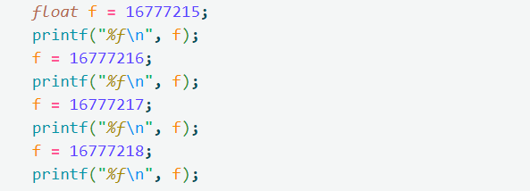

   输出为：

   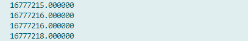

   与16777216紧邻的蓝点是16777218，两数差值为2，32位浮点数无法表示出16777217，可以得知16777216是一个临界点，它之前的间隔为1，之后为2。

3. IEEE754标准中32位浮点数的间隔

   知道了表盘的间隔，就能计算表盘的精度了。复杂的地方在于IEEE754这个表盘的间隔不是固定的，而是越来越大。不过wiki已经总结了其间隔数据：

   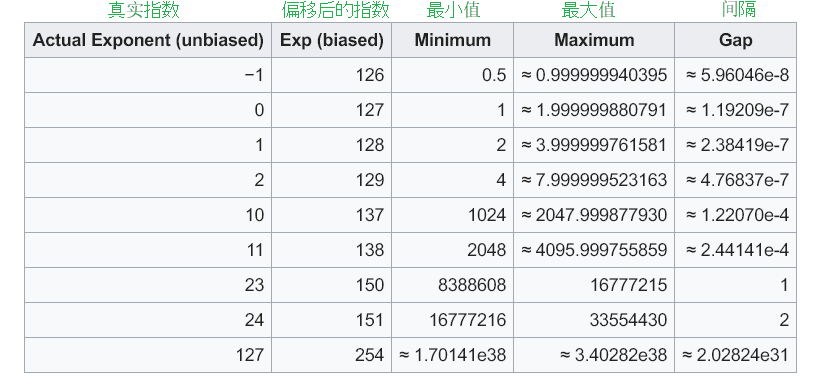

   这张数据表的右侧三列表示：取值范围在 $[最小值，最大值]$ 间的间隔。比如8388608\approx16777215这个取值范围范围之间的数，间隔是1。

   

   所以32位浮点数可以存储8388608，也可以存储8388609，但无法存储8388608.5，因为间隔是1。

   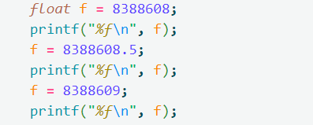

   输出：

   

   第二行1~1.999999880791这个范围之间的数，间隔是1.19209e-7。

   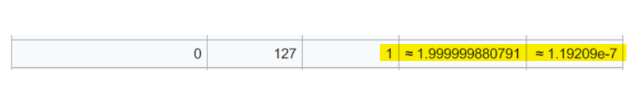

   在c语言float.h的源码中:

   ```c
   #define FLT_EPSILON 1.192092896e-07F // smallest such that 1.0+FLT_EPSILON != 1.0
   ```

   定义常量`FLT_EPSILON`，其值为`1.192092896e-07F`，这个`1.192092896e-07F`，就是表格中的间隔1.19209e-7

   源码中说：32位浮点数1.0，最少也要加上`FLT_EPSILON`这个常量，才能不等于1.0。如果1.0加上一个小于`FLT_EPSILON`的数 N，就会出现 $1.0 + N == 1.0$ 这种“诡异的情况”。因为对于 $1\sim1.999999880791$ 这个范围中的32位浮点数，至少要加上`FLT_EPSILON`，或者说至少要加上该范围对应的间隔，才能够把指针从当前蓝点，移动到紧邻的下一个蓝点。

   注意：如果不是 $1\sim1.999999880791$ 之间的数，则不一定要加上`1.19209e-7`。准确来说是某个区间中的数至少要加上该区间对应的间隔，才能从当前蓝点移动到下一个蓝点。

   附：64位浮点数的间隔表，也可以参见 [IEEE754 WIKI](en.wikipedia.org/wiki/IEEE_754-1985)

4. IEEE754标准中32位浮点数的精度

   首先要说明的是32位浮点数的精度是“Approximately 7 decimal digits”，大约7位十进制数。但事实上，对于有些8位十进制数，32位浮点数容器也能对其精确保存，比如下面两个数都能精确保存。

   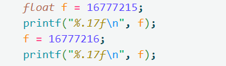

   输出：

   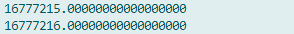

   所谓的精度是大约7位十进制数到底是什么意思呢？探讨这个之前需要先了解一些更本质的东西

   1. 浮点数只能存储蓝点位置对应的值。

      正如前文所说，32位浮点数会形成一个表盘，表盘上的蓝点逐渐稀疏。绿色指针只能指向某个蓝点，不能指向两个蓝点之间的位置，即32位浮点数只能保存蓝点对应的值。如果要保存的值不是蓝点对应的值，就会被自动舍入到离该数最近的蓝点对应的值。

      例如，在 $0.5\sim1$ 这个范围内，间隔约为`5.96046e-8`，约为`0.00000005.96046`。

      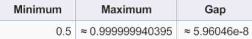

      也就是表盘上有一个蓝点是0.5，则 $下一个蓝点=当前蓝点+间隔\approx0.5+0.00000005.96046\approx0.5000000596046$ ，如果要保存`0.50000006`，即要保存的这个值稍大于下一个蓝点:

      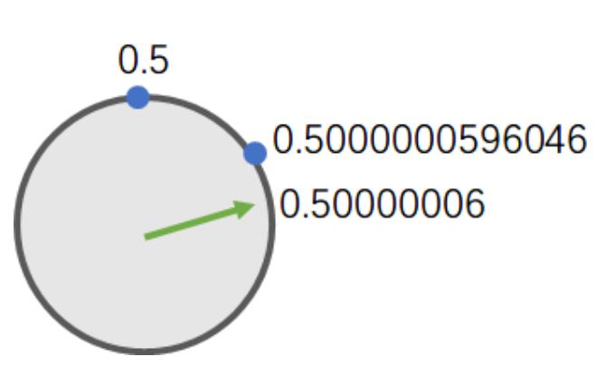

      由于绿色指针必须指向蓝点，不能指向蓝点之间的位置，所以绿色指针会被"校准"到0.5000000596046，或者说要保存的0.50000006，会被舍入为0.5000000596046。

      测试：

      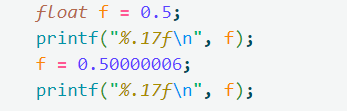

      输出：

      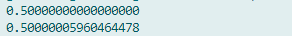

      事实上，每个32位浮点数容器中，存储的必然是一个蓝点值，验证一下：  
      首先求出从0.5开始的蓝点值:

      $$
      第一个蓝点
      =0.5
      $$

      $$
      第二个蓝点
      \approx第一个蓝点+0.0000000596046
      \approx0.5000000596046
      $$

      $$
      第三个蓝点
      \approx第二个蓝点+0.0000000596046
      \approx0.0000001192092
      $$

      $$
      第四个蓝点
      \approx第三个蓝点 + 0.0000000596046
      \approx0.0000001788138
      $$

      用C语言代码测试：

      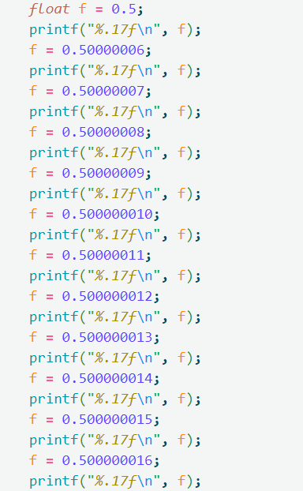

      输出：

      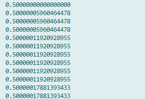

      可以发现变量中实际存储的其实都是蓝点值。现在就能大体解释一个经典编程问题了："为什么32位浮点数中的`0.99999999` 会被存储为`1.0`呢？" 因为`0.99999999`不是一个蓝点值，离他最近的蓝点值是`1.0`，然后绿色指针被自动"校准"到了离他最近的蓝点`1.0`。

      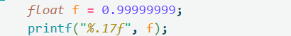

      

   2. 理解32位浮点数的精度是7位十进制数

      理解这点可以根据维基百科上IEEE754_1985的数据表，举例论证。

      

      * 例1：查表发现 $1024\sim2048$ 范围中的间隔约为`0.000122070`

        

        想要精确存储到小数点后4位，却发现做不到，其实只能精确存储到小数点后3位：

        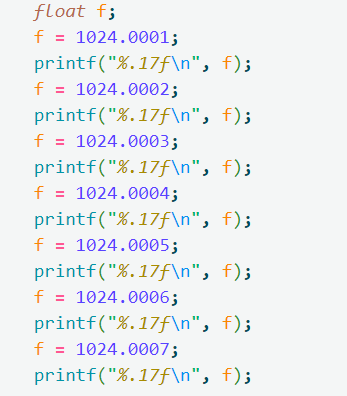

        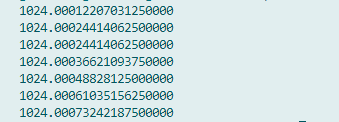

        无法存储1024.0005。

        **结论**：在 $1024\sim2048$ 范围内能精确保存的数是 $4位十进制整数 + 3位十进制小数 = 7位十进制$ 。

      * 例2：查表发现 $8388608\sim16777215$ 范围中的 间隔为1。

        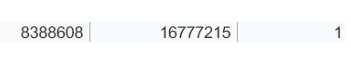

        想要精确存储到小数点后一位，却发现做不到，其只能精确存储到小数点后零位，或者说只能精确存储到个位数(因为最小间隔为1)：

        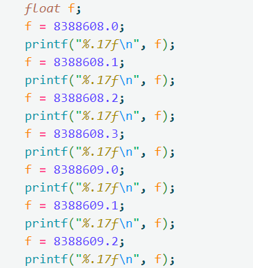

        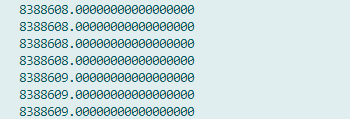

        **结论**：在 $8388608\sim16777215$ 范围内能精确保存的数是 $7或8位十进制整数 + 0位十进制小数 = 7或8位十进制数$ 。

        是的，32位浮点数也能精确保存小于等于 16777215 的 8 位十进制数，所以说其精度大约是7位十进制数。

        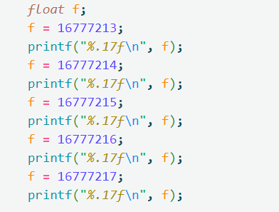

        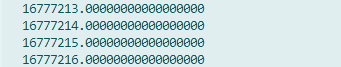

      * 例3：查表发现 $1\sim2$ 范围中的间隔为`1.19209e-7`。

        

        想要精确存储到小数点后7位，却发现做不到，其只能精确存储到小数点后6位：

        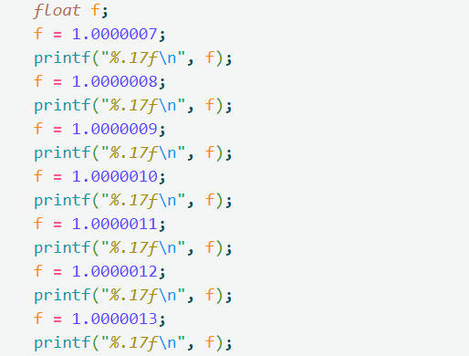

        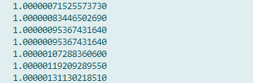

        想精确存储到小数点后7位，却发现实际上无法存储`1.0000012`，表盘上没有`1.0000012xxxx`这个级别的数。

        **结论**：在 $1\sim2$ 这个范围内，能精确保存的数是 $ 1位十进制整数 + 6位十进制小数 = 7位十进制数$ 。

   所谓的32位浮点数的精度是7位十进制数，大概就是这样算出来的. 基本上 **整数位 + 小数位 最多只能有7位**，再多加无法确保精度了 (注意这不是wiki给出的计算方法，wiki给出的算法见下文)

   仅记住如下两点即可:

   1. 32位浮点数其实只能存储对应表盘上的蓝点值，而不能存储蓝点与蓝点之间的值
   2. 蓝点不是均匀分布的，而是越来越稀疏。或者说蓝点与蓝点之间的间隔越来越大，或者说精度越来越低。（这也是为什么到`1.xxxxxxx`时还能精确到小数点后6位，到`1024.xxx`时只能精确到小数点后3位，到`8388608`时只能精确到个位数的原因。因为蓝点越来越稀疏了，再往后连个位数都精确不到了。）

5. 注意事项
   1. 区分32位浮点数的存储精度 & 打印效果

      在c语言中，使用 %f 打印时，默认打印 6 位小数，32位浮点数的有效位数是 7 位有效数，这两者并不冲突，比如:

      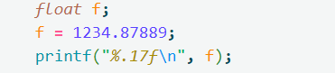

      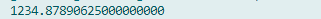

      原始值 1234.878 89

      打印效果 1234.878 906

      可见打印效果中只有 前7位 和 原始值 是一致的

      事实上，"原始值" vs "打印出来的值" ，其实就是 "想要存储的值" vs "实际存储的值"

     想要存储1234.878 89，但实际存储的是1234.878 906... 因为1234.878 906...才是个"蓝点值"，才能真正的被绿色指针所指向，才能真正的被32位浮点数容器所存储.

      虽然不能精确存储想要保存的值，但32位浮点数能保证精确存储想要保存的值的前 7 位. 所以打印效果中的前7位和 原始值 是一致的.

      %f 默认打印到6位小数，打印出来的是实际存储的蓝点值. 但，蓝点值可不一定是7位小数，可能有十几位小数，只是 %f 会默默的将其舍入为7位小数并打印出来
   2. 有时候精度不是7位

      可能的原因有很多，比如:
      1. 打印时，%f发生了舍入（此时可以设置打印更多的小数位）

         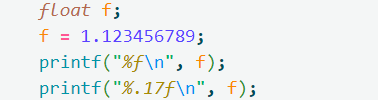

         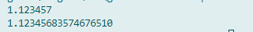

      2. 好像精确度不止7位

         注意，浮点数中能存储的都其实是蓝点值。所以如果要存储的值和蓝点值完全一样，那要存储的值就能够被完全精确的存储下来的；如果要存储的值和蓝点值非常非常靠近，就会体现出超乎寻常的精度。

         例如：

         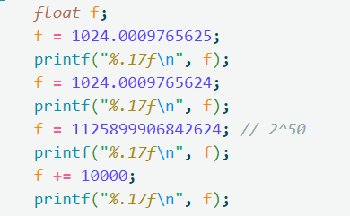

         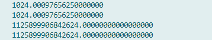

      3. 好像精确度不到7位

         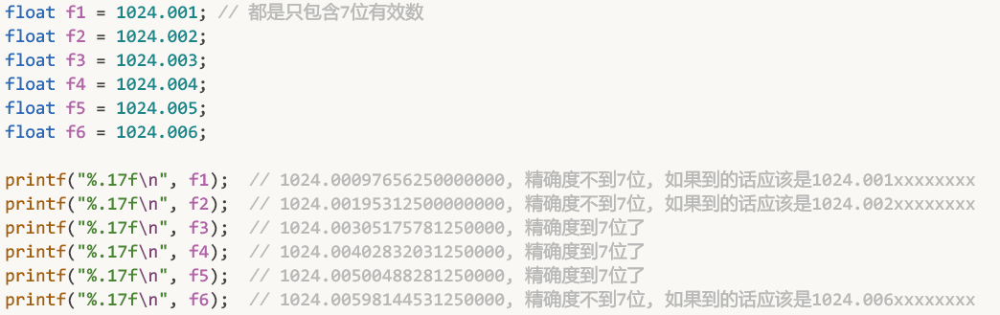

         对于 $1024\sim2048$ 之间的数，32位浮点数确实有能力精确到7位有效数。当要存储的值不是一个蓝点值时会发生舍入，即自动舍入到离它最近的一个蓝点值。所以`1024.001`，会舍入到离它最近的蓝点`1024.000976...`，体现的好像精度不足7位；而`1024.0011`就会舍入到离它最近的蓝点`1024.00109...`，体现的好像精度又足7位了。只是说32位浮点数确实有精确到7位有效数的能力，但舍入规则使得它有时好像无法精确到7位。

         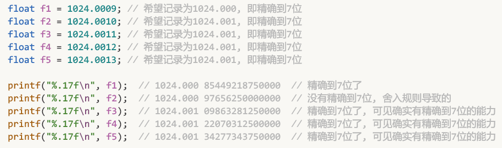

         前文中:

         ```text
         c语言的float.h中有这样一行代码:
         # define FLT_EPSILON 1.192092896e-07F // smallest such that 1.0+FLT_EPSILON != 1.0
         ↑ 定义常量FLT_EPSILON，其值为1.192092896e-07F
         这个 1.192092896e-07F ，其实就是1~2范围中的间隔：1.19209e-7
         源码中说：32位浮点数1.0，最少也要加上FLT_EPSILON这个常量，才能不等于1.0
         换句话说，如果 1.0 加上一个小于 FLT_EPSILON 的数 N，就会出现1.0 + N == 1.0 这种"诡异的情况".
         ```

         这里好像忽略掉了舍入规则：$1\sim2$ 范围中，两个蓝点之间的间隔是：`1.19209e-7`，但这并不意味着想从当前蓝点走到下一个蓝点需要走满一个间隔啊，因为有舍入规则的存在，其实只要走大半个间隔就行了，然后舍入规则会自动把舍入到下一个蓝点。

         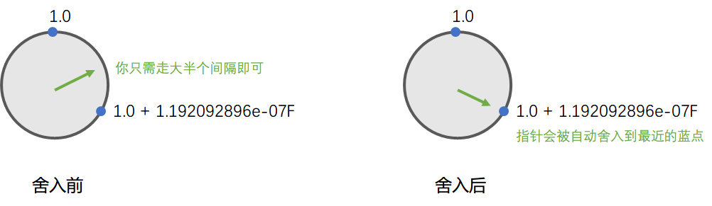

         在c语言中验证:

         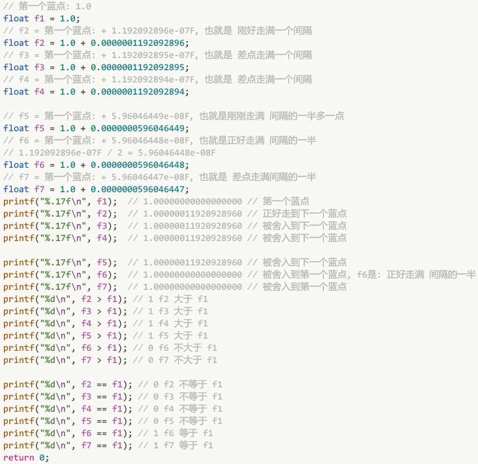

         可见，因为有舍入机制的存在，一个蓝点想移动到下一个蓝点，大体上只需移动间隔的一半多一点即可。而c语言中的这行注释:`# define FLT_EPSILON 1.192092896e-07F // smallest such that 1.0+FLT_EPSILON != 1.0`其实也不太对，1.0 也不需要加上 `FLT_EPSILON` 这一整个间隔才能 $\neq1.0$ (或者说才能到下一个蓝点)，大体上只需加上 FLT_EPSILON的一半多一点 就能 $\neq1.0$ 了(或者说就能到下一个蓝点了).

         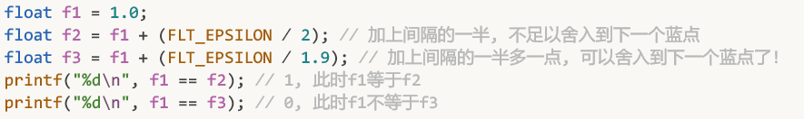

      4. `0.xxxxxxx` 到底能精确到小数点后几位

         32位浮点数能记录7位有效数，那对于 `0.xxxxxxx` 这种格式的数，到底是能精确到小数点后7位，还是小数点后6位. 或者说，此时整数部分的0算不算有效数?

         个人理解，对于`0.xxxxxxx`这也的小数，其实能精确到小数点后7位，即0不算一位有效数

         以 $0.5\sim1$ 这个范围为例，此时的间隔是间隔是`5.96046e-8`，约等于`0.0000 0006`

         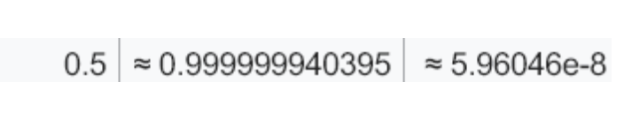

         尝试精确到小数点后8位，发现不行：

         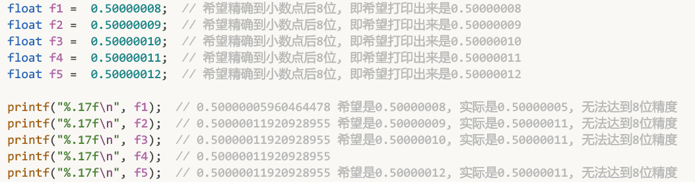

         但精确到小数点后7位确是绰绰有余:

         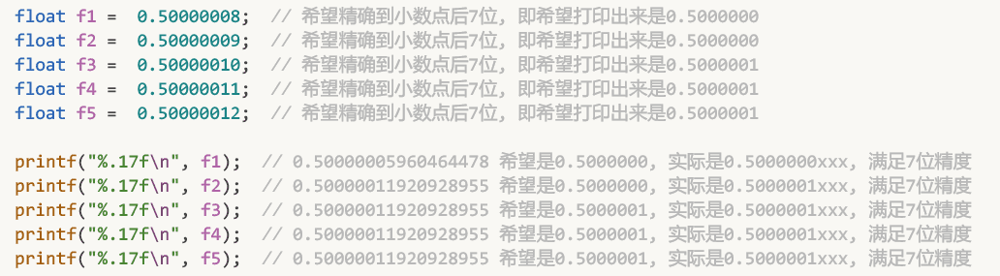

         而 $0\sim0.5$ 之间，间隔则会更小，精度则会更高。因为浮点数表盘上的蓝点是越来越稀疏，精度越来越差的。如果靠后的 $0.5\sim1$ 范围中能精确到小数点后7位，那更靠前的 $0\sim0.5$ 中只会更精确，或者说蓝点只会更密集，间隔只会更小。

         举例:

         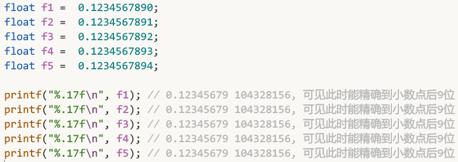

         总之大体来说，32位浮点数的精度是7位有效数。

         事实上，浮点数中只能存储蓝点，蓝点越靠近0就越密集，精度就越高。7位有效数是对这一现象的总结和概括性描述

         最后说一点：有些同学可能会错误的认为32位浮点数类型的精度是：始终能精确到小数点后6位，比如能精确存储999999.123456，但不能精确存储999999.1234567。相信读到这里，大家都能找出这种理解的错误之处了：32位浮点数的精确度是7位有效数，大体来说，这7位有效数，指的是 整数 + 小数一共7位，而不是说始终能精确到小数点后六位。

### 3.2.3 深入理解间隔表

再回头看看这张wiki上的间隔表，其实它主要就是告诉：某个范围中，两个蓝点间的间隔是多少。

比如在 $1\sim2$ 范围中，两个蓝点间的间隔约是`1.19209e-7`在 $8388608\sim16777215$ 范围中，两个蓝点间的间隔是1。


这里其实有几个注意事项:

1. 每个范围中，都有 $2^{23}$ 个蓝点，或者每个区间都被等分为 $2^{23}$ 个间隔。比如范围 $1\sim2$ 会被等分为 $2^{23}$ 个间隔，范围 $8388608\sim16777215$ 也会被等分为 $2^{23}$ 个间隔。

2. 范围的划分由指数决定

   例如：
   * 范围 $1\sim2$ 会被等分为 $2^{23}$ 个间隔，准确来说应该是范围 $2^0\sim2^1$ 会被等分为 $2^{23}$ 个间隔；
   * 范围 $8388608\sim16777215$ 会被等分为 $2^{23}$ 个间隔，准确来说应该是范围 $2^{23}\sim2^24$会被等分为 $2^{23}$ 个间隔。

   每次指数位变更，都会划分出新的范围。

   比如：  
   起点  
   `0 00000010 00000000000000000000000`  
   往前移动 $2^{23}-1$ 步，或者说往前移动 $2^{23}-1$ 个间隔，其实就是尾数从  
   `00000000000000000000000`，  
   一步步变成  
   `11111111111111111111111`  
   再往前走一步，也就是共往前移动了 $2^{23}$ 个间隔，来到了终点：  
   `0 00000011 00000000000000000000000`  
   可见终点相对起点，仅指数位增长了1就确定了一段范围。该范围被等分成了 $2^{23}$ 个间隔。 $(终点-起点)/2^{23}$ 就是每个间隔的长度。  
   再往前走 $2^{23}$ 个间隔，就来到了  
   `0 00000100 00000000000000000000000`，  
   同样是指数变大了1  
   这就不难看出：指数位的变更用于划分范围，尾数位的变更用于往前一步步移动。
   * 有多少个尾数位就决定了每个范围中可以划分出多少个间隔，比如有23个尾数位，就意味着每个范围中可以划分出 $2^{23}$ 个间隔。
   * 有多少指数位，决定可以囊括多少的范围. 比如有8个指数位 (可表示的指数范围是 $[-127，128]$ )，那的范围划分就是这样的:
     * $2^{-127}\sim2^{-126}$ 是一个范围
     * $2^{-126}\sim2^{-125}$ 是一个范围

       $\dots$
     * $2^0\sim2^1$ 是一个范围
     * $2^1\sim2^2$ 是一个范围

       $\dots$
     * $2^{127}\sim2^{128} 是一个范围

     * 每个范围都会被尾数位等分为 $2^{23}$ 份间隔。
   * 增大指数位不会增大精度。比如如果将指数位增大到16位(可表示的指数范围是 $[-32767，32768]$ )，那的范围划分是这样的:
     * $2^{-32767}\sim2^{-32766}$ 是一个范围
     * $2^{-32766}\sim2^{-32765}$ 是一个范围

       $\dots$
     * $2^{-127}\sim2^{-126}$ 是一个范围
     * $2^{-126}\sim2^{-125}$ 是一个范围

       $\dots$
     * $2^0\sim2^1$ 是一个范围
     * $2^1\sim2^2$ 是一个范围

       $\dots$
     * $2^{32767}\sim2^{32768}是一个范围
     * 每个范围依旧会被尾数位等分为 $2^{23}$ 份间隔
     * **注意**： $2^0\sim2^1$ ，这个范围还是被等分为 $2^{23}$ 份间隔， $2^{-126}\sim2^{-125}$ ，这个范围还是被等分为 $2^{23}$ 份间隔，即每个范围的精度都没有任何提升。
   * 增大尾数位才会增大精度：比如，将尾数位增大为48. 则每个范围会被等分为 $2^{48}$ 份间隔. 这样每个范围中的间隔才会变小，蓝点才会变密集，精度才会提升。

**总结**：指数位的多少控制着能囊括多少个范围，尾数位的多少控制着每个范围的精度，或者说控制着每个范围中间隔的大小，蓝点的密度。

## 3.3 从WIKI中的计算方法理解32位浮点数的精度是"7位有效数"

IEEE754标准中规定32位浮点数在内存中表示为: 1位符号位，8位指数位，23位尾数位。而事实上尾数位是24位，因为在尾数位前还隐藏了一个整数部分`1.`或`0.`。

在浮点数内存的三个部分中,

1. 符号位控制正负号;
2. 指数位控制指数；

   也就是控制小数点的移动：就好像在十进制中: $1.2345e2 = 123.45$、 $1.2345e3 = 1234.5$ ，指数位+1只是把小数点向后移动了一位。二进制中也是一样的，指数位也仅仅用于控制小数点的移动。比如 $0.01\rightarrow0.001$ 小数点向左移动了一位。）
3. 尾数位控制精度。

   或者说记录状态：
   在24位尾数中  
   从: `0.0000 0000 0000 0000 0000 000`  
   到: `0.0000 0000 0000 0000 0000 001`  
   ...  
   一直到: `1.1111 1111 1111 1111 1111 111`  
   共包含2^24种状态，或者说能精确记录2^24种不同的状态:  
   `0.0000 0000 0000 0000 0000 000` 是一种状态,  
   `0.0000 0000 0000 0000 0000 001` 又是一种状态,  
   `1.0010 1100 0100 1000 0000 000` 又是另一种状态
   ...  
   如果要记录2^24 + 1种状态，那尾数就不够用了，或者说就不能满足精度需求了。
   在这种视角下，精度和可表示的状态数之间画上了等号。

   总结一下: 32位浮点数一共能记录2^24种状态 (符号位用于控制正负，指数位用于控制小数点的位置. 只有尾数位用于精确记录状态)。对于 `float f = xxx;` 其中`xxx`是个数值，不管`xxx`是用什么进制书写，只要是使用32位浮点数作为容器，就最多只能精确记录2^24种状态，就好像一个32位浮点数大楼中一共有2^24个房间一样。

   事实上，`xxx`我们一般用10进制书写,而 $2^{24} = 16 777 216$(十进制)，即32位浮点数容器最多只能存储16 777 216(十进制)种状态,16 777 216 是个8位数，**所以32位浮点数的精度最多是7位十进制(0 - 9 999 999)，共10 000 000种状态**。如果32位浮点数的精度是8位十进制的话(0 - 99 999 999)，这一共是100 000 000种状态，大于了32位浮点数能存储的状态上限16 777 216...所以说精度到不了8位十进制数。

到这里就分析完毕了，如果用数学表达式表示的话，那么 "32位浮点数的精度最多是N位十进制" ，N是这样算出来的:

$$
N = log_{10}2^{24}\approx 7.2
$$

下面是wiki中对该算法的描述：The number of decimal digits precision is calculated via number_of_mantissa_bits * Log10(2). Thus ~7.2 and ~15.9 for single and double precision respectively.如wiki中所说，32位浮点数的精度大约是7位十进制数，64位浮点数的大约是16位十进制数。

对于这两种理解角度: wiki算法的理解角度更简单一些，可以直接用数学公式计算出精度。从“间隔”理解角度的解释性更强一些，细节更丰富，能解释的现象也更多一些。
