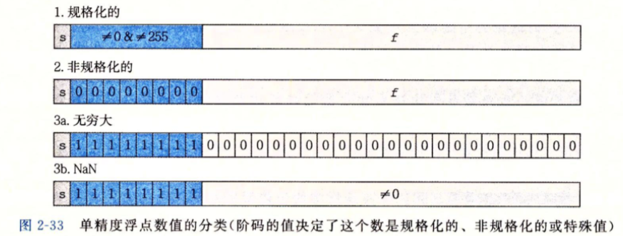
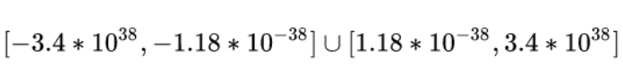
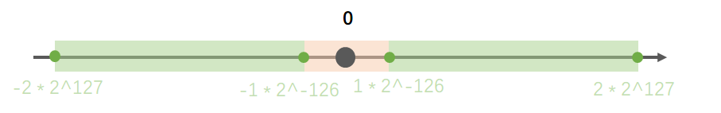
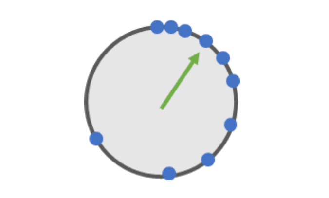
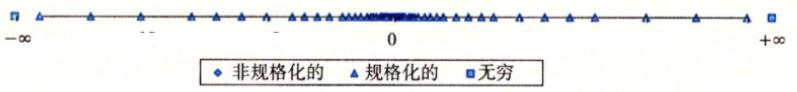
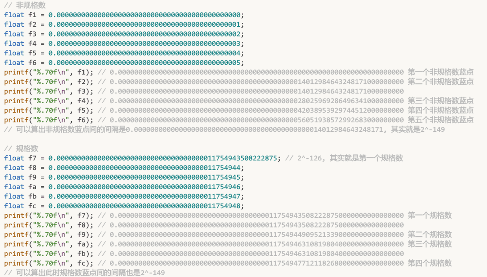
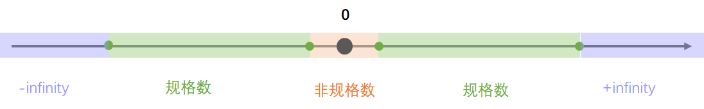
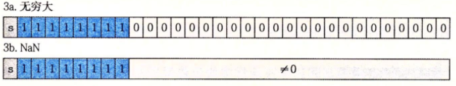
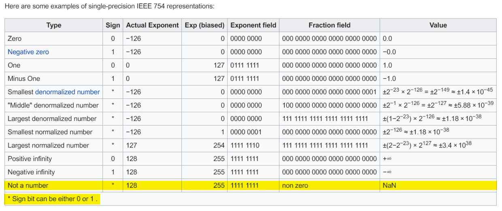

# 四  IEEE754规范: 非规格数，±infinity，NaN

IEEE754标准中，浮点数包含三种状态：normal number(规格数)、subnormal number(非规格数)和non-number(特殊数)，现在详细介绍这三种状态。

## 4.1  如何区分这三种状态

这三种状态是通过指数部分区分的，而且很容易区分。以32位浮点数为例，其内存状态分为1位符号位、8位指数位和23位尾数位。

* 如果8位指数位全为`0`，就代表当前数是个非规格数。即形如`* 00000000 ***********************`格式的数就是非规格数。
* 如果8位指数位全为`1`，就代表当前数是个特殊数。即形如`* 11111111 ***********************`格式的数就是特殊数.
* 如果**8位指数不全为0，也不全为1**(也就是除去以上两种状态外，剩下的所有状态)，这个数就是规格数。如`* 10101100 ***********************`就是一个规格数。

可见非规格数和特殊数是两种特殊状态，规格数则是非常常见的状态，如下图所示：（下图把特殊数分为了两种状态：无穷大和NaN）

## 4.2 三种状态的作用

为什么要把浮点数分为这三种状态呢？

答案当然是有用啊，而且作用相当直观：

* 规格数: 用于表示最常见的数值，比如1.2、34567、7.996、0.2......但规格数不能表示0和非常靠近0的数。
* 非规格数: 用于表示0，以及非常靠近0的数，比如1E-38。
* 特殊数: 用于表示"无穷"和"NaN"。
  * 浮点数的存储和计算中会涉及到"无穷"这个概念，比如32位浮点数的取值范围是

    

    如果你要往里面存储 $4\times10^{38}$ (这超过了最大的可取值)，32位浮点数就会在内存中这样记录 "存储的数超过了最大表示范围，记录为存储了一个无穷大。"
  * 浮点数的存储和计算中还会涉及到“NaN (not a number)”这个概念，比如给一个负数开根号（如 $\sqrt{1}$ ），而IEEE754标准中的浮点数却不知道该怎么进行这个运算，它就会在内存中这样记录 "不知道怎么算，这不是个数值，记录为NaN。"

### 4.2.1 状态一: 规格数

1. 对于规格数
   * 符号位，1位: 可正可负
   * 指数位，8位: 不全为0且不全为1
     * 对于32位浮点数来说，规格数的指数位的取值范围是 $[1，254]$，偏置bias是127，所以实际的指数是:$[1 - 127，254 - 127]$ ，即 $[-126，127]$
   * 尾数位，23位: 尾数位前隐藏的整数部分是`1.`（而非`0.`）
     * 所以尾数位的取值范围是 $[1.00000000000000000000000，1.11111111111111111111111]$ (二进制),换算为10进制为 $[1,2)$

2. 规格数的局限性

   无法表示 0 和 及其靠近0 的数，因为IEEE754浮点数的求值公式是:

   $$
   =\pm 尾数 \times 2^{指数}
   $$

   所以可求出32位浮点数的取值范围就是:

   $$
   =\pm [1,2)\times 2^{[-126,127]}
   $$

   注意尾数部分的取值范围是 $[1，2)$，始终大于1。

   $$
   2^{[-126,127]}
   $$

   这个数始终大于0，即便 $2^{-167}$ 非常小，但还是大于0。一个始终大于1的数乘上一个始终大于0的数，永远无法等于0。其实$1(尾数最小值) * 2^-167(指数最小值) = 2^-167$ ，$2^{-167}$ 就是当前我们能表示的最小值。也就是说，使用规格数时，我们除了无法表示0，也无法表示 $(0，2^{-167})$之间的靠近0的极小数。这就是规格数的局限性，这个局限性将由非规格数解决。

   其实前面计算过32位浮点数的取值范围:

   $$
   =(-2\times2^{127},-1\times2{-126}]\cup[1\times2{-126},2\times2^{127})
   $$

   这里可以画一个示意图:

   

   * 绿色区域就是32位浮点数中规格数的取值范围，可见它取不到0和靠近0的极小数
   * 红色区域包含0和靠近0的极小数，红色区域其实是非规格数的取值范围。

### 4.2.2 状态二: 非规格数

1. 对于非规格数
   * 符号位，1位: 可正可负
   * 指数位，8位: 全为0
     * 对于32位浮点数来说，非规格数的指数位全为0，对应的值也是0。偏置bias依旧是127，但实际指数的计算方法是 $实际指数=1-bias=1-127=-126$ ，即**非规格数的实际指数固定为-126，这是规定。和规格数实际指数的计算方法（ $实际指数 = 指数位的值 - bias$ ）不同**。
   * 尾数位，23位: 尾数位前隐藏的整数部分是`0.`（而非1.）
     * 尾数位的取值范围是 $[0.00000000000000000000000，0.11111111111111111111111]$ (二进制)，换算为10进制为 $[0,1)$
2. 非规格数的作用————表示0和靠近0的数
   * 非规格数表示0：
     1. IEEE754浮点数求值公式:

        $$
        =\pm尾数\times2^{指数}
        $$

     2. 非规格数尾数的取值范围是 $[0，1)$ ，指数固定为-126。
     3. 让尾数取0就能表示数值0:

        $$
        =\pm0\times2^{-126}=\pm0
        $$

    可见当尾数取0时，通过变更符号位，我们可以表示出+0和-0，IEEE754规范中也确实存在着这两种表示0的方式。某些场景下，+0和-0会被认为完全相同，某些场景下，+0和-0又被认为不完全相同。这往往取决于具体的编程语言和应用场景。只需知道IEEE754中可以表示+0和-0即可，+0和-0在IEEE754中是两种内存状态(符号位不同)。

   * 非规格数表示接近0的数:

     准确来说，对于32位浮点数，非规格数如何表示：

     $$
     =(-1\times2^{-126},1\times2^{-126})
     $$

     之间的数。也就是如何表示出下图中的红色区域的:

     

     1. 浮点数求值公式:

        $$
        =\pm尾数\times2^{指数}
        $$

     2. 非规格数尾数的取值范围是 $[0，1)$，指数固定为-126.
     3. 非规格数的取值范围就是:

        $$
        \pm[1,2)\times2^{-126}
        =(-1\times2^{-126},0]\cup[0,1\times2^{-126})
        =(-1\times2^{-126},1\times2^{-126})
        $$

   现在我们尝试着把32位浮点数中的非规格数的取值范围，和规格数的取值范围拼接在一起，即32位浮点数中，非规格数的取值范围:

   $$(-1\times2^{-126},1\times2^{-126})$$

   32位浮点数中，规格数的取值范围:

   $$
   (-2\times2^{127},-1\times2^{-126}]
   \cup
   [1\times2^{-126},2\times2^{127})
   $$

   可以看见非规格数的取值范围，正好可以卡在规格数取值范围的中间，现在我们得到了一个完整的取值范围:

   $$(-2\times2^{127},2\times2^{127})$$

   这就是非规格数的作用: 用于表示0和靠近0的数，和规格数形成一个完整的取值范围。

3. 非规格数补充
   1. 逐渐溢出

      前文说过，非规格数中尾数的取值范围是 $[0，1)$ ，指数固定为-126，所以是尾数的变化在导致非规格数的值变大。例如`0 00000000 00000000000000000000001`就比`0 00000000 00000000000000000000000`要大一些随着尾数逐渐增大，相应的非规格数也在不断增大:...`0 00000000 11111111111111111111111` 这是非规格数的最大值，此时尾数(带上隐藏的整数部分0.)其实是0.11111111111111111111111，是个比1小一点点的数，不妨记做 $1-\varepsilon$ ，则此时非规格数的值就是

      $$(1-\varepsilon)\times2^{-126}$$

      此时再往前前进一格就会进入规格数的范围:`0 00000001 00000000000000000000000`。这是个规格数,其尾数位的值隐藏了1.或者说此时真正的尾数应该是1.00000000000000000000000 ，也就是1。其指数位的值是1，则实际指数应该是1 - bias = 1-127 = -126。所以这个规格数的值就是

      $$1\times2^{-126}$$

      这是规格数的最小值。可以发现非规格数的最大值:

      $$(1-\varepsilon)\times2^{-126}$$

      和规格数的最小值:

      $$1\times2^{-126}$$

      两者之间实现了非常平滑的过度，非规格数的最大值非常紧密的连接上了规格数的最小值。非规格数 "一点点逐渐变大，最后其最大值平稳的衔接上规格数的最小值"，这种特性在IEEE754中被叫做逐渐溢出(gradual underflow)

      明白了这一点，就很容易解释：
      1. 为什么规定非规格数的尾数前隐藏的整数部分是`0.`而规格数尾数前隐藏的整数部分是`1.`;
      2. 为什么非规格数的真实指数的计算公式是 1 - bias，而规格数的真实指数的计算公式是 指数部分的值 - bias 了

      这些设计实现了逐渐溢出这种特性：

      关于第1点，这使得非规格数的尾数取值范围是 $[0,1)$ ，而规格数的尾数取值范围是 $[1,2)$ ，两者平滑的衔接在了一起。

      关于第2点，这使得对于32位浮点数来说，非规格数的真实指数固定为-126，而规格数的指数是  $[-126，127]$ ，两者也平滑的衔接在了一起。

   2. 密集分布

      前面提到：如果把IEEE754浮点数想象成一个表盘的话，那表盘上的蓝点是越来越稀疏的。或者说越靠近0越密集。

      

      不过当时仅讨论了规格数的分布情况，而非规格数的蓝点分布间隔和规格数中蓝点最密集的区域(也就是最靠近0的区域)是一致的。

      验证:

      非规格数的范围是

      $$[0,1\times2^{-126})$$

      在这个范围中分布了2^23个蓝点，则蓝点间的间隔是

      $$
      2^{-126}/2^{23}=2^{-149}
      $$

      规格数中蓝点最密集的区域，也就是最靠近0的区域是:

      $$[2^{-126},2^{-125}]$$

      在这个范围中分布了2^23个蓝点，则蓝点间的间隔是:

      $$(2^{-125}-2^{-126})/2^{23}=2^{-126}/2^{23}=2^{-149}$$

      所以，即便把非规格数与规格数放在一起审视，IEEE754浮点数表盘上的蓝点依旧是越靠近0越密集，越靠近 $\infty$ 越稀疏。计算机系统第三版浮点数密度的示意图中间部分密密麻麻的都是非规格数：

      

      下面是在c语言中的测试结果:

      

### 4.2.3 状态三: 特殊数

特殊数分为两种: 无穷和NaN

1. 无穷

   无穷和非规格数有很多相似之处，对于无穷:

   * 符号位，1位: 可正可负
   * 指数位，8位: 全为1
   * 尾数位，23位: 全部为0
   * 当内存位于上述状态时，就表示无穷(infinity)
   * 具体写出来就是: `* 11111111 00000000000000000000000` 表示无穷(infinity)，其中符号位可正可负，分别记做+infinity和-infinity。

   以32位浮点数为例，其规格数的取值范围是:

   $$
   (-2\times2^{127},-1\times2^{-126}]
   \cup
   [1\times2^{-126},2\times2^{127})
   $$

   * 当要存储的数大于规格数取值范围的最大值时，就会被记做+infinity，比如2^128，刚刚超过规格数的取值范围的最大值，就会被记做+infinity；
   * 当要存储的数小于规格数取值范围的最小值时，就会被记做-infinity，比如-2^128，刚刚小于规格数的取值范围的最小值，就会被记做-infinity。
   * **注意**：
     * 所有+infinity的内存状态都是`0 11111111 00000000000000000000000`，不会有任何变动：2^128对应的内存状态是`0 11111111 00000000000000000000000`，2^123456789对应的内存状态还是`0 11111111 00000000000000000000000`。
     * 所有-infinity的内存状态都是`1 11111111 00000000000000000000000`。

   * 此外，就像非规格数的最大值可以和规格数的最小值平稳衔接一样，规格数的最大值也可以和+infinity平稳衔接：规格数的最大值是`0 11111110 11111111111111111111111`；尾数位其实是`1.11111111111111111111111`，非常接近2，不妨记做 $2-\varepsilon$ ；指数是127；所以最大值是

     $$(2-\varepsilon)\times2^{127}$$

     +infinity的内存状态则是`0 11111111 00000000000000000000000`；尾数是`1.00000000000000000000000`，等于1；指数是128；所以+infinity的内存状态对应的值是

     $$2^{128}$$

     可见规格数的最大值也能和+infinity平稳衔接，-infinity同理。

   现在就集齐了整个数轴:

   

   而且各个节点都能平稳的衔接在一起
2. NaN

   NaN则更简单，前面说过，如果计算出来的值不是一个数值，则记录为NaN。NaN的内存状态是：
   * 符号位，1位: 可正可负
   * 指数位，8位: 全为1
   * 尾数位，23位: 不全为0即可

   

   仅仅是一种特殊状态标记而已。

   需要注意的是，根据wiki，没有+NaN或-NaN这种说法，统称为NaN

   
