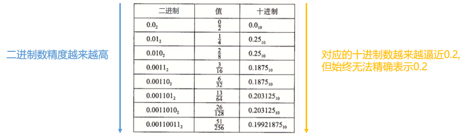
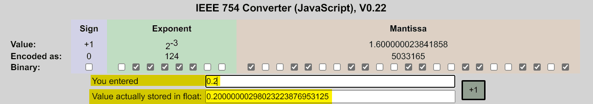
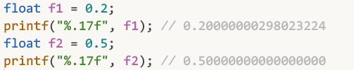
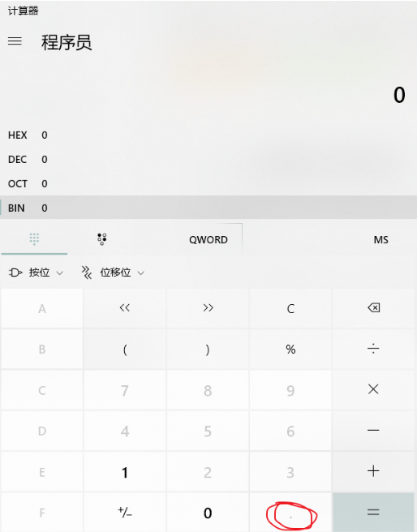
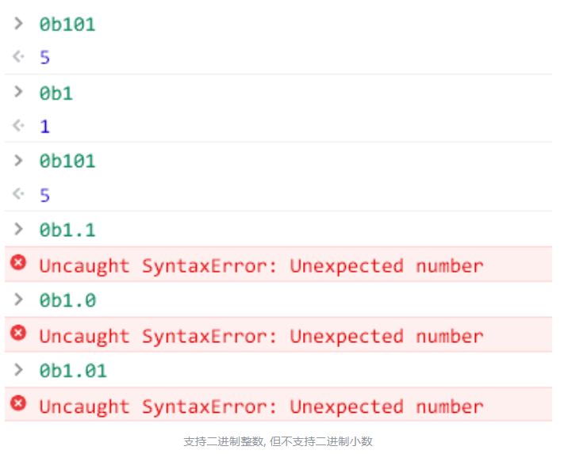
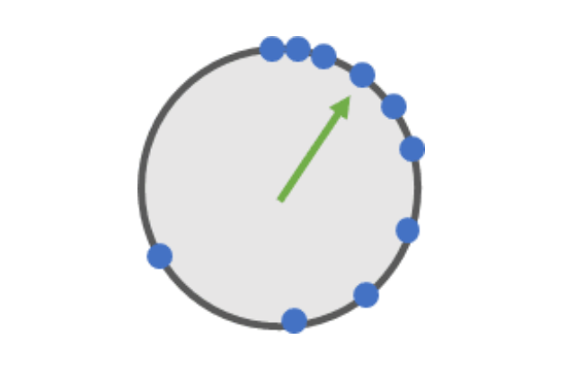
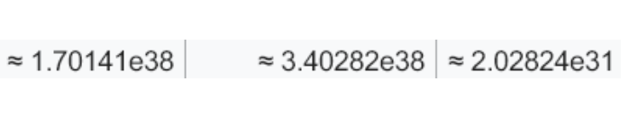
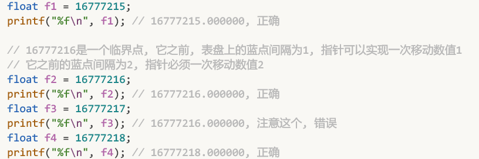
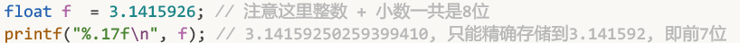

# 五、 IEEE 754规范的一些补充

## 5.1 导致浮点数存储不精确的其他原因

1. IEEE754标准中的小数是离散的导致了存储不精确

   前面提到数学中的小数是连续的，而计算机中的小数（准确来说是IEEE754标准中的小数）是离散的。

   

   这就会引发精度问题：图中的绿色指针只能指向蓝点，不能指向蓝点之间的数。比如上面最右边的图，绿色指针其实无法指向0.3，当你想要指向0.3时，实际上会被舍入为0.234，即舍入到离它最近的蓝点对应的值。
2. 进制问题也会导致IEEE754浮点数存储不精确

   简单来说就是有限长度编码下，每种进制都有他们不能精确表示的值。比如10进制不能精确的表示1/3 (0.3333333.....)，十进制可以精确表示1/5 (0.2)，但二进制无法精确表示1/5。不能精确表示时，只能取近似值。编码长度越长，近似程度越高。

   下图尝试用二进制表示0.2，可以发现，只能近似表示：

   

   当你把一个十进制数存储到计算机中时，实际上存储的是该数的二进制表示。所以，当写入如下代码`float f = 0.2;`时，虽然0.2(十进制)远远没有到达32位浮点数的精度上限(7位精度)，但计算机其实无法精确地存储该数值，因为0.2(十进制)无法使用二进制格式精确表示。此时变量f对应的内存状态是这样的:

   

   输入的是0.2，内存中实际存储的是`0.20000000298023223876953125`

   在c语言中验证：

   

   可见十进制的0.2无法用二进制精确表示，但十进制的0.5却可以用二进制精确表示。

## 5.2 二进制的小数形式

在IEEE765标准中，会经常和二进制小数打交道，所以这里补充一点相关内容。二进制为什么会有小数形式？常见的二进制都是整数形式，比如十进制的9，表示为二进制是`1001`。怎么会有`1001.101`这种二进制的小数格式呢？这里确实比较容易让人困惑，比如win10自带的计算机就不支持二进制小数：

许多编程语言，比如js也不支持直接使用二进制小数：

但和十进制一样，二进制其实也有小数形式，而且很容易理解，比如对于十进制数78.23：

* 十位：7，表示： $7\times10^1$ ；
* 个位：8，表示： $8\times10^0$ ；
* 十分位：2，表示 $\frac2{10}$ ，或说表示： $2\times10^{-1}$ ；
* 百分位：3，表示 $\frac3{100}$ ，或说表示：$3\times10^{-2}$ ；
* 这个十进制所表示的值是 $70 + 8 + \frac2{10} + \frac3{100}$ 。

二进制数也是同理的，比如对于二进制数 10.11：

* 第一位：1，表示 $1 * 2^1 = 2$ ；
* 第二位：0，表示 $0 * 2^0 = 0$ ；
* 第三位：1，表示 $1 * 2^{-1} = 0.5$ ；
* 第四位：1，表示 $1 * 2^{-2} = 0.25$ ；
* 所以这个二进制表示的值，其实就是十进制的 $2 + 0 + 0.5 + 0.25 = 2.75$ 。

这里比较有趣的一点是：

* 十进制小数点后面的那一位(也就是十分位)，对应的权是 $\frac1{10}$ ，也就是0.1。例如十进制数3.4，这个4对应的值是 $4 * 权 = 4 * 0.1 = 0.4$ ；
* 二进制小数点后面的一位，对应的权是 $\frac1{2}$ ，也就是十进制的0.5。假设有二进制数0.1，则这个1对应的值是 $1\times0.5 = 0.5$ ，所以二进制的0.1，其实等于十进制的0.5。

  脑筋急转弯：什么时候 0.1 比 0.2 要大？

  答：当0.1是个二进制数，而0.2是个十进制数的时候。

事实上，对于小数点之后的位，二进制的位权始终比十进制的位权要大。因为十进制数中小数点之后的位权依次是 $\frac1{10}$ 、 $\frac1{100}$ 、 $\frac1{1000}\dots$ ；二进制数中小数点之后的位权依次是 $\frac12$ 、 $\frac14$ 、 $\frac18\dots$ 相应位的权始终比十进制的要大。所以会出现一种现象：二进制：1.000001，小数点后面的数看起来已经很小很小了，对应的十进制是：1.015625，小数点后面的数其实还挺大。

## 5.3 关于32位浮点数的错误认知

1. 32位浮点数能存储很大的整数

   这是32位浮点数的取值范围:

   $$
   [-3.4\times10^{38},1.18\times10^{-38}]
   \cup
   [1.18\times10^{-38},3.4\times10^{38}]
   $$

   这个取值范围时很大？一个浮点数，占用32字节，竟然能存储下约 $±340000000000000000000000000000000000000$ 这么大的数。相比之下，一个同样32字节的long类型，存储范围只有约 $\pm2147483647$ ，那为什么还要用long类型？

   那是因为32位浮点型确实最大可以存储到 $3.4\times10^{38}$,这么大的数，但精度很低。前文说过，32位浮点数表盘中的蓝点会越来越稀疏：

   

   等到了 $3.4\times10^{38}$这么大的数时，其实蓝点已经稀疏的不成样子了，基本是不可用状态。根据wiki中给出的间隔，对于 $1.70141\times10^{38}\sim3.40282\times10^{38}$ 范围中的数，间隔是 $2.02824\times10^{31}$

   

   也就是说，32位浮点数中大体上能精确存储 $1.70141\times10^{38}$ 但无法精确存储 $1.70141\times10^{38}+1$ 也无法精确存储 $1.70141\times10^{38}+2$ ，也无法精确存储 $1.70141\times10^{38}+100000000000$ 。下一个能精确存储的数是： $1.70141\times10^{38}+20282400000000000000000000000000$ (即加上间隔)，这个精度基本上是不可用的。

   事实上，如果要用float存储整数的话，最多只能精确存储到 16777216。再大的话，间隔就会变为2，就不适合用来存储整数了:

   

   此时同为32位的long类型，能精确存储的整数范围约是：$\pm2147483647$ 比 $\pm16777216$ 大多了。所以存储大整数还是应该选择long类型。

   **总结**：32位浮点数只是有能力存储到：$3.4\times10^{38}$，实际上存储的数过大会导致精度过低，基本上不可用。用32位浮点数存储整数时，只适用存储 $\pm16777216$ 之间的整数。
2. 32位浮点数能存储很精确的小数

   同样的，在32位浮点数的取值范围中：

   $$
   [-3.4\times10^{38},1.18\times10^{-38}]
   \cup
   [1.18\times10^{-38},3.4\times10^{38}]
   $$

   看起来好像能存储 $1.18\times10{-38}$这么精确的小数，但其实和存储整数一样，32位浮点数只是有能力存储到 $1.18\times10^{-38}$ 这么小的小数而已。

   在关于32位浮点数的精确度是7位有效数的内容中就有解释过：当要存储的数的 $整数部分+小数部分>7位$ 时，32位浮点数就无法精确存储了。比如，32位浮点数就不能精确存储我们常背的部分圆周率

   

   32位浮点数倒是可以存储常见的月工资，比如 5078.65，或 12665.73。但如果要存储年工资，或把工资存储到3位小数，32位浮点数就不一定够用了。所以，虽然32位浮点数的取值范围看起来很大，足足有:

   $$
   [-3.4\times10^{38},1.18\times10^{-38}]
   \cup
   [1.18\times10^{-38},3.4\times10^{38}]
   $$

   但其实32位浮点数只适合存储常见数据。

   感性地去认知的话，float(也就是32位浮点数)类型其实和int类型有些相似：int用于存储最常用，最自然的整数。float则用于存储最常用，最自然的浮点数...编程时，如果要存储的数很大或精度很高(相对来说，这些数往往不怎么常用或不怎么自然)，就要考虑改用long或double.

   精确来说的话，就是不要被32位浮点数骇人的取值范围吓到。而是记住事实上它只能存储7位有效数就行了。
