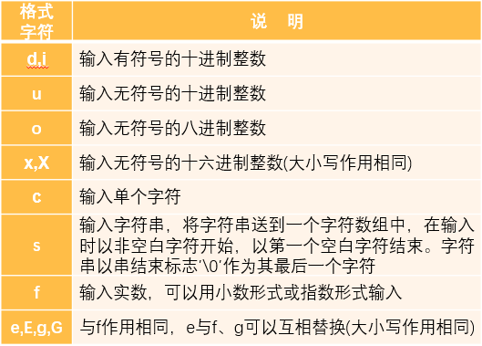

# 第 3 章 顺序程序设计

## 3.2 数据的表现形式及运算

### 3.2.1 常量和变量

1. 常量

   在程序运行过程中，其值不能被改变的量，有以下几类：
   1. 整型常量  
      不带小数点的数值是整型常量，但应注意其有效范围。
   2. 实型常量
      * 十进制小数形式，由数字和小数点组成。
      * 指数形式，e或E之前必须有数字。  
      计算机输入输出时，无法表示上角和下角，  
      规定以字母e或E表示以10为底的指数，  
      e或E之前必须是数字，且后面必须是整数。
   3. 字符常量
      * 普通字符  
        用单撇号括起来的一个字符
      * 转义字符  
        以字符\开头的字符序列
        
   4. 字符串常量  
      用双撇号括起来的若干个字符
   5. 符号常量  
      用#define指令，指定一个符号名称代表一个常量。  
      使用符号常量的好处：
      * 含义清楚，见明知意；
      * 一改全改。
        符号常量和变量的区别：
      * 符号常量不占内存，在预编译后这个符号就不存在了，故不能对符号常量赋以新值；
      * 为与变量相区别，习惯上符号常量用大写表示。
2. 变量

   代表一个有名字的、具有特殊属性的存储单元。它用来存放数据，也就是存放变量的值。
   1. 变量必须先定义后使用。
   2. 变量名实际上是以一个名字代表的一个存储地址。
3. 常变量

   用关键字const修饰的变量，在变量存在期间其值不能改变。
   * 常变量与常量的区别：
     * 常变量有类型，占存储单元，只是不允许改变其值；
     * 常变量是有名字的不变量，常量时没有名字的不变量。
   * 常变量和符号常量的区别：
     * 定义符号常量用#define指令，它是预编译指令，用来代表一个常量，在预编译时仅是进行常量替换，预编译之后就不存在了。对符号常量的名字是不分配存储单元的。
     * 常变量占存储单元，有变量值，只是该值不改变。从使用角度看，常变量具有符号常量的优点，而且使用方便。有了常变量以后，可以不必多用符号常量。
4. 标识符

   用来对变量、符号变量名、函数、数组、类型等命名的有效字符序列统称为标识符 （identifier）

   只能有字母、数字和下划线3种字符组成，且第1个字符必须为字母或下划线。

   C语言种的关键字

   

### 3.2.2 数据类型

C语言要求在定义变量时都要指定变量的类型。常量也是区分类型的。  
类型，就是对数据分配存储单元的安排，包括存储单元的长度以及数据的存储形式。

1. 为什么要指定数据的类型？

   在计算机中，数据是存放在存储单元中的，它是具体存在的，而存储单元是由有限的字节构成，每一个存储单元中存放数据的范围有限，所谓类型，就是对数据分配存储单元，包括存储单元的长度（占多少字节）以及数据的存储形式。
2. C语言允许使用的类型:

   

   * 基本类型和枚举类型变量的值都是数值，统称为算术型（arithmetic type）
   * 算术类型和指针类型变量的值是以数字来表示的，统称为纯量类型（scalar type）
   * 数组类型和结构体类型统称为组合类型（aggregate type）
   * 共用体类型在同一时间内只有一个成员具有值，不属于组合类型；
   * 函数类型用来定义函数，描述一个函数的接口，包括函数返回值的数据类型和参数的类型。

### 3.2.3 整型数据

1. 整型数据的分类
   1. 基本整型（int）
      * 占4个字节。
      * 在存储单元中的存储方式是：
      * 用整数的补码形式存放。
      * 正数的补码是它的二进制真值，
      * 负数的补码是其绝对值的补码取反再加1。

        
   2. 短整型（short）
      * 占 2 个字节  
      * 取值范围： $*2^{15}\sim 2^{15}*1$
   3. 长整型（long）
      * 占 4个字节
   4. 双长整型（long long int）
      * 占 8 个字节
2. 整型变量的符号属性
   * 只有整型(包括字符型)数据可以加signed或unsigned修饰符，实型数据不能加。
   * 在类型符号前加修饰符unsigned，表示该变量是“无符号整数”类型，加signed，则是“有符号类型”。
   * 有符号类型数据存储单元最高位表示符号，无符号型存储单元中全部位都作存放的数值本身。
   * 对无符号整型数据用“%u”格式输出。

   
   说明：C标准没有具体规定各种类型数据所占用存储单元的长度，只要求sizeof(short)≤sizeof(int)≤sizeof(long)≤sizeof(long long)，具体由各编译系统自行决定的。

   sizeof是测量类型或变量长度的运算符。

### 3.2.4 字符型数据

1. 字符与字符代码  
   字符是以整数形式（字符的ASCII代码）存放在内存单元中的，而所有127个字符的ASCII代码最多用7个二进制位就可以表示，所以在C语言中，指定用1个字节（8位）存储一个字符，此时字节中第1位置为0。
2. 字符变量  
   用类型符char定义，占1个字节，如果在定义变量时既不加signed也不加unsigned，C标准并未规定是按 signed char处理还是按unsigned char处理，由各编译系统决定。把char变量改为unsigned char，即第一位并不固定设为 0，而是把8位都用来存放字符代码，这样可以存放255个字符代码。

3. ASCII字符集包括：

   * 字母: 大写英文字母A~Z，小写英文字母a~z
   * 数字: 0～9
   * 专门符号: 29个,包括! "  #  &  '  (  )  *  +  ,  -  .  /  :  ;  <  =  >  ?  [  \  ]  ^  _  `  {  |  }  ~
   * 空格符: 空格、水平制表符(tab)、垂直制表符、换行、换页(form feed)
   * 不能显示的字符: 空(null)字符(以'\0'表示)、警告(以'\a'表示)、退格(以'\b'表示)、回车(以'\r'表示)等

   

### 3.2.5 浮点型数据

浮点型数据是用来表示具有小数点的实数的。在C语言中，实数是以指数形式存放在存储单元中的。

规范化的指数形式：把小数部分中小数点前的数字为0、小数点后第一位数字不为0。

计算机中用二进制来表示小数部分以及用2的幂次来表示整数部分。在4个字节（32 位）中，有的编译系统以 24 位表示小数部分（包括符号），以8位表示指数部分（包括指数的符号）。

[IEEE754关于浮点数取值范围的规范](https://blog.csdn.net/gao_zhennan/article/details/120717424)


### 3.2.6 常量的类型

1. 整型常量
   * 不带小数点的数值是整型常量，但应注意其取值范围。不同编译系统给整型数据分配的字节数不同，因此，取值范围也不同。
   * 在一个整数的末尾加大写字母L或小写字母l，表示它是一个长整型（long int）。
2. 浮点型常量
   * 凡以小数形式或指数形式出现的实数，是浮点型常量，在内存中以指数形式存储。
   * 凡以小数形式或指数形式出现的实数，是浮点型常量，在内存中都以指数形式存储。
   * C程序中的实型常量都是双精度浮点型常量。
   * 可以在常量的末尾加专用字符，强制指定常量的类型，如F或f表示float型常量。
   * 有的C编译系统把所有实数都作为双精度数处理。因此在初始化时把一个双精度常量赋给月份float型变量时，会显示”警告“信息。可以在常量后加”f“标注。

   区分类型和变量

   * 类型是变量的属性；
   * 变量占存储单元，是具体存在的实体，可以存放数据；
   * 类型是变量的共性，是抽象的，不占存储单元，不能存放数据。

### 3.2.7 运算符和表达式


1. 基本算术运算符  
   除法运算符/中，两个实数相除的结果是双精度实数，如果除数或被除数中有一个为负值，多数 C 编译系统采取“向零取整”的方法。
2. 自增自减运算符  

   ```text
   ++i，**i   在使用ｉ之前，先使ｉ的值加/减1
   i++，i**   在使用ｉ之后，使ｉ的值加/减1
   ```

   建议谨慎使用++和**运算符，只用最简单的形式，即i++，i**，且把它们作为单独的表达式。
3. 算术表达式和运算符的优先级和结合性  
   用算术运算符和括号将运算对象（也称操作数）连接起来的、符合Ｃ语法规则的式子称为C算术表达式。

   运算对象包括常量、变量、函数等。

   C语言规定了运算符的优先级(例如先乘除后加减)，还规定了运算符的结合性。

   在表达式求值时，先按运算符的优先级别顺序执行，当在一个运算对象两侧的运算符的优先级别相同时，则按规定的“结合方向”处理。Ｃ语言规定了各种运算符的结合方向（结合性）， “自左至右的结合方向”又称“左结合性”，即运算对象先与左面的运算符结合。相反“自右至左的结合方向”称为“右结合性”。

4. 不同类型数据间的混合运算

   如果一个运算符两侧的数据类型不同，则先自动进行类型转换，使二者成为同一种类型，然后进行运算。整型、实型、字符型数据间可以进行混合运算。
   规律为：

   * +、*、*、/运算的两个数中有一个数为float或double型，结果是double型，因为系统将所有float型数据都先转换为double型，然后进行运算。
   * 如果int型与float或double型数据进行运算，先把int型和float型数据转换为double型，然后进行运算，结果是double型。
   * 字符(char)型数据与整型数据进行运算，就是把字符的ASCII代码与整型数据进行运算。如果字符型数据与实型数据进行运算，则将字符的ASCII代码转换为double型数据，然后进行运算。

      float和double $\to$ double  
      int、float和double $\to$ double  
      char和整型 $\to$ 整型、char和实型 $\to$ double

5. 强制类型转换运算符
   1. 自动类型转换

      在运算时不必用户干预，系统自动进行的类型转换。
   2. 强制类型转换

      当自动类型转换不能实现目的时，可以用强制类型转换。

      一般形式：**(类型名)(表达式)**

      例如：a=(double)x;

      **注意**：进行强制类型运算(int)x后得到一个int类型的临时值，它的值等于ｘ的整数部分，把它赋给a，注意x的值和类型都未变化，仍为float型。该临时值在赋值后就不再存在了。

## 3.3 C语句

C程序结构


### 3.3.1 C语句的作用与分类

语句的作用是向计算机操作系统发出指令，要求执行相应操作。（一个C语句经过编译后产生若干条机器指令。声明部分不是语句，它不产生机器指令，只是对有关数据的声明。）

分类：

1. 控制语句
   * `if()...else...`
   * `for()`
   * `do...while()`
   * `while()`
   * `switch()`
   * `continue`
   * `break`
   * `return`
   * `goto`
2. 函数调用语句

   由一个函数调用加一个分号构成。
3. 表达式语句

   由一个表达式加一个分号构成。
4. 空语句

   只有一个分号（;）的语句；

   可以用来作为流程的转向点，  
   也可用作循环语句的循环体。
5. 复合语句

   用{}括起来的语句和声明，又称语句块。  
   **注意**：复合语句中最后一个语句末尾的分号不能忽略不写。

### 3.3.2 赋值语句

1. 赋值运算符 =

   “=”的作用是将一个数据赋给一个变量，也可以将一个表达式的值赋给一个变量。
2. 复合赋值运算符

   在赋值符=之前加上其他运算符，可以构成复合的运算符。

   凡是二元（二目）运算符，都可以与赋值符一起组合成复合赋值符。
有关算术运算的复合赋值运算符有+=，－=，=，／=，％=。

3. 赋值表达式

   赋值表达式的作用是将一个表达式的值赋给一个变量，因此赋值表达式具有计算和赋值的双重功能。

   一般形式：变量 赋值运算符 表达式，如：a =(b*c)

   对赋值表达式求解的过程是：
   * 求赋值运算符右侧的“表达式”的值，
   * 赋给赋值运算符左侧的变量。既然是一个表达式，就应该有一个值，表达式的值等于赋值后左侧变量的值。
   * 赋值运算符左侧应该是一个可修改值的“左值”(left value，简写为lvalue)。
   * 能出现在赋值运算符右侧的表达式称为“右值”(right value，简写为rvalue)。右结合性
4. 赋值过程中的类型转换
   如果赋值运算符两侧的类型不一致，但都是基本类型时，在赋值时要进行类型转换。类型转换是由系统自动进行的，转换的规则是：

   1. 将浮点型数据（包括单、双精度）赋给整型变量时，先对浮点数取整，即舍弃小数部分，然后赋予整型变量。
   2. 将整型数据赋给单、双精度变量时，数值不变，但以浮点数形式存储到变量中。
   3. 将一个double型数据赋给float变量时，先将双精度数转换为单精度，即只取6～7位有效数字，存储到float型变量的4个字节中。应注意双精度数值的大小不能超出float型变量的数值范围；将一个float型数据赋给double型变量时，数值不变，在内存中以8个字节存储，有效位数扩展到15位。
   4. 字符型数据赋给整型变量时，将字符的ASCII代码赋给整型变量。
   5. 将一个占字节多的整型数据赋给一个占字节少的整型变量或字符变量时，只将其低字节原封不动地送到被赋值的变量（即发生“截断”）。

5. 赋值表达式和赋值语句

   C语言的赋值语句属于表达式语句，由一个赋值表达式加一个分号组成。
在一个表达式中可以包含另一个表达式。
   **注意区分赋值表达式和赋值语句**
   * 赋值表达式的末尾没有分号，而赋值语句的末尾必须有分号。
   * 在一个表达式中可以包含一个或多个赋值表达式，但绝不能包含赋值语句。
6. 变量赋初值

   可以用赋值语句对变量赋值，也可以在定义变量时对变量赋以初值。
   一般形式：**类型 变量 = 值**

## 3.4 数据的输入输出

### 3.4.2 有关数据的输入输出的概念

1. 以计算机为主体；
2. C语言不提供输入输出语句
3. 由C语言标准函数库中的函数实现。

   要在程序文件的开头用预处理指令#include把有关头文件放在本程序中
   #include指令说明
   三种形式：
   * 按指定路径查找文件：#include "c:\cpp\include\myFile.h"
   * 源程序文件所在目录：#include "myFile.h"
   * C编译系统指定的include目录：#include <myFile.h>

### 3.4.3 用printf函数输出数据

用来向终端（或系统隐含指定的输出设备）输出若干个任意类型的数据。

1. 一般形式：

   `printf(参数1，参数2，参数3，...，参数n)`  。参数1必须有，参数2～参数n是可选的

   `printf(格式控制，输出表列)`

   * “格式控制”是用双引号括起来的一个字符串，称为格式控制字符串，简称格式字符串。包括：
      * 格式声明。格式声明由“%”和格式字符组成。作用是将输出的数据转换为指定的格式后输出。
      * 普通字符。普通字符即需要在输出时原样输出的字符。
   * 输出表列是程序需要输出的一些数据，可以是常量、变量或表达式。

2. 格式声明：

   `%  附加字符  格式字符`

   * printf函数输出时，务必注意输出对象的类型应与上述格式说明匹配，否则将会出现错误。
   * 除了X,E,G外，其他格式字符必须用小写字母，如%d不能写成%D。
   * 可以在printf函数中的格式控制字符串内包含转义字符，如\n,\t,\b,\r,\f和\377等。
   * 一个格式声明以“%”开头，以格式字符之一为结束，中间可以插入附加格式字符（也称修饰符）。
   * 如果想输出字符“%”，应该在“格式控制字符串”中用连续两个“%”表示，如：printf(″%f%%\n″,1.0/3);

   格式字符

   

   附件字符

   

### 3.4.4 用scanf函数输入数据

1. 一般形式：

   `scanf（格式控制，地址表列）`

   * “格式控制”是用双引号括起来的一个字符串，含义同printf函数。包括：
      * 格式声明。以%开始，以一个格式字符结束，中间可以插入附加的字符。
      * 普通字符。
   * 地址表列是由若干个地址组成的表列，可以是变量的地址，或字符串的首地址。

2. 格式声明：

   * scanf函数中的格式控制后面应当是变量地址，而不是变量名。
应与上述格式说明匹配，否则将会出现错误。
   * 如果在格式控制字符串中除了格式声明以外还有其他字符，则在输入数据时在对应的位置上应输入与这些字符相同的字符。
   * 在用“％c”格式声明输入字符时，空格字符和“转义字符”中的字符都作为有效字符输入。
   * 在输入数值数据时，如输入空格、回车、Tab键或遇非法字符(不属于数值的字符)，认为该数据结束。
   * 在scanf函数中多个格式符没有间隔时，输入空格时系统认为前一个数据到此结束。
   * 在用scanf输入双精度实型数据时，应当在格式符f的前面加修饰符l（小写字母），表示长浮点型。

   格式字符

   

   附加字符：

   
3. 使用scanf时应注意的问题：
   * **“格式控制”后是变量地址**
   * “格式控制字符串”中除格式声明外还有其他字符，输入时对应位置应输入相同字符
   * **“%c”输入时，空格和“转义字符”均为有效字符**
   * **数值输入时，空格、回车、tab或其他非法字符则结束**

### 3.4.5 字符数据的输入输出


1. putchar函数

   从计算机向显示器输出一个字符。

   ` putchar(c) `

   * 用putchar函数既可以输出可显示字符，也可以输出控制字符和转义字符。
   * c可以是字符常量、整型常量、字符变量或整型变量(其值在字符的ASCII代码范围内)。

2. getchar函数

   向计算机输入一个字符。

   `getchar()`

   * 函数没有参数。
   * 函数的值就是从输入设备得到的字符。
   * 只能接收一个字符。
   * 如果想输入多个字符就要用多个函数。
   * 不仅可以从输入设备获得一个可显示的字符，而且可以获得控制字符。
   * 用getchar函数得到的字符可以赋给一个字符变量或整型变量，也可以作为表达式的一部分。如，putchar(getchar());将接收到的字符输出。
