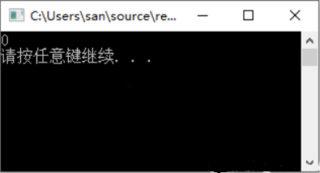
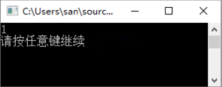
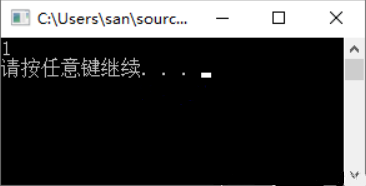
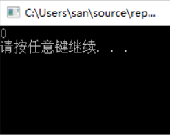
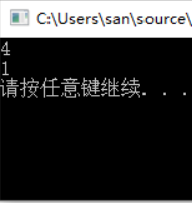
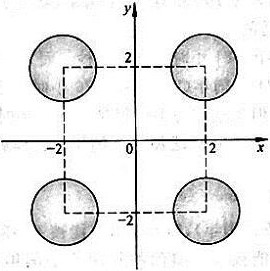

# 习题

## 1. 什么是算术运算？什么是关系运算？什么是逻辑运算

- 算术运算

  算术运算即“四则运算”，是加法、减法、乘法、除法、乘方、开方等几种运算的统称。
  其中加减为一级运算，乘除为二级运算，乘方、开方为三级运算。在一道算式中，如果有多级运算存在，则应先进行高级运算，再进行低一级的运算。  
  C语言中的算熟运算符包括：​​+​​​、​​-​​​、​​*​​​、​/​、​​++​​​、​​--​​​、​​%​​ 等种类。
  如果只存在同级运算；则从左至右的顺序进行；如果算式中有括号，则应先算括号里边，再按上述规则进行计算。
  - 示例： $(1+1)^{2}\times 4+5\times 3$   
  解析：
  先进行括号内运算​​1+1​​，然后进行乘方运算得到结果4.
  接下来与4相乘，得到结果16
  因为乘法优先级大于加法，因此先进行5*3，得到结果15
  最终相加得到结果31
  结果：31
- 关系运算：  
  关系的基本运算有两类：
  一类是传统的集合运算（并、差、交等），
  另一类是专门的关系运算（选择、投影、连接、除法、外连接等），
  而在C语言中，关系运算通常被认为是比较运算，将两个数值进行比较，判断比较结果是否符合给定的条件。
  - 常见的关系运算符包括：​​<​​​、​​<=​​​、​​>​​​、​​>=​​​、​​==​​​、​​!=​​ 等种类。
  其中，前4种关系运算符(<、<=、>、>= )的优先级别相同，后2种(==、!=)也相同。而前4种高于后2种。  
  例如, ​​>​​​ 优先于 ​​==​​​ 。而 ​​>​​​ 与 ​​<​​​ 优先级相同。
  并且，关系运算符的优先级低于算术运算符，关系运算符的优先级高于赋值运算符(=)。
- 逻辑运算**：  
  在逻辑代数中，有与、或、非三种基本逻辑运算。表示逻辑运算的方法有多种，如语句描述、逻辑代数式、真值表、卡诺图等。而在C语言中，逻辑运算通常用于使用逻辑运算符将关系表达式或其它逻辑量连接起来组成逻辑表达式用来测试真假值。  
  - 常见的逻辑运算符包括：​​&&​​​、​​||​​​、​​!​​ 等种类
    - &&​​：与是双目运算符，要求有两个运算对象，表示两个运算对象都成立，则结果为真，否则结果为假。  
    例如：(a < b) && (x > y)，表示(a < b)和(x > y)同时成立则为真。
    - ​||​​：是双目运算符，要求有两个运算对象，表示两个运算对象只要任意一个成立，则结果为真，否则结果为假。  
    例如：(a < b) && (x > y)，表示(a < b)和(x > y)两个对象中任意一个成立则结果为真。
    - **​​!​​**：是单目运算符，只要求有一个运算对象，表示取运算对象反义，运算对象为真则结果为假，运算对象结果为假则结果为真。  
    例如：!(a > b)，表示(a > b)成立时结果为假，不成立时结果为真。  
    - 若在一个逻辑表达式中包含多个逻辑运算符，则优先次序为： ​​!​​​ > ​​&&​​​ > ​​||​​。当然若一个逻辑表达式中包含括号括起来的子逻辑，则优先括号内的子逻辑判断。  
      示例：
      - (1 > 2) || (2 > 3) && (4 > 3) 结果为0
      - !(1 > 2) || (2 > 3) && (4 > 3) 结果为1  
        注：​​&&​​​优先级大于​​||​​​，((2 > 3) && (4 > 3))无法同时成立，则结果为假，然后与(1 > 2)结果进行逻辑或运算，两者都为假因此第一次结果为假。 而第二次​​!​​优先级最高，先对(1 > 2)的结果取逻辑非，得到结果为真，因此结果为真。

## 2. C语言中如何表示“真”和“假”?系统如何判断一个量的“真”和“假”

  在C语言中逻辑常量只有两个，即0和1，用来表示两个对立的逻辑状态，其中​​0​​​表示假，​​1​​表示真。  
  逻辑变量与普通代数一样，也可以用字母、符号、数字及其组合成为的逻辑表达式表示。  
  对于系统来说，判断一个逻辑量的值时，系统会以​​0​​​作为假，以​​非0​​​作为真。  
  例如​​3&&5​​​的值为真，系统给出​​3&&5​​​的值为​​1​​。

## 3. 写出下面各逻辑表达式的值。设a = 3,b = 4,c = 5

（1）a + b > c && b == c  
（2）a || b + c && b - c  
（3）!(a > b) && !c || 1  
（4）!(x = a) && (y = b) && 0  
（5）!(a + b) + c - 1 && b + c / 2  

解题思路：  
关系运算符的优先级高于赋值运算符，但是低于算术运算符；
&&表示两边条件同为真则成立，||表示两边条件任意一个为真则成立，!取条件反义。
逻辑运算符优先级： ! > && > ||
有括号优先括号。

- 3.1 题目：a + b > c && b == c  $\to$  3 + 4 > 5 && 4 == 5

    解析： 3 + 4 > 5 优先 3 + 4 得到结果 7，因此 7>5 结果为真；4 == 5 为假，一真一假逻辑与最终结果为假。  
    答案： 0

```c
#include <stdio.h>

int main()
{
    int a = 3, b = 4, c = 5;

    printf("%dn", a + b > c && b == c);

    system("pause");//这一句是为了让控制台不退出
    return 0;
}
```



- 3.2 题目：a || b + c && b - c  $\to$  3||4 + 5 && 4-5

    解析： 优先算术运算 4+5 得到 7，非 0 则为真，4-5 得到-1，非 0 则为真，接下来逻辑与判断，最终逻辑或判断  
    答案：1

```c
    #include <stdio.h>
    int main()
    {
        int a = 3, b = 4, c = 5;
        printf("%dn", a || b + c && b - c);
        system("pause");//这一句是为了让控制台不退出
        return 0;
    }
```



- 3.3 题目：!(a > b) && !c || 1  $\to$  !(3>4) && !5 || 1

    解析：! 优先级最高，!(3>4) 最终结果为真，!5 为假； 其次 &&，真 && 假 得到假，最终||，1 为真，假或真为真。  
    答案：1

```c
    #include <stdio.h>
    int main()
    {
        int a = 3, b = 4, c = 5;
        printf("%dn", !(a > b) && !c || 1);
        system("pause");//这一句是为了让控制台不退出
        return 0;
    }
```



- 3.4 题目：!(x = a) && (y = b) && 0  $\to$  !(x=3) && (y=4)&&0

    解析：这里 && 优先级最低是最后一个逻辑运算，因此不管如何，最终 && 0，则肯定为假。  
    答案：0

```c
    #include <stdio.h>
    int main()
    {
        int a = 3, b = 4, c = 5;
        int x, y;
        printf("%dn", !(x = a) && (y = b) && 0);
        system("pause");//这一句是为了让控制台不退出
        return 0;
    }
```



- 3.5 题目：!(a + b) + c - 1 && b + c / 2  $\to$  !(3+4)+5-1 && 4+5/2

    解析： 在vs中优先对 (a+b) 取非得到 0, 0+5-1 结果为 4 ，因此最终为真（此题涉及不同平台结果不同的问题，因为在有的平台下编译器会优先算术运算，则最终取非得到结果为假）  
    **答案：** 1

```c
    #include <stdio.h>
    int main()
    {
        int a = 3, b = 4, c = 5;
        printf("%dn", !(a + b) + c - 1);
        printf("%dn", !(a + b) + c - 1 && b + c / 2);
        system("pause");//这一句是为了让控制台不退出
        return 0;
    }
```



## 4. 有3个整数a, b, c，由键盘输入，输出其中最大的数

[`xt4-4-1.c`](xt4-4-1.c)

[`xt4-4-2.c`](xt4-4-2.c)

## 5.从键盘输入一个小于1000的正数

要求输出它的平方根(如平方根不是整数，则输出其整数部分)。
要求在输入数据后先对其进行检查是否为小于1000 的正数。若不是,则要求重新输入。

[`xt4-5.c`](xt4-5.c)

## 6. 有一个函数，编写程序，输入x的值，输出y相应的值

$$
y=\begin{cases}
x&(x < 1)\\
2x - 1&(1\leqslant x < 10)\\
3x - 11&(x\geqslant 10)
\end{cases}
$$

[`xt4-6.c`](xt4-6.c)

## 7. 有一个函数

$$
y=\begin{cases}
-1&(x < 0)\\
0&(x = 0)\\
1&(x > 0)
\end{cases}
$$

[`xt4-7.c`](xt4-7.c)

## 8. 给出一百分制成绩,要求输出成绩等级’A’、‘B’、‘C’、‘D’、‘E’

- 90分以上为’A’
- 80~89分为’B’
- 70~79分为’C’
- 60~69分为’D’
- 60分以下为’E’

[`xt4-8.c`](xt4-8.c)

## 9. 给一个不多于5位的正整数

- 要求:
- 求出它是几位数
- 分别输出每一位数字
- 按逆序输出各位数字，例如原数为321,应输出123

[`xt4-9.c`](xt4-9.c)

## 10. 企业发放的奖金根据利润提成

- 利润低于或等于10万元时，奖金可提10%
- 利润高于10万元，低于20万元时，低于10万元的部分按10%提成，高于10万元的部分，可提成7.5%
- 20万到40万之间时，高于20万元的部分，可提成5%
- 40万到60万之间时高于40万元的部分，可提成3%
- 60万到100万之间时，高于60万元的部分，可提成1.5%
- 高于100万元时，超过100万元的部分按1%提成

从键盘输入当月利润，求应发放奖金总数？要求：(1) 使用if语句编写程序。(2) 使用switch语句编写程序。

[`xt4-10.c`](xt4-10.c)

## 11. 输入4个整数，要求按由小到大的顺序输出

[`xt4-11.c`](xt4-11.c)

## 12. 有4个圆塔,圆心分别为(2,2)、(-2,2)、(-2,-2)、(2,-2),圆半径为1,见图



这4个塔的高度为10m,塔以外无建筑物。今输入任一点的坐标，求该点的建筑高度(塔外的高度为零)。

[`xt4-12.c`](xt4-12.c)
