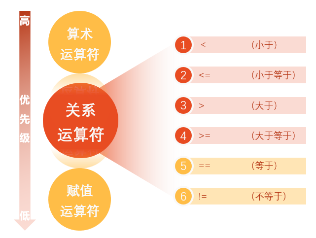
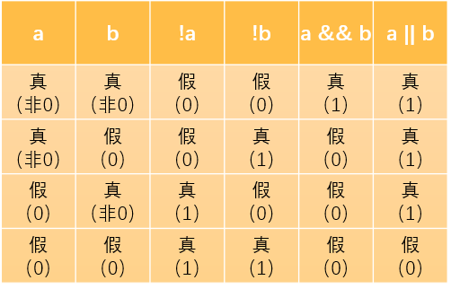

# 第 4 章 选择结构程序设计

## 4.1 选择结构和条件判断

C语言有两种选择语句

1. if语句:用来实现两个分支的选择结构
  在if语句中对给定的条件进行检查，判定所给定的条件是否成立。判定的结果是一个逻辑值，即“真”或“假”。
2. switch语句:用来实现多分支的选择结构

## 4.3 关系运算符和关系表达式

在C语言中，比较符(或称比较运算符)称为关系运算符。所谓“关系运算”就是“比较运算”，将两个数值进行比较，判断其比较的结果是否符合给定的条件。

1. 关系运算符及其优先次序

   

   * 前４种关系运算符的优先级别相同，后2种也相同。前４种高于后２种。
   * 关系运算符的优先级低于算术运算符。
   * 关系运算符的优先级高于赋值运算符。

2. 关系表达式

   * 用关系运算符将两个数值或数值表达式连接起来的式子，称为关系表达式。
   * 关系表达式的值是一个逻辑值，即“真”或“假”。
   * 在C的逻辑运算中，以“1”代表“真”，以“0”代表“假”。

## 4.4 逻辑运算符和逻辑表达式

1. 逻辑运算符及其优先次序

   |运算符|含义|举例|说明|
   |:--:|:--:|:--:|:--:|
   |!|逻辑非(NOT)|!a|如果a为假，则!a为真;如果a为真，则!a为假|
   |&&|逻辑与(AND)|a&&b|如果a和b都为真，则结果为真，否则为假|
   |\|\||逻辑或(OR)|a\|\|b|如果a和b有一个以上为真，则结果为真，二者都为假时，结果为假|

   * “&&”和“‖”是双目运算符，要求有两个运算对象(操作数)； “！”是单目运算符，只要有一个运算对象
   * 优先次序：!(非)→＆＆(与)→‖(或)， 即“！”为三者中最高的； 逻辑运算符中的“＆＆”和“‖”低于关系运算符，“！”高于算术运算符
   * 逻辑运算结果不是0就是1，不可能是其他数值。而在逻辑表达式中作为参加逻辑运算的运算对象可以是0(“假”)或任何非0的数值(按“真”对待)

   

2. 逻辑表达式

   用逻辑运算符将关系表达式或其他逻辑量连接起来的式子就是逻辑表达式。
   * C语言编译系统在表示逻辑运算结果是，以数值1代表“真”，以0代表“假”，  
   * 但在判断一个量是否为“真”时，以0代表“假”，以非0代表“真”。  
   * 逻辑表达式0为假，非0为真。  
   * 在逻辑表达式的求解中，并不是所有的逻辑运算符都被执行，只是在必须执行下一个逻辑运算符才能求出表达式的解时，才执行该运算符。
   * 既然关系表达式和逻辑表达式的值是0和1，而且在判断一个量是否为“真”时，以0代表“假”，以非0代表“真”。所以在if语句中表达式可以是任何数值表达式。

3. 逻辑性变量

   C99增加的一种数据类型，有些c编译系统并未实现此功能。

   `_Bool 变量名`

   * 如果在源文件中使用#include指令包含了头文件stdbool.h，那么可以写成：`bool 变量名`
   * 逻辑型变量bool和true和false原本是C++使用的，目前有些C编译系统并未实现此功能。
   * 如果用的是C++的编译系统，使用逻辑变量时要把文件吗后缀改为.cpp，作为C++程序运行。

## 4.5 条件运算符和条件表达式

1. 条件运算符由两个符号(?和:)组成，必须一起使用。
2. 要求有3个操作对象，称为三目(元)运算符，它是Ｃ语言中唯一的一个三目运算符。
3. 条件运算符的执行顺序: 先求解表达式1，若为非0(真)则求解表达式２，此时表达式２的值就作为整个条件表达式的值。若表达式1的值为0(假)，则求解表达式３，表达式３的值就是整个条件表达式的值。

一般形式：`表达式1？表达式2：表达式3`

## 4.6 选择结构的嵌套

1. 一般形式：

   ```c
   if()
        if()
            语句1
        else
            语句2
    else
        if()
            语句3
        else
            语句4
   ```

2. if与else的配对关系:

   * else总是与它上面的最近的未配对的if配对。
   * if语句无论写在几行上，都是一个整体，属于同一个语句。不要误认为if是一个语句，else是另一个语句。
   * 为了是逻辑关系清晰，避免出错，一般把内嵌的if语句放在外层的else子句中。  

## 4.7 用switch语句实现多分支选择结构

1. 一般形式：

   ```c
    switch(表达式)
    {
        case 常量1 : 语句1
        case 常量1 : 语句1
        ...
        case 常量n : 语句n
        default:    语句n+1
    }
   ```

   1. 括号内的“表达式”，其值的类型应为整数类型(包括字符型)。
   2. 花括号内是一个复合语句，内包含多个以关键字case开头的语句行和最多一个以default开头的行。case后面跟一个常量(或常量表达式)，它们和default都是起标号作用，用来标志一个位置。执行switch语句时，先计算switch后面的“表达式”的值，然后将它与各case标号比较，如果与某一个case标号中的常量相同，流程就转到此case标号后面的语句。如果没有与switch表达式相匹配的case常量，流程转去执行default标号后面的语句。
   3. 可以没有default标号，此时如果没有与switch表达式相匹配的case常量，则不执行任何语句。
   4. 各个case标号出现次序不影响执行结果。
   5. 每一个case常量必须互不相同；否则就会出现互相矛盾的现象。
   6. case标号只起标记的作用。在执行switch语句时，根据switch表达式的值找到匹配的入口标号，在执行完一个case标号后面的语句后，就从此标号开始执行下去，不再进行判断。因此，一般情况下，在执行一个case子句后，应当用break语句使流程跳出switch结构。最后一个case子句(今为default子句)中可不加break语句。
   7. 在case子句中虽然包含了一个以上执行语句，但可以不必用花括号括起来，会自动顺序执行本case标号后面所有的语句。当然加上花括号也可以。
   8. 多个case标号可以共用一组执行语句。

## 4.8 不能显示的字符

* 空（null）字符（以'\0'表示）
* 警告（以'\a'表示）
* 退格（以'\b'表示）
* 回车（以'\r'表示）等...
