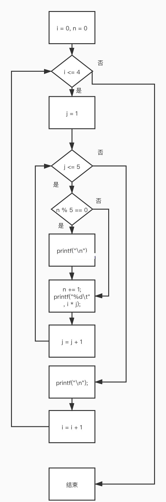
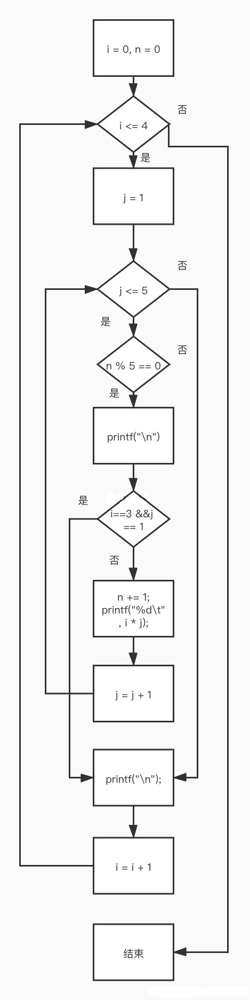

# 习题

## 1. 请画出例5.6中给出的3个程序段的流程图

* 流程图1  

* 流程图2  

* 流程图3  


## 2. 请补充例5.7程序,分别统计当“fabs(t) $\geqslant$ 1e- 6”和“fabs(t) $\geqslant$  1e- 8”时执行循环体的次数

[5-2.c](xt5-2.c)

## 3. 输人两个正整数m和n,求其最大公约数和最小公倍数

[5-3.c](xt5-3.c)

## 4. 输人一行字符,分别统计出其中英文字母、空格、数字和其他字符的个数

[5-4.c](xt5-4.c)

## 5. 求 $S_n=a+aa+aaa+\cdots+\overbrace{a\cdots aa}^{n个a}$ 的值，其中 $a$ 是一个数字， $n$ 表示 $a$ 的位数，例如： $2+22+222+2222+22222$ (此时 $n=5$ ) $n$ 由键盘键入

[5-5.c](xt5-5.c)

## 6. 求 $\sum\limits_{n=1}^{20}n!$

[5-6.c](xt5-6.c)

## 7. 求 $\sum\limits_{k=1}^{100}k+\sum\limits_{k=1}^{50}k^2+\sum\limits_{k=1}^{10}\frac1k$

[5-7.c](xt5-7.c)

## 8. 输出所有的“水仙花数”,所谓“水仙花数”是指一个3位数,其各位数字立方和等于该数本身。例如 153是水仙花数,因为 $153=1^3+5^3+3^3$

[5-8.c](xt5-8.c)

## 9. 编程序找出1000之内的所有完数,并按下面格式输出其因子

```text
6 its factors are 1,2,3
```

一个数如果恰好等于它的因子之和,这个数就称为“完数”。
例如,6的因子为1,2,3,而 $6=1+2+3$ ,因此6是“完数”。

[5-9-1.c](xt5-9-1.c)

[5-9-2.c](xt5-9-2.c)

## 10. 有一个分数序列 $\frac21,\frac32,\frac53,\frac85,\frac{13}8,\frac{21}{13}\dots$ 求出这个数列的前20项之和

[5-10.c](xt5-10.c)

## 11. 一个球从100m高度自由落下，每次落地后反弹回原高度的一半，再落下，再反弹。求它在第 10次落地时共经过多少米,第10次反弹多高

[5-11.c](xt5-11.c)

## 12. 猴子吃桃问题

猴子第1天摘下若干个桃子，当即吃了一半，还不过瘾，又多吃了一个。
第2天早上又将剩下的桃子吃掉一半，又多吃了一个。
以后每天早上都吃了前一天剩下的一半零一个。
到第10天早上想再吃时，就只剩一个桃子了。求第1天共摘多少个桃子。

[5-12.c](xt5-12.c)

## 13. 用迭代法求 $x=\sqrt a$

求平方根的迭代公式为:
$$X_{n+1}=\frac12\times (X_n + \frac a{X_n})$$
要求前后两次求出的x的差的绝对值小于 $10^{-5}$。

* 算法：
  1. 先自定一个初值 $x_0$ ，作为 $a$ 的平方根值，在我们的程序中取 $\frac a2$ 作为 $x_0$ 的初值；利用迭代公式求出一个 $x_1$ 。此值与真正的 $a$ 的平方根值相比，误差很大。
  2. 把新求得的 $x_1$ 代入 $x_0$ 中，准备用此新的 $x_0$ 再去求出一个新的 $x_1$ 。
  3. 利用迭代公式再求出一个新的 $x_1$ 的值，也就是用新的 $x_0$ 又求出一个新的平方根值 $x_1$ ，此值将更趋近于真正的平方根值。
  4. 比较前后两次求得的平方根值 $x_0$ 和 $x_1$ ，如果它们的差值小于我们指定的值，即达到我们要求的精度，则认为 $x_1$ 就是 $a$ 的平方根值，去执行步骤5；否则执行步骤2，即循环进行迭代。

  [5-13.c](xt5-13.c)

## 14. 用牛顿迭代法求下面方程在1.5附近的根： $2x^3-4x^2+3x-6=0$

* 基本公式： $$X_{n+1}=X_n-\frac{f(X_n)}{f'(X_n)}$$
  其中 $X_{n+1}$ 为第 $n+1$ 次迭代结果，$X_n$ 为第 $n$ 次迭代结果， $f'(X_n)$ 为 $f(X_n)$ 的导函数值。

* 算法：
  1. 把方程改写为多项式 $f(x)=2x^3-4x^2+3x-6$ ，给定初值 $x_0$ ；
  2. 将 $X_n$ 带入迭代公式 $X_{n+1}=X_n-\frac {f(X_n)}{f'(X_n)}$ ，求出 $X_{n+1}$
  3. 判断精度 $fabs(X_{n+1}-X_n)$ 是否达到要求，满足则输出，否则返回上一步

  [5-14-1.c](xt5-14-1.c)

  [5-14-2.c](xt5-14-2.c)

## 15. 用二分法求下面方程在(-10,10)之间的根： $2x^3-4x^2+3x-6=0$

* 定义：对于区间 $[a，b]$ 上连续不断且 $f(a)·f(b)<0$ 的函数 $y=f(x)$ ，通过不断地把函数 $f(x)$ 的零点所在的区间一分为二，使区间的两个端点逐步逼近零点，进而得到零点近似值的方法叫二分法。

  [5-15.c](xt5-15.c)

## 16. 输出以下图案

```text
       *
      ***
     *****
    *******
     *****
      ***
       *
```

[5-16.c](xt5-16.c)

## 17. 两个乒乓球队进行比赛，各出3人。甲队为A，B，C 3人，乙队为X，Y，Z 3人。已抽签决定比赛名单。有人向队员打听比赛的名单，A说他不和X比，C说他不和X，Z比，请编程序找出3对赛手的名单

[5-17.c](xt5-17.c)
