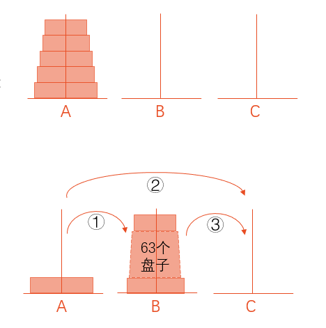
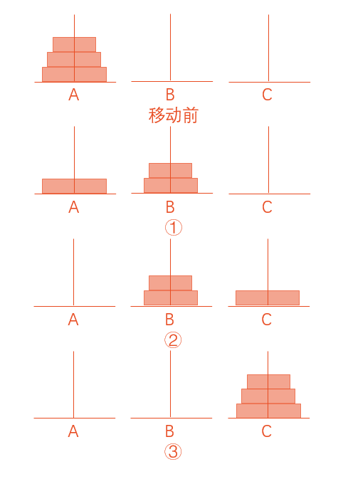

# 例题

## 例7.1 想输出以下的结果，用函数调用实现

    ******************
      How do you do!
    ******************

[c7-1.c](c7-1.c)

## 例7.2 输入两个整数，要求输出其中值较大者。要求用函数来找到大数

[c7-2.c](c7-2.c)

## 例7.3 将例7.2稍作改动，将在max函数中定义的变量z改为float型。函数返回值的类型与指定的函数类型不同，分析其处理方法

[c7-3.c](c7-3.c)

## 例7.4 输入两个实数，用一个函数求出它们之和

[c7-4-1.c](c7-4-1.c)

[c7-4-2.c](c7-4-2.c)

## 例7.5 输入4个整数，找出其中最大的数。用函数的嵌套调用来处理

[c7-5-1.c](c7-5-1.c)

[c7-5-2.c](c7-5-2.c)

[c7-5-3.c](c7-5-3.c)

[c7-5-4.c](c7-5-4.c)

## 例7.6 有5个学生坐在一起，问第5个学生多少岁，他说比第4个学生大2岁。问第4个学生岁数，他说比第3个学生大2岁。问第3个学生，又说比第2个学生大2岁。问第2个学生，说比第1个学生大2岁。最后问第1个学生，他说是10岁。请问第5个学生多大

[c7-6.c](c7-6.c)

## 例7.7 用递归方法求 $n!$

[c7-7.c](c7-7.c)

## 例7.8 Hanoi（汉诺）塔问题。古代有一个梵塔，塔内有3个座A,B,C。开始时A座上有64个盘子，盘子大小不等，大的在下，小的在上。有一个老和尚想把这64个盘子从A座移到C座，但规定每次只允许移动一个盘，且在移动过程中在3个座上都始终保持大盘在下，小盘在上。在移动过程中可以利用B座。要求编程序输出移动盘子的步骤

解题思路:

老和尚会这样想: 假如有另外一个和尚能有办法将上面63个盘子从一个座移到另一座。那么，问题就解决了。此时老和尚只须这样做:

① 命令第2个和尚将63个盘子从A座移到B座；

② 自己将1个盘子（最底下的、最大的盘子）从A座移到C座；

③ 再命令第2个和尚将63个盘子从B座移到C座。

第2个和尚又想: 如果有人能将62个盘子从一个座移到另一座，我就能将63个盘子从A座移到B座，他是这样做的:

① 命令第3个和尚将62个盘子从A座移到C座；

② 自己将1个盘子从A座移到B座；

③ 再命令第3个和尚将62个盘子从C座移到B座。

......

为便于理解，先分析将A座上3个盘子移到C座上的过程：

① 将A座上2个盘子移到B座上（借助C座）。

② 将A座上1个盘子移到C座上。

③ 将B座上2个盘子移到C座上（借助A座）。

其中第②步可以直接实现。第①步又可用递归方法分解为:

  将A座上1个盘子从A座移到C座；

  将A座上1个盘子从A座移到B座；

  将C座上1个盘子从C座移到B座。

第③步可以分解为:

  将B座上1个盘子从B座移到A座上；

  将B座上1个盘子从B座移到C座上；

  将A座上1个盘子从A座移到C座上。

将以上综合起来，可得到移动3个盘子的步骤为:

A→C，A→B，C→B，A→C，B→A，B→C，A→C。

共经历7步。由此可推出: 移动n个盘子要经历(2n-1)步。

由上面的分析可知: 将n个盘子从A座移到C座可以分解为以下3个步骤:

① 将A座上n－1个盘借助C座先移到B座上；

② 把A座上剩下的一个盘移到C座上；

③ 将n－1个盘从B座借助于A座移到C座上。

上面第①步和第③步，都是把n－1个盘从一个座移到另一个座上，采取的办法是一样的，只是座的名字不同而已。为使之一般化，可以将第①步和第③步表示为:

将one座上n－1个盘移到two 座(借助three座)。只是在第①步和第③步中，one,two,three和A,B,C的对应关系不同。对第①步，对应关系是one对应A，two对应B，three对应C。对第③步，是: one对应B，two对应C，three对应A。

因此，可以把上面3个步骤分成两类操作:

① 将n－1个盘从一个座移到另一个座上（n＞1）。这就是大和尚让小和尚做的工作，它是一个递归的过程，即和尚将任务层层下放，直到第64个和尚为止。——hanoi函数

② 将1个盘子从一个座上移到另一座上。这是大和尚自己做的工作。——move函数

[c7-8.c](c7-8.c)

## 例7.9 输入10个数，要求输出其中值最大的元素和该数是第几个数

[c7-9.c](c7-9.c)

## 例7.10 有一个一维数组score，内放10个学生成绩，求平均成绩

[c7-10.c](c7-10.c)

## 例7.11 有两个班级，分别有35和30名学生，调用average函数，分别求这两个班的学生的平均成绩

[c7-11.c](c7-11.c)

## 例7.12 用选择法对数组中10个整数按由小到大排序

[c7-12.c](c7-12.c)

## 例7.13 有一个3×4的矩阵，求所有元素中的最大值

[c7-13.c](c7-13.c)

## 例7.14 有一个一维数组，内放10个学生成绩，写一个函数，当主函数调用此函数后，能求出平均分、最高分和最低分

[c7-14.c](c7-14.c)

## 例7.15 若外部变量与局部变量同名，分析结果

[c7-15.c](c7-15.c)

## 例7.16 考察静态局部变量的值

[c7-16.c](c7-16.c)

## 例7.17 输出1到5的阶乘值

[c7-17.c](c7-17.c)

## 例7.18 调用函数，求3个整数中的大者

[c7-18.c](c7-18.c)

## 例7.19 给定b的值，输入a和m，求 $a \times b$ 和 $a^m$ 的值

[c7-19-1.c](c7-19-1.c)

[c7-19-2.c](c7-19-2.c)

## 例7.20 有一个字符串,内有若干个字符,现输入一个字符,要求程序将字符串中该字符删去

[c7-20-1.c](c7-20-1.c)

[c7-20-2.c](c7-20-2.c)

[c7-20-3.c](c7-20-4.c)

[c7-20-3.c](c7-20-4.c)
