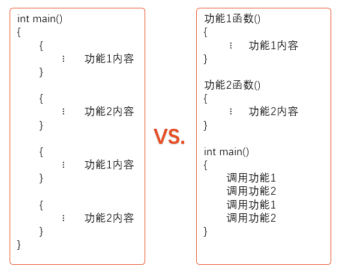
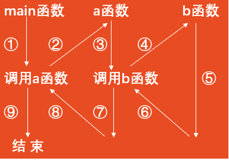
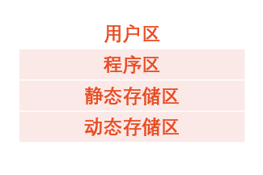
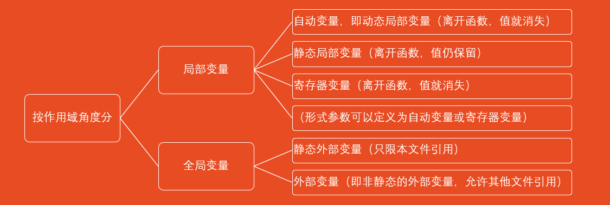
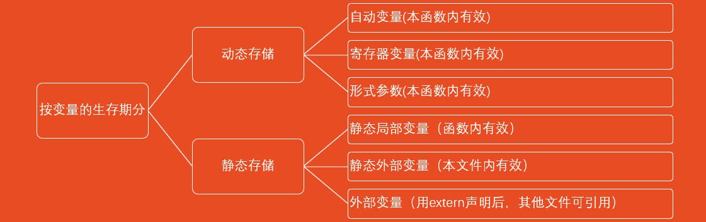
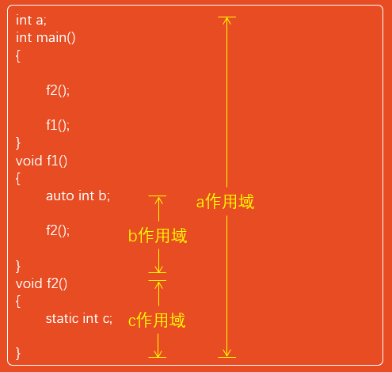
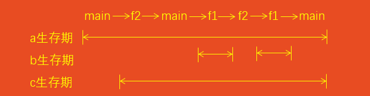
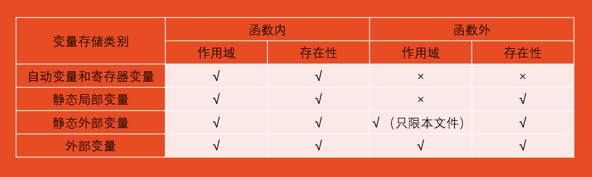

# 第7章 用函数实现模块化程序设计

## 7.1 为什么要用函数

简单的C程序功能单一，而在处理实际问题中，要求程序的功能比较多，规模比较大。如果把所有程序代码都写在一个main函数中，就降低了程序的易阅读性和易维护性。此外，有时程序中要多次实现某一功能，就需要多次重复编写实现该功能的程序代码，这使程序冗长，不精炼。

因此，人们采用模块化程序设计的思路，将一批常用的程序代码事先编写好，需要用时就可以直接调用，这种实现各种不同功能的程序代码就称为函数。

使用函数可使程序清晰、精炼、简单、灵活。

函数就是功能。每一个函数用来实现一个特定的功能。函数名应反映其代表的功能。

在设计较大程序时，往往把它分为若干个程序模块，每一个模块包括一个或多个函数，每个函数实现一个特定的功能。

一个C程序可由一个主函数和若干个其他函数构成。由主函数调用其他函数，其他函数也可以互相调用。



说明：

1. 一个C程序由一个或多个程序模块组成，每一个程序模块作为一个源程序文件。较大的程序，可分别放在若干个源文件中。这样便于分别编写和编译，提高调试效率。一个源程序文件可以为多个C程序共用。
2. 一个源程序文件由一个或多个函数以及其他有关内容（如指令、数据声明与定义等）组成。一个源程序文件是一个编译单位，在程序编译时是以源程序文件为单位进行编译的，而不是以函数为单位进行编译的。
3. C程序的执行是从main函数开始的，如果在main函数中调用其他函数，在调用后流程返回到main函数，在main函数中结束整个程序的运行。
4. 所有函数都是平行的，即在定义函数时是分别进行的，是互相独立的。一个函数并不从属于另一个函数，即函数不能嵌套定义。函数间可以互相调用，但不能调用main函数。main函数是被操作系统调用的。

### 7.1.1 函数分类

1. 从用户使用的角度看，函数有两种。
   * 库函数，它是由系统提供的，用户不必自己定义，可直接使用它们。应该说明，不同的C语言编译系统提供的库函数的数量和功能会有一些不同，当然许多基本的函数是共同的。
   * 用户自己定义的函数。它是用以解决用户专门需要的函数。
2. 从函数的形式看，函数分两类。
   * 无参函数。在调用无参函数时，主调函数不向被调用函数传递数据。
   * 有参函数。在调用函数时，主调函数在调用被调用函数时，通过参数向被调用函数传递数据。

## 7.2 怎样定义函数

C语言规定，在程序中用到的所有函数，必须“先定义，后使用”。即将函数名、函数返回值类型、函数实现的功能及参数个数与类型这些信息通知编译系统。

定义函数应包括以下几个内容:

   1. 指定函数的名字，以便以后按名调用。
   2. 指定函数的类型，即函数返回值的类型。
   3. 指定函数的参数的名字和类型，以便在调用函数时向它们传递数据。对无参函数不需要这项。
   4. 指定函数应当完成什么操作，也就是函数是做什么的，即函数的功能。这是最重要的，是在函数体中解决的。

### 7.2.1 定义函数

1. 定义无参函数

   ```text
   类型名 函数名()
   {
      函数体
   }
   ```

   或

   ```text
   类型名 函数名(void)
   {
      函数体
   }
   ```

   说明：

   * 函数名后面括号内的void表示“空”，即函数没有参数。
   * 函数体包括声明部分和语句部分。
   * 在定义函数时要用“类型标识符”即类型名.指定函数值的类型，即指定函数带回来的值的类型。

2. 定义有参函数

   ```text
   类型名 函数名(形式参数表列)
   {
      函数体
   }
   ```

   函数体包括声明部分和语句部分。
3. 定义空函数

   ```text
   类型名 函数名()
   {}
   ```

   因为在程序设计中，根据需要确定若干个模块，分别由一些函数实现，其中一些次要功能将安排在以后扩充，所以在将来准备扩充功能的地方写一个空函数，这样做使程序的结构清楚，可读性好。

## 7.3 调用函数

### 7.3.1 函数调用的形式

1. 一般形式：`函数名(实参表列)`
   * 调用无参函数，则“实参表列”可以没有，但括号不能省略。
   * 调用有参函数，如果“实参表列”有多个实参，则各参数间用逗号隔开。
2. 3种函数调用方式（按函数调用在程序中出现的形式和位置来分）
   * 函数调用语句
      * 把函数调用单独作为一个语句。如`printf_star();`
      * 这时不要求函数带回值，只要求函数完成一定的操作。
   * 函数表达式
      * 函数调用出现在另一个表达式中，如`c=max(a,b);`
      * 这时要求函数带回一个确定的值以参加表达式的运算。
   * 函数参数
      * 函数调用作为另一个函数调用时的实参。如`m=max(a,max(b,c));`，又如:`printf ″%d″, max(a,b));`
3. 形式参数和实际参数

   在调用有参函数时，主调函数和被调用函数之间有数据传递关系。
   * 在定义函数时函数名后面括号中的变量名称为“形式参数”（简称“形参”）或“虚拟参数”。
   * 在主调函数中调用一个函数时，函数名后面括号中的参数称为“实际参数”（简称“实参”）。 实际参数可以是常量、变量或表达式，但要求它们有确定的值。
   * 实参与形参的类型应相同或赋值兼容。赋值兼容是指实参与形参类型不同时能按不同类型数值的赋值规则进行转换。

### 7.3.2 函数调用的数据传递

在调用函数过程中，系统把实参的值传递给被调用函数的形参，该值只在函数调用期间有效，这里发生的实参与形参之间的数据传递，常称为“虚实结合”，即形参是实参的一份临时拷贝。

说明：

   1. 实参可以是常量、变量或表达式。但要求它们有确定的值。
   2. 实参于形参的类型应相同或赋值兼容。

### 7.3.3 函数调用过程

1. 在定义函数中指定的形参，在未出现函数调用时，它们并不占内存中的存储单元。在发生函数调用时，函数的形参才被临时分配内存单元。
2. 将实参的值传递给对应形参。
3. 在执行函数期间，由于形参已经有值，就可以利用形参进行有关的运算。
4. 通过return语句将函数值带回到主调函数。应当注意返回值的类型与函数类型一致。如果函数不需要返回值，则不需要return语句。这时函数的类型应定义为void类型。
5. 调用结束，形参单元被释放。注意: 实参单元仍保留并维持原值，没有改变。如果在执行一个被调用函数时，形参的值发生改变，不会改变主调函数的实参的值。因为实参与形参是两个不同的存储单元
6. **注意**：实参向形参的数据传递是“值传递”，单向传递。如果执行一个被调用函数时，形参的值发生变化，但实参单元是保留并维持原值，没有改变的，因为实参和形参在内存中占不同的内存单元，实参无法得到形参的值。

### 7.3.4 函数的返回值

通常，希望通过函数调用使主调函数能得到一个确定的值，这就是函数值(函数的返回值)。

1. 函数的返回值是通过函数中的return语句获得的。一个函数中可以有一个以上的return语句，执行到哪一个return语句，哪一个return语句就起作用。return语句后面的括号可以不要，如“return z;”与“return(z);”等价。return后面的值可以是一个表达式。
2. 函数值的类型。函数值的类型在定义函数时指定。
3. 在定义函数时指定的函数类型一般应该和return语句中的表达式类型一致。
如果函数值的类型和return语句中表达式的值不一致，则以函数类型为准。对数值型数据，可以自动进行类型转换。即函数类型决定返回值的类型。
4. 对于不带回值的函数，应当用定义函数为“void类型”（或称“空类型”）。这样，系统就保证不使函数带回任何值，即禁止在调用函数中使用被调用函数的返回值。此时在函数体中不得出现return语句。

## 7.4 对被调用函数的声明和函数原型

1. 在一个函数中调用另一个函数（即被调用函数）需要具备如下条件:
   * 首先被调用的函数必须是已经定义的函数（是库函数或用户自己定义的函数）。
   * 如果使用库函数，应该在本文件开头用#include指令将调用有关库函数时所需用到的信息“包含”到本文件中来。
   * 如果使用用户自己定义的函数，而该函数的位置在调用它的函数（即主调函数）的后面（在同一个文件中），应该在主调函数中对被调用的函数作声明(declaration)。声明的作用是把函数名、函数参数的个数和参数类型等信息通知编译系统，以便在遇到函数调用时，编译系统能正确识别函数并检查调用是否合法。
2. 函数的声明和函数定义中的第1行（函数首部）基本上是相同的，只差一个分号(函数声明比函数定义中的首行多一个分号)。
函数的首行(即函数首部)称为函数原型(function  prototype)。
因为在函数的首部包含了检查调用函数是否合法的基本信息(它包括了函数名、函数值类型、参数个数、参数类型和参数顺序)，因此，在函数调用时检查函数原型是否与函数声明一致。这样就能保证函数的正确调用。
3. 在函数声明中的形参名可以省写，而只写形参的类型。
4. 如果已在文件的开头(在所有函数之前)，已对本文件中所调用的函数进行了声明，则在各函数中不必对其所调用的函数再作声明。
5. **注意**：对函数的“定义”和“声明”不是同一回事。函数的定义是指对函数功能的确立，包括指定函数名、函数值类型、形参及其类型以及函数体等，它是一个完整的、独立的函数单位。而函数的声明的作用则是把函数的名字、函数类型以及形参的类型、个数和顺序通知编译系统，以便在调用该函数时系统按此进行对照检查，它不包含函数体。
6. **说明**：
   * 用函数首部作为函数声明的目的是便于对函数调用的合法性进行检查
     * 要求函数名、函数类型、参数个数和参数顺序必须与函数声明一致；
     * 实参类型必须与函数声明中的形参类型相同或复制兼容。

   * 函数声明中的形参名省写，而只写形参的类型。
     * 编译系统只关心和检查参数个数和参数类型，而不检查参数名。

## 7.5 函数的嵌套调用

C语言的函数定义是互相平行、独立的，也就是说，在定义函数时，一个函数内不能再定义另一个函数，即不能嵌套定义，但可以嵌套调用函数，即在调用一个函数的过程中，又调用另一个函数。



1. 执行main函数的开头部分；
2. 遇函数调用语句，调用函数a，流程转去a函数；
3. 执行a函数的开头部分；
4. 遇函数调用语句，调用函数b，流程转去函数b；
5. 执行b函数，如果再无其他嵌套的函数，则完成b函数的全部操作；
6. 返回到a函数中调用b函数的位置；
7. 继续执行a函数中尚未执行的部分，直到a函数结束；
8. 返回main函数中调用a函数的位置；
9. 继续执行main函数的剩余部分直到结束。

**fgets函数**：

* 一个C语言中的输入函数，用于从标准输入流（通常是键盘）读取一行字符串。
* 原型：`char *fgets(char *str, int n, FILE *stream)`;
其中， `str` 是一个字符数组，用于存储读取的字符串； `n` 是最大读取字符数； `stream` 是要读取的文件流，通常使用 `stdin` 表示标准输入流。
* 执行过程：fgets函数会读取输入流中的一行字符，包括换行符，然后将其存储到 `str` 指向的字符数组中，直到达到最大字符数 `n` 或者遇到换行符为止。
* 返回值：读取成功后，fgets函数会返回指向存储字符串的字符数组的指针，如果发生错误或到达文件末尾，则返回NULL。
* **注意**：fgets函数会将换行符 `\n` 也读取并存储在字符串中，因此如果需要去除换行符，可以使用字符串处理函数来处理。

## 7.6 函数的递归调用

在调用一个函数的过程中又出现直接或间接的调用该函数本身，称为函数的递归调用。

程序中不应出现无终止的递归调用，而只应出现有限次数的、有终止的递归调用，这可以用if语句来控制，只有在某一条件成立时才继续执行递归调用；否则就不再继续。

## 7.7 数组做函数参数

|形式参数|实际参数|
|:--:|:--:|
|变量|常量、变量、表达式、数组元素|
|数组|数组|

1. 数组元素可以用作函数实参，但是不能用作形参。因为形参是在函数被调用时才临时分配存储单元，不可能为一个数组元素单独分配存储单元(数组是一个整体，在内存中占连续的一段存储单元)。在用数组元素作函数实参时，把实参的值传给形参，是“值传递”方式。数据传递的方向是从实参传到形参，单向传递。
2. 数组名作函数实参
   * 向形参（数组或指针变量）传递的是数组第一个元素的地址。
     * 形参为一维数组时，可以留一个空的[]而不指定其大小，因为C语言编译系统并不检查形参数组的大小，只是将数组的首元素地址传给形参数组名。
     * 形参为二维数组时，可以不指定第一维的大小，只保留第二维的大小。因为二维数组在内存中是按行存放的，因此必须指定第二维的大小。
   * **注意**：数组名作函数实参时，和形参共占同一段内存单元，形参的变化会使实参同时变化。

## 7.8 局部变量和全局变量

每一个变量都有一个作用域问题，即它们在什么范围内有效。

定义变量可能有3种情况：

1. 函数的开头定义；
2. 在函数内的复合语句中定义；
3. 在函数外部定义。

在一个函数内部定义的变量只在本函数范围内有效，也就是说只有在本函数内才能引用它们，在此函数以外是不能使用这些变量的。在复合语句内定义的变量只在本复合语句范围内有效，只有在本复合语句内才能引用它们。在该复合语句以外是不能使用这些变量的，以上这些称为“局部变量”。

从作用域（即从空间）的角度来观察，变量可以分为局部变量和全局变量。

### 7.8.1 局部变量

在一个函数内部或复合语句内部定义的变量。

1. 主函数中定义的变量也只在主函数中有效。主函数也不能使用其他函数中定义的变量。
2. 不同函数中可以使用同名的变量，它们代表不同的对象，互不干扰。
3. 形式参数也是局部变量。只在定义它的函数中有效。其他函数中不能直接引用形参。
4. 在一个函数内部，可以在复合语句中定义变量，这些变量只在本复合语句中有效，这种复合语句也称为“分程序”或“程序块”。

### 7.8.2 全局变量

程序的编译单位是源程序文件,一个源文件可以包含一个或若干个函数。在函数内定义的变量是局部变量,而在函数之外定义的变量称为外部变量,外部变量是全局变量(也称全程变量)。全局变量可以为本文件中其他函数所共用。它的有效范围为从定义变量的位置开始到本源文件结束。

**注意**：在函数内定义的变量是局部变量，在函数外定义的变量是全局变量。

设置全局变量的作用是增加了函数间数据联系的渠道。由于同一文件中的所有函数都能引用全局变量的值，因此如果在一个函数中改变了全局变量的值，就能影响到其他函数中全局变量的值。相当于各个函数间有直接的传递通道。由于函数的调用只能带回一个函数返回值，因此有时可以利用全局变量来增加函数间的联系渠道，通过函数调用能得到一个以上的值。

为了便于区别全局变量和局部变量，在C程序设计人员中有一个习惯（但非规定），将全局变量名的第1个字母用大写表示。

**建议在非必要时不使用全局变量**，原因如下：

1. 全局变量在程序的全部执行过程中都占用存储单元，而不是仅在需要时才开辟单元。
2. 它使函数的通用性降低了，因为如果在函数中引用了全局变量，那么执行情况会受到有关的外部变量的影响，如果将一个函数移到另一个文件中，还要考虑把有关的外部变量及其值一起移过去。但是若该外部变量与其他文件的变量同名时，就会出现问题。这就降低了程序的可靠性和通用性。在程序设计中，在划分模块时要求模块的“内聚性”强、与其他模块的“耦合性”弱。即模块的功能要单一（不要把许多互不相干的功能放到一个模块中），与其他模块的相互影响要尽量少，而用全局变量是不符合这个原则的。一般要求把C程序中的函数做成一个相对的封闭体，除了可以通过“实参—形参”的渠道与外界发生联系外，没有其他渠道。这样的程序移植性好，可读性强。
3. 使用全局变量过多，会降低程序的清晰性，人们往往难以清楚地判断出每个瞬时各个外部变量的值。由于在各个函数执行时都可能改变外部变量的值，程序容易出错。因此，要限制使用全局变量。

## 7.9 变量的存储方式和生存期

### 7.9.1 变量的存储方式

从变量值存在的时间（即生存期）来观察，有的变量在程序运行的整个过程都是存在的，而有的则是在调用其所在的函数时才临时分配存储单元，在函数调用结束后该存储单元就马上释放了。也就是说变量的存储方式有两种不同的方式：静态存储方式和动态存储方式。

1. 静态存储方式是指在程序运行期间由系统分配固定的存储空间的方式。
2. 动态存储方式则是程序运行期间根据需要进行动态的分配存储空间的方式。

内存中供用户使用的存储空间可分为3部分：

1. 程序区
2. 静态存储区
3. 动态存储区



数据分别存放在静态存储区和动态存储区中。全局变量全部存放在静态存储区中，在程序开始执行时给全局变量分配存储区，程序执行完毕就释放。在程序执行过程中它们占据固定的存储单元，而不是动态地进行分配和释放。

在动态存储区中存放以下数据:

1. 函数形式参数。在调用函数时给形参分配存储空间。
2. 函数中定义的没有用关键字static声明的变量，即自动变量。
3. 函数调用时的现场保护和返回地址等。

对以上这些数据，在函数调用开始时分配动态存储空间，函数结束时释放这些空间。在程序执行过程中，这种分配和释放是动态的，如果在一个程序中两次调用同一函数，而在此函数中定义了局部变量，在两次调用时分配给这些局部变量的存储空间的地址可能是不相同的。
如果一个程序中包含若干个函数，每个函数中的局部变量的生存期并不等于整个程序的执行周期，它只是程序执行周期的一部分。在程序执行过程中，先后调用各个函数，此时会动态地分配和释放存储空间。

在C语言中，每一个变量和函数都有两个属性: 数据类型和数据的存储类别。

存储类别指的是数据在内存中存储的方式(如静态存储和动态存储)。
在定义和声明变量和函数时，一般应同时指定其数据类型和存储类别，也可以采用默认方式指定（即如果用户不指定，系统会隐含地指定为某一种存储类别）。
  
C的存储类别包括4种: 自动的（auto）、静态的（static）、寄存器的（register）、外部的（`extern`）。根据变量的存储类别，可以知道变量的作用域和生存期。

### 7.9.2 局部变量的存储类别

1. 自动变量（auto变量）
   函数中的局部变量，如果不专门声明为static（静态）存储类别，都是动态地分配存储空间的，数据存储在动态存储区中。函数中的形参和在函数中定义的局部变量（包括在复合语句中定义的局部变量），都属于此类。在调用该函数时，系统会给这些变量分配存储空间，在函数调用结束时就自动释放这些存储空间。因此这类局部变量称为自动变量。自动变量用关键字auto作存储类别的声明。

   实际上，关键字auto可以省略，不写auto则隐含指定为“自动存储类别”，它属于动态存储方式。程序中大多数变量属于自动变量。

   有时希望函数中的局部变量的值在函数调用结束后不消失而继续保留原值，即其占用的存储单元不释放，在下一次再调用该函数时，该变量已有值（就是上一次函数调用结束时的值）。这时就应该指定该局部变量为“静态局部变量”，用关键字static进行声明。

2. 静态局部变量（static局部变量）
   * 静态局部变量属于静态存储类别，在静态存储区内分配存储单元。在程序整个运行期间都不释放。而自动变量（即动态局部变量）属于动态存储类别，分配在动态存储区空间而不在静态存储区空间，函数调用结束后即释放。
   * 对静态局部变量是在编译时赋初值的，即只赋初值一次，在程序运行时它已有初值。以后每次调用函数时不再重新赋初值而只是保留上次函数调用结束时的值。而对自动变量赋初值，不是在编译时进行的，而是在函数调用时进行的，每调用一次函数重新给一次初值，相当于执行一次赋值语句。
   * 如果在定义局部变量时不赋初值的话，则对静态局部变量来说，编译时自动赋初值0（对数值型变量）或空字符′\0′（对字符变量）。而对自动变量来说，它的值是一个不确定的值。这是由于每次函数调用结束后存储单元已释放，下次调用时又重新另分配存储单元，而所分配的单元中的内容是不可知的。
   * 虽然静态局部变量在函数调用结束后仍然存在，但其他函数是不能引用它的。因为它是局部变量，只能被本函数引用，而不能被其他函数引用。
   * 用静态存储要多占内存（长期占用不释放，而不能像动态存储那样一个存储单元可以先后为多个变量使用，节约内存），而且降低了程序的可读性，当调用次数多时往往弄不清静态局部变量的当前值是什么。因此，若非必要，不要多用静态局部变量。

3. 寄存器变量（register变量）
   一般情况下，变量（包括静态存储方式和动态存储方式）的值是存放在内存中的。当程序中用到哪一个变量的值时，由控制器发出指令将内存中该变量的值送到运算器中。 经过运算器进行运算，如果需要存数，再从运算器将数据送到内存存放。

   如果有一些变量使用频繁（例如，在一个函数中执行10 000次循环，每次循环中都要引用某局部变量），则为存取变量的值要花费不少时间。为提高执行效率，允许将局部变量的值放在CPU中的寄存器中，需要用时直接从寄存器取出参加运算，不必再到内存中去存取。由于对寄存器的存取速度远高于对内存的存取速度，因此这样做可以提高执行效率。这种变量叫做寄存器变量，用关键字register作声明。如`register int  f;`

   由于现在的计算机的速度愈来愈快，性能愈来愈高， 优化的编译系统能够识别使用频繁的变量，从而自动地将这些变量放在寄存器中，而不需要程序设计者指定。因此，现在实际上用register声明变量的必要性不大。

**注意**：3种局部变量的存储位置是不同的: 自动变量存储在动态存储区；静态局部变量存储在静态存储区；寄存器存储在CPU中的寄存器中。

### 7.9.3 全局变量的存储类别

全局变量都是存放在静态存储区中的。因此它们的生存期是固定的，存在于程序的整个运行过程。
一般来说，外部变量是在函数的外部定义的全局变量，它的作用域是从变量的定义处开始，到本程序文件的末尾。在此作用域内，全局变量可以为程序中各个函数所引用。但有时程序设计人员希望能扩展外部变量的作用域。

扩展外部变量的作用域：

1. 在一个文件内扩展外部变量的作用域
   * 如果外部变量不在文件的开头定义，其有效的作用范围只限于定义处到文件结束。 在定义点之前的函数不能引用该外部变量。如果由于某种考虑，在定义点之前的函数需要引用该外部变量，则应该在引用之前用关键字`extern`对该变量作“外部变量声明”，表示把该外部变量的作用域扩展到此位置。有了此声明，就可以从“声明”处起，合法地使用该外部变量。
   * 用关键字`extern`对在定义点之前的外部变量作声明，表示把该外部变量的作用域扩展到此位置（不是全文件）。
   * 提倡将外部变量的定义**放在引用它的所有函数之前**，避免在函数中多加一个`extern`声明
   * 用`extern`声明外部变量时，类型名可写可省写。
2. 将外部变量的作用域扩展到其他文件
   * 如果一个程序包含两个文件，在两个文件中都要用到同一个外部变量Num，不能分别在两个文件中各自定义一个外部变量Num，否则在进行程序的连接时会出现“重复定义”的错误。
   * 正确的做法是: 在任一个文件中定义外部变量Num，而在另一文件中用`extern`对Num作“外部变量声明”，即“`extern` Num; ”。在编译和连接时，系统会由此知道Num有“外部链接”，可以从别处找到已定义的外部变量Num，并将在另一文件中定义的外部变量Num的作用域扩展到本文件，在本文件中可以合法地引用外部变量Num。
   * `extern`既可以用来扩展外部变量在本文件中的作用域，又可以使外部变量的作用域从一个文件扩展到程序中的其他文件，系统在编译过程中遇到`extern`时，先在本文件中找外部变量的定义，如果找到，就在本文件中扩展作用域；如果找不到，就在连接时从其他文件中找外部变量的定义。如果从其他文件中找到了，就将作用域扩展到本文件；如果再找不到，就按出错处理。
   * 用这种方法扩展全局变量的作用域应十分慎重，因为在执行一个文件中的操作时，可能会改变该全局变量的值，会影响到另一文件中全局变量的值，从而影响该文件中函数的执行结果。
3. 将外部变量的作用域限制在本文件
   * 有时在程序设计中希望某些外部变量只限于被本文件引用，而不能被其他文件引用。这时可以在定义外部变量时加一个static声明。这种加上static声明、只能用于本文件的外部变量称为静态外部变量。
   * 在程序设计中，常由若干人分别完成各个模块，各人可以独立地在其设计的文件中使用相同的外部变量名而互不相干。只须在每个文件中定义外部变量时加上static即可。这就为程序的模块化、通用性提供方便。如果已确认其他文件不需要引用本文件的外部变量，就可以对本文件中的外部变量都加上static，成为静态外部变量，以免被其他文件误用。至于在各文件中在函数内定义的局部变量，本来就不能被函数外引用，更不能被其他文件引用，因此是安全的。
   * 不要误认为对外部变量加static声明后才采取静态存储方式（存放在静态存储区中），而不加static的是采取动态存储（存放在动态存储区）。
   * 声明局部变量的存储类型和声明全局变量的存储类型的含义是不同的。
     * 对于局部变量来说，声明存储类型的作用是指定变量存储的区域(静态存储区或动态存储区)以及由此产生的生存期的问题，
     * 而对于全局变量来说，由于都是在编译时分配内存的，都存放在静态存储区，声明存储类型的作用是变量作用域的扩展问题。
4. 用static声明一个变量的作用是：
   * 对局部变量用static声明，把它分配到静态存储区，该变量在整个程序执行期间不释放，其所分配的空间始终存在。
   * 对全局变量用static声明，则该变量的作用域只限于本文件模块。
5. **注意**：用auto，register和static声明变量时，是在定义变量的基础上加上这些关键字，而不能单独使用。

### 7.9.4 存储类别小结

对一个数据的定义，需要指定两种属性：数据类型和存储类别，分别使用两个关键字。此外，可以用`extern`声明已定义的外部变量。

1. 从作用域角度分，有局部变量和全局变量。采用的存储类别：

   

2. 从变量存在的时间（生存期）来区分，有动态存储和静态存储两种类型。静态存储时程序整个运行时间都存在，而动态存储则是在调用函数时临时分配单元。

   

3. 从变量存放的位置来区分：

   

4. 关于作用域和生存期的概念。从前面叙述可以知道，对一个变量的属性可以从两个方面分析，一是变量的作用域，一是变量值存在时间的长短，即生存期。前者是从空间的角度，后者是从时间的角度。二者有联系但不是同一回事。

   

   

   如果一个变量在某个文件或函数范围内是有效的，就称该范围为该变量的作用域，在此作用域内可以引用该变量，在专业书中称变量在此作用域内“可见”，这种性质称为变量的可见性。

   如果一个变量值在某一时刻是存在的，则认为这一时刻属于该变量的生存期，或称该变量在此时刻“存在”。

   各种类型变量的作用域和存在性的情况

   

5. **static对局部变量和全局变量的作用**
   * 对局部变量来说，它使变量由动态存储方式改变为静态存储方式；
   * 对全局变量来说，它使变量局部化（局部于本文件），但仍为静态存储方式；
   * 从作用域角度看，凡是static声明的变量，其作用域或是局限于函数内（静态局部变量），或是局限于本文件内（静态外部变量）。

## 7.10 变量的声明和定义

在声明部分出现的变量有两种情况: 一种是需要建立存储空间的(如“int a;”)，另一种是不需要建立存储空间的（如“`extern` a;”）。前者称为定义性声明(defining declaration)，或简称定义（definition）；后者称为引用性声明(referencing declaration)。一般把建立存储空间的声明称定义，而把不需要建立存储空间的声明称为声明。

外部变量定义和外部变量声明的含义是不同的。外部变量的定义只能有一次，它的位置在所有函数之外。在同一文件中，可以有多次对同一外部变量的声明，它的位置可以在函数之内（哪个函数要用就在哪个函数中声明），也可以在函数之外。系统根据外部变量的定义（而不是根据外部变量的声明）分配存储单元。对外部变量的初始化只能在“定义”时进行，而不能在“声明”中进行。所谓“声明”，其作用是声明该变量是一个已在其他地方已定义的外部变量，仅仅是为了扩展该变量的作用范围而作的“声明”。

**注意**：有一个简单的结论，在函数中出现的对变量的声明(除了用`extern`声明的以外)都是定义。在函数中对其他函数的声明不是函数的定义。

## 7.11 内部函数和外部函数

函数本质上是全局的，因为定义一个函数的目的就是要被另外的函数调用。如果不加声明的话，一个文件中的函数既可以被本文件中其他函数调用，也可以被其他文件中的函数调用。但是,也可以指定某些函数不能被其他文件调用。根据函数能否被其他源文件调用，将函数区分为内部函数和外部函数。

### 7.11.1 内部函数

`static 类型名 函数名形参表;`

内部函数又称静态函数，因为它是用static声明的。使用内部函数,可以使函数的作用域只局限于所在文件。这样，在不同的文件中即使有同名的内部函数，也互不干扰，不必担心所用函数是否会与其他文件模块中的函数同名。

通常把只能由本文件使用的函数和外部变量放在文件的开头，前面都冠以static使之局部化，其他文件不能引用。这就提高了程序的可靠性。

### 7.11.2 外部函数

``extern 类型名 函数名形参表;`

在需要调用此函数的其他文件中，需要对此函数作声明(不要忘记，即使在本文件中调用一个函数，也要用函数原型进行声明)。在对此函数作声明时，要加关键字`extern`，表示该函数“是在其他文件中定义的外部函数”。

使用`extern`声明就能够在本文件中调用在其他文件中定义的函数，或者说把该函数的作用域扩展到本文件。`extern`声明的形式就是在函数原型基础上加关键字`extern`。

由于函数在本质上是外部的，在程序中经常要调用其他文件中的外部函数，为方便编程，C语言允许在声明函数时省写`extern`。

用函数原型能够把函数的作用域扩展到定义该函数的文件之外（不必使用`extern`）。只要在使用该函数的每一个文件中包含该函数的函数原型即可。函数原型通知编译系统: 该函数在本文件中稍后定义，或在另一文件中定义。

利用函数原型扩展函数作用域最常见的例子是`#include`指令的应用。在`#include`指令所指定的“头文件”中包含调用库函数时所需的信息。
