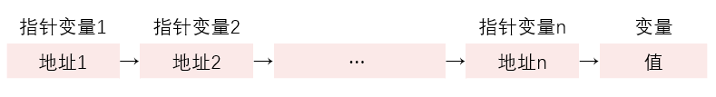

# 第8章 善于利用指针

指针是C语言中的一个重要概念，也是C语言的一个重要特色。正确而灵活得运用它，可以使程序简洁、紧凑、高效。

## 8.1 指针是什么

### 8.1.1 数据在内存中是如何的存储的，又是如何读取的

1. 内存是由一系列的存储单元组成的。每个存储单元都有一个唯一的地址，用于访问和存储数据。

   内存空间中：
   * 位（bit）：内存的最小单位，可以存储一个二进制位（0或1）。
   * 字节（byte）：由8个位组成，通常用来存储一个字符。
   * 字（word）：由若干个字节组成，字的大小可以根据计算机系统的不同而变化，一般为2个或4个字节。
   * 内存单元（memory cell）：由一个或多个字组成，用于存储数据。
   * 内存地址（memory address）：用于唯一标识内存中的每个存储单元。
   * 内存容量（memory capacity）：指内存可以存储的数据量，通常以字节为单位。

   总的来说，内存空间是由存储单元、地址和容量组成的，用于存储和读取计算机程序和数据。
2. 内存区的每个字节都有一个编号，这就是“地址”。如果在程序中定义了一个变量，在对程序进行编译时，编译系统就会给这个变量分配内存单元，根据程序中定义的变量类型，分配一定长度的空间。通过地址就能找到其对应的内存单元，可以说，地址指向该变量的内存单元，故将地址形象化地称为“指针”。
3. C语言中的地址包括位置信息(内存编号，或称纯地址)和它所指向的数据的类型信息，或者说它是“带类型的地址”。存储单元的地址和存储单元的内容是两个不同的概念。在程序中一般是通过变量名来引用变量的值。**直接按变量名进行的访问，称为“直接访问”方式。还可以采用另一种称为“间接访问”的方式，即将变量的地址存放在另一变量（指针变量）中，然后通过该指针变量来找到对应变量的地址，从而访问变量。**

## 8.2 指针变量

存放地址的变量就是指针变量，它用来指向另一个对象（如变量、数组、函数、指针等）。

### 8.2.2 定义指针变量

一般形式：`类型名 * 指针变量名;`

* 左端的类型名是在定义指针变量时必须指定的“基类型”。指针变量的基类型用来指定此指针变量可以指向的变量的类型
* **说明**：前面介绍过基本的数据类型(如int,char，float等)，既然有这些类型的变量，就可以有指向这些类型变量的指针，因此，指针变量是基本数据类型派生出来的类型，它不能离开基本类型而独立存在。
* 在定义指针变量时要注意：
  * 指针变量前面的“\*”表示该变量为指针型变量。指针变量名则不包含“\*”。
  * 在定义指针变量时必须指定基类型。一个变量的指针的含义包括两个方面，一是以存储单元编号表示的纯地址（如编号为2000的字节），一是它指向的存储单元的数据类型（如int,char,float等）。
  * 如何表示指针类型。指向整型数据的指针类型表示为“int *”，读作“指向int的指针”或简称“int指针”。
  * 指针变量中只能存放地址（指针），不要将一个整数赋给一个指针变量。

### 8.2.3 引用指针变量

1. 给指针变量赋值
2. 引用指针变量指向的变量
3. 引用指针变量的值

```c
   int a, *p;
   p=&a;                //把a的地址赋给指针变量p
   printf("%d",*p);     //以整数形式输出指针变量p所指向的变量的值，即a的值
   *p=1;                //将整数1赋给p当前所指向的变量，由于p指向变量a，相当于把1赋给a，即a=1
   printf("%o",p);      //以八进制形式输出指针变量p的值，由于p指向a，相当于输出a的地址，即&a
```

**注意**：

1. ＆是取地址运算符。&a是变量a的地址。
2. \*是指针运算符（或称“间接访问”运算符），*p代表指针变量p指向的对象。

### 8.2.4 指针变量作函数参数

函数的调用可以（而且只可以）得到一个返回值（即函数值），而使用指针变量作参数，可以得到多个变化了的值。如果不用指针变量是难以做到这一点的。要善于利用**指针法**。

如果想通过函数调用得到n个要改变的值，可以这样做:

1. 在主调函数中设n个变量，用n个指针变量指向它们；
2. 设计一个函数，有n个指针形参。在这个函数中改变这n个形参的值；
3. 在主调函数中调用这个函数，在调用时将这n个指针变量作实参，将它们的值，也就是相关变量的地址传给该函数的形参；
4. 在执行该函数的过程中，通过形参指针变量，改变它们所指向的n个变量的值；
5. 主调函数中就可以使用这些改变了值的变量。

## 8.3 通过指针引用数组

### 8.3.1 数组元素的指针

一个变量有地址，一个数组包含若干元素，每个数组元素都在内存中占用存储单元，它们都有相应的地址。指针变量既然可以指向变量，当然也可以指向数组元素（把某一元素的地址放到一个指针变量中）。所谓数组元素的指针就是数组元素的地址。可以用一个指针变量指向一个数组元素。

```c
int a[10]={1,3,5,7,9,11,13,15,17,19};  //定义a为包含10个整型数据的数组
int *p;                                //定义p为指向整型变量的指针变量
p=&a[0];                               //把a[0]元素的地址赋给指针变量p
```

引用数组元素可以用下标法，也可以用指针法，即通过指向数组元素的指针找到所需的元素。

```c
p=&a[0];  //p的值是a[0]的地址
```

等价于

```c
p=a;  //p的值是数组a首元素(即a[0])的地址
```

**注意**：程序中的数组名不代表整个数组，只代表数组首元素的地址。

在定义指针变量时可以对它初始化：

```c
int *p;
p=&a[0];  //不应写成*p=&a[0];
```

等价于

```c
int *p=&a[0];
```

等价于

```c
int *p=a;
```

### 8.3.2 在引用数组元素时指针的运算

在指针已指向一个数组元素时，可以对指针进行以下运算：

* 加一个整数(用+或+=)，如p+1，表示指向同一数组中的下一个元素；
  * **注意**：执行p+1时并不是将p的值(地址)简单地加1，而是根据定义的基类型加上一个数组元素所占用的字节数。
* 减一个整数(用-或-=)，如p-1，表示指向同一数组中的上一个元素；
* 自加运算，如p++，++p；
* 自减运算，如p--，--p。
* 两个指针相减，如p1-p2(只有p1和p2都指向同一数组中的元素时才有意义)，结果是两个地址之差除以数组元素的长度。注意: 两个地址不能相加，如p1+p2是无实际意义的。
* 如果p的初值为`&a[0]`，则p+i和a+i就是数组元素`a[i]`的地址，或者说，它们指向a数组序号为i的元素。
`*(p+i)`或`*(a+i)`是p+i或a+i所指向的数组元素，即`a[i]`。`[]`实际上是变址运算符，即将`a[i]`按a+i计算地址，然后找出此地址单元中的值。

### 8.3.3 通过指针引用数组元素

速度快，不必每次都计算地址。

1. 下标法

   ```c
   #include <stdio.h>
   int main()
   {
      int a[10];
      int i;
      printf("please enter 10 integer numbers:");
      for(i=0;i<10;i++)
      scanf("%d",&a[i]);
      for(i=0;i<10;i++)
      printf("%d ",a[i]);
      //数组元素用数组名和下标表示
      printf("%\n");
      return 0;
   }
   ```

2. 通过数组名计算数组元素地址，找出元素的值

   ```c
   #include <stdio.h>
   int main()
   {
      int a[10];
      int i;
      printf("please enter 10 integer numbers:");
      for(i=0;i<10;i++)
      scanf("%d",&a[i]);
      for(i=0;i<10;i++)
      printf("%d ",*(a+i));
      //通过数组名和元素序号计算元素地址找到该元素
      printf("\n");
      return 0;
   }
   ```

3. 用指针变量指向数组元素

   ```c
   #include <stdio.h>
   int main()
   {
      int a[10];
      int *p,i;
      printf("please enter 10 integer numbers:");
      for(i=0;i<10;i++)
      scanf("%d",&a[i]);
      for(p=a;p<(a+10);p++)
      printf("%d ",*p);
      //用指针指向当前的数组元素
      printf("\n");
      return 0;
   }
   ```

第(1)和第(2)种方法执行效率是相同的。C编译系统是将`a[i]`转换为`*(a+i)`处理的，即先计算元素地址。因此用第(1)和第(2)种方法找数组元素费时较多。

第(3)种方法比第(1)、第(2)种方法快，用指针变量直接指向元素，不必每次都重新计算地址，像p++这样的自加操作是比较快的。这种有规律地改变地址值(p++)能大大提高执行效率。

用下标法比较直观，能直接知道是第几个元素。适合初学者使用。

用地址法或指针变量的方法不直观，难以很快地判断出当前处理的是哪一个元素。但用指针变量的方法进行控制，可使程序简洁、高效。

在使用指针变量指向数组元素时，有以下几个问题要注意：

1. 可以通过改变指针变量的值指向不同的元素。
   * 如果不用p变化的方法而用数组名a变化的方法（例如，用a++）行不行呢？
     因为数组名a代表数组首元素的地址，它是一个指针型常量，它的值在程序运行期间是固定不变的。既然a是常量，所以a++是无法实现的。
2. 要注意指针变量的当前值。
   * 定义数组时指定它包含10个元素，并用指针变量p指向某一数组元素，但是实际上指针变量p可以指向数组以后的存储单元，结果不可预期，应避免出现这样的情况。
   * 指向数组元素的指针变量也可以带下标，如`p[i]`。`p[i]`被处理成`*(p+i)`，如果p是指向一个整型数组元素`a[0]`，则`p[i]`代表`a[i]`。但是必须弄清楚p的当前值是什么？如果当前p指向`a[3]`，则`p[2]`并不代表`a[2]`，而是`a[3+2]`，即`a[5]`。
3. 利用指针引用数组元素，比较方便灵活，有不少技巧。请分析下面几种情况(设p开始时指向数组a的首元素，即p = a)：

   ```c
   //①
   p++;  //使p指向下一元素a[1]
   *p;  //得到下一个元素a[1]的值

   //②
   *p++;  /*由于++和*同优先级，结合方向自右而左，因此它等价于*(p++)。先引用p的值，实现*p的运算，然后再使p自增1*/
   //③
   *(p++);  //先取*p值，然后使p加1
   *(++p);  //先使p加1，再取*p

   //④
   ++(*p);  /*表示p所指向的元素值加1，如果p=a, 则相当于++a[0]，若a[0]的值为3，则a[0]的值为4。注意: 是元素a[0]的值加1，而不是指针p的值加1*/

   //⑤如果p当前指向a数组中第i个元素a[i]，则: 
   *(p--)  //相当于a[i--]，先对p进行“*”运算，再使p自减
   *(++p)  //相当于a[++i]，先使p自加，再进行“*”运算
   *(--p)  //相当于a[--i]，先使p自减，再进行“*”运算
   ```

   **注意**：*和++同优先级，结合方向为自右向左。`*p++;` $\equiv$ `*(p++);`

### 8.3.4 用数组名作函数参数

实际上，C编译都是将形参数组名作指针变量处理的。  
**例证**：`sizeof(形参数组名)`的值是4或8。

从应用角度看，形参数组与实参数组共占同一段内存单元，在调用函数期间，如果改变了形参数组的值，实参数组的值也随之改变。

**注意**：实参数组名是一个固定的地址，是指针常量，形参数组名是指针变量。

```c
int main()
{
   void fun(int arr[], int n);    //对fun函数的声明
    int array[10];            //定义array数组
       ⋮
    fun(array,10);             //用数组名作函数的参数
    return 0;
} 
void fun(int arr[], int n)         //定义fun函数
{
       ⋮
}
//等价于
void fun(int *arr, int n)     //定义fun函数
{
      ⋮
}
```

array是实参数组名，arr为形参数组名。当用数组名作参数时，如果形参数组中各元素的值发生变化，实参数组元素的值随之变化。

在该函数被调用时，系统会在fun函数中建立一个指针变量arr，用来存放从主调函数传递过来的实参数组首元素的地址。如果在fun函数中用运算符sizeof测定arr所占的字节数，可以发现sizeof(arr)的值为4(用Visual C++时)。这就证明了系统是把arr作为指针变量来处理的(指针变量在Visual C++中占4个字节)。

当arr接收了实参数组的首元素地址后，arr就指向实参数组首元素，也就是指向array[0]。

以变量名和数组名作为函数参数的比较


C语言调用函数时虚实结合的方法都是采用“值传递”方式，当用变量名作为函数参数时传递的是变量的值，当用数组名作为函数参数时，由于数组名代表的是数组首元素地址，因此传递的值是地址，所以要求形参为指针变量。

**注意**：实参数组名代表一个固定的地址，或者说是指针常量，但形参数组名并不是一个固定的地址，而是按指针变量处理。

在函数调用进行虚实结合后，形参的值就是实参数组首元素的地址。

在函数执行期间，它可以再被赋值。

```c
void fun (arr[ ],int n)
{
    printf(″%d\n″, *arr);//输出array[0]的值
    arr=arr+3;//形参数组名可以被赋值
    printf(″%d\n″, *arr);//输出array[3]的值
}
```

如果有一个实参数组，要想在函数中改变此数组中的元素的值，实参与形参的对应关系有以下4种情况。

1. 形参和实参都用数组名

   ```c
   int main()
   {
      int a[10];
         ⋮
      f(a,10);
         ⋮
   }

   int f(int x[], int n)
   {
         ⋮
   }
   ```

2. 实参用数组名，形参用指针变量。

   ```c
   int main()
   {
      int a[10];
         ⋮
      f(a,10);
         ⋮
   }

   int f(int *x, int n)
   {
         ⋮
   }
   ```

3. 实参形参都用指针变量。

   ```c
   int main()
   {
      int a[10];*p=a;
         ⋮
      f(p,10);
         ⋮
   }

   int f(int *x, int n)
   {
         ⋮
   }
   ```

4. 实参为指针变量，形参为数组名。

   ```c
   int main()
   {
      int a[10];*p=a;
         ⋮
      f(p,10);
         ⋮
   }

   int f(int x[], int n)
   {
      ⋮
   }
   ```

**注意**：如果用指针变量作实参，必须先使指针变量有确定值，即指向一个已定义的对象。

### 8.3.5 通过指针引用多维数组

指针可以指向一维数组中的元素，也可以指向多维数组中的元素。

1. 多维数组元素的地址

   

   从二维数组的角度看，二维数组名代表二维数组首元素的地址，而二维数组首元素是一个由多个数组元素组成的一维数组，因此二维数组名代表的是二维数组首行的首地址。

   例如在二维数组`a[i][j]`中:
   |表现形式|含义|值|
   |:----:|:----:|:----:|
   |`a`|首行的首地址|`&a[0][0]`|
   |`a+i`|序号i行的首地址|`a[i]`的首地址|
   |`a[i]`|i行0列元素地址|`&a[i][0]`|
   |`*(a+i)`|i行0列元素地址|`&a[i][0]`|
   |`a[i]+j`|i行j列元素地址|`&a[i][j]`|
   |`*(a+i)+j`|i行j列元素地址|`&a[i][j]`|
   |`*(*(a+i)+j)`|i行j列元素的值|`a[i][j]`|

   **强调**：
   二维数组名是指向行的，如`a`；一维数组名是指向列元素的，如`a[i]`；  
   在指向行的指针前面加一个`*`，就转换成指向列的指针；
   在指向列的指针前面加一个`&`，就转换成指向行的指针。  
   **注意**：
   二维数组`a[i][j]`中并不存在`a[i]`这样一个实际的数据存储单元。
   `&a[i]`和`a[i]`值相等，但指向的对象不同，即指针的基类型不同。

   C语言的地址信息中既包含位置信息(如内存编号2000)，还包含它所指向的数据的类型信息。

   `a[0]`是一维数组名，它是一维数组中起始元素的地址，a是二维数组名，它是二维数组的首行起始地址，二者的纯地址是相同的，即2000，但它们的基类型不同，即它们指向的数据的类型不同，前者是整型数据，后者是一维数组。

   如果用一个指针变量pt来指向此一维数组，应当这样定义：

   ```c
   int (*pt)[4];//表示pt指向由4个整型元素组成的一维数组，此时指针变量pt的基类型是由4个整型元素组成的一维数组
   ```

2. 指向二维数组元素的指针变量
   * 指向数组元素的指针变量

     p是一个int *型(指向整型数据)的指针变量，它可以指向一般的整型变量，也可以指向整型的数组元素。每次使p值加1，使p指向下一元素。

     如果要输出某个指定的数值元素（例如`a[2][3]`），则应事先计算该元素在数组中的相对位置（即相对于数组起始位置的相对位移量）。计算`a[i][j]`在数组中的相对位置的计算公式为：`i*m＋j`，其中，m为二维数组的列数（二维数组大小为n×m）。

   * 指向由m个元素组成的一维数组的指针变量
     * 比较：
       1. `int a[4];`（a有4个元素，每个元素为整型）
       2. `int (*p)[4];`

       第②种形式表示(*p)有4个元素，每个元素为整型。也就是p所指的对象是有4个整型元素的数组，即p是指向一维数组的指针，见图。

       

       应该记住，此时p只能指向一个包含4个元素的一维数组，不能指向一维数组中的某一元素。p的值是该一维数组的起始地址。虽然这个地址（指纯地址）与该一维数组首元素的地址相同，但它们的基类型是不同的。

       要注意指针变量的类型，从`int (*p)[4];`可以看到，p的类型不是`int *`型，而是`int (*)[4]`型，p被定义为指向一维整型数组的指针变量，一维数组有4个元素，因此p的基类型是一维数组，其长度是16字节。`*(p+2)+3`括号中的2是以p的基类型(一维整型数组)的长度为单位的，即p每加1，地址就增加16个字节（4个元素，每个元素4个字节），而`*(p+2)+3`括号外的数字3，不是以p的基类型的长度为单位的。由于经过`*(p+2)`的运算，得到`a[2]`，即`&a[2][0]`，它已经转化为指向列元素的指针了，因此加3是以元素的长度为单位的，加3就是加(3×4)个字节。虽然p+2和*(p+2)具有相同的值，但由于它们所指向的对象的长度不同，因此(p+2)+3和*(p+2)+3的值就不相同了。

     * 一般形式：`类型名 (*指针变量名)[元素个数]`  
     * 注意`()`不可缺少，因为`[]`运算级别高。
     * 指针变量的类型：`类型名* [元素个数]`
     * 指针变量的基类型：一维数组
     * `*(指针变量+i)+j`:
       * i是以指针变量的基类型为单位；
       * j是以元素为单位；
     * `*(指针变量+i)` $\equiv$ `二维数组名[i]` $\equiv$ `&二维数组名[i][0]`
     * `*(指针变量+i)+j` $\equiv$ `&二维数组名[i][j]`

3. 用指向数组的指针作函数参数

   一维数组名可以作为函数参数，多维数组名也可作函数参数。

   用指针变量作形参，以接受实参数组名传递来的地址。可以有两种方法：
   * 用指向变量的指针变量；
   * 用指向一维数组的指针变量。

   **注意**：实参与形参如果是指针类型，它们的基类型必须一致。不应把`int *`型的指针(即数组元素的地址)传给`int (*)[4]` 型(指向一维数组)的指针变量，反之亦然。

## 8.4 通过指针引用字符串

### 8.4.1 字符串的引用方式

1. 用字符数组存放一个字符串，可以通过数组名和下标引用字符串中一个字符，也可以通过数组名和格式声明“%s”输出该字符串。
2. 用字符指针变量指向一个字符串常量，通过字符指针变量引用字符串常量。

在C语言中只有字符变量，没有字符串变量。而对于字符串常量是将其按字符数组进行处理，即在内存中开辟一个字符数组用来存放该字符串常量，但这个字符数组没有名字，不能通过数组名来引用，只能通过指针变量来引用。

```c
char *string="I love China!";
```

$\equiv$

```c
char *string;     //定义一个char *型变量
string=″I love China!″;//把字符串第1个元素的地址赋给字符指针变量string
```

**注意**：string被定义为一个指针变量，基类型为字符型。它只能指向一个字符类型数据，而不能同时指向多个字符数据，更不是把″I love China!″这些字符存放到string中（指针变量只能存放地址），也不是把字符串赋给*string。只是把″I love China!″的第1个字符的地址赋给指针变量string。

可以对指针变量进行再赋值，如：

```c
string="I am a student.";  //对指针变量string重新赋值
```

可以通过字符指针变量输出它所指向的字符串，如：

```c
printf(″%s\n″,string);  //%s可对字符串进行整体的输入输出
```

%s格式符输出字符串时，系统会输出指针变量所指向的字符串第一个字符，然后自动使指针变量加1，使之指向下一个字符，再输出该字符......如此直到遇到字符串结束标志'\0'为止。
**注意**：在内存中字符串的最后被自动加了一个'\0'

对字符串中字符的存取，可以用下标方法，也可以用指针方法。

#### 字符指针作函数参数

1. 用字符数组名作为函数参数
2. 用字符型指针变量作实参
3. 用字符指针变量作形参和实参

字符指针作为函数参数时，实参与形参的类型有以下几种对应关系：

|实参|形参|
|:--:|:--:|
|字符数组名|字符数组名|
|字符数组名|字符指针变量|
|字符指针变量|字符指针变量|
|字符指针变量|字符数组名|

### 8.4.3 字符指针变量和字符数组比较

1. **字符数组由若干个元素组成，每个元素中放一个字符，而字符指针变量中存放的是地址**(字符串第1个字符的地址)，绝不是将字符串放到字符指针变量中。
2. 赋值方式。

   **可以对字符指针变量赋值，但不能对字符数组名赋值。**（数组名是常量）
3. 初始化的含义。

   `char *a="I love China!";`$\equiv$`char *a;  a=″I love China!″;`
   `char str[14]="I love China!";` $\neq$ `char str[14];  str[]=″I love China!″;`
    **错误**：`char str[14];str[]="I love China!";`
4. 存储单元的内容。

   编译时为字符数组分配若干存储单元，以存放各元素的值，而对字符指针变量，只分配一个存储单元(Visual C++为指针变量分配4个字节)。
   * **错误**：`char *a;scanf("%s",a)`;a的值不可预料。
   * **正确**：`char *a,str[10];a=str; scanf("%s",a);`
5. **指针变量的值是可以改变的，而字符数组名代表一个固定的值(数组首元素的地址)，不能改变。**
6. 字符数组中各元素的值是可以改变的(可以对它们再赋值)，但字符指针变量指向的字符串常量中的内容是不可以被取代的(不能对它们再赋值)。
   * **错误**:`char *b="House";b[2]='r';`
   * **正确**:`char a[]="House";a[2]='r';`
7. 引用数组元素。对字符数组可以用下标法(用数组名和下标)引用一个数组元素(如`a[5]`)，也可以用地址法(如*(a+5))引用数组元素`a[5]`。如果定义了字符指针变量p，并使它指向数组a的首元素，则可以用指针变量带下标的形式引用数组元素(如`p[5]`)，同样，可以用地址法(如*(p+5))引用数组元素`a[5]`。
   * 如：`char *a="I love China!";a[5];`
8. 用指针变量指向一个格式字符串，可以用它代替printf函数中的格式字符串。
   * 如：`char *format="a=%d,b=%f\n";printf(format,a,b);`

## 8.5 指向函数的指针

### 8.5.1 什么是函数的指针

如果在程序中定义了一个函数，在编译时会把函数的源代码转换为可执行代码并分配一段存储空间。这段内存空间有一个起始地址，也称为函数的入口地址。每次调用函数时都从该地址入口开始执行此段函数代码。

**函数名就是函数的指针，它代表函数的起始地址。**

可以定义一个指向函数的指针变量，用来存放某一函数的起始地址，这就意味着此指针变量指向该函数。例如：`int (*p)(int,int);`

定义p是一个指向函数的指针变量，它可以指向函数类型为整型且有两个整型参数的函数。此时，指针变量p的类型用`int (*)(int,int)`表示。

### 8.5.2 用函数指针变量调用函数

1. 通过函数名调用函数

   ```c
   #include <stdio.h>
   int main()
   {
      int max(int,int); //函数声明
      int a,b,c;
      printf("please enter a and b:");
      scanf("%d,%d",&a,&b);
      c=max(a,b);    //通过函数名调用max函数
      printf("a=%d\nb=%d\nmax=%d\n",a,b,c);
      return 0;
   }

   int max(int x,int y)    //定义max函数
   {
      int z;
      if(x>y) z=x;
      else z=y;
      return(z);
   }
   ```

2. 通过指针变量调用它所指向的函数

   ```c
   #include <stdio.h>
   int main()
   {
      int max(int,int); //函数声明
      int (*p)(int,int);   //定义指向函数的指针变量p
      int a,b,c;
      p=max;         //使p指向max函数
      printf("please enter a and b:");
      scanf("%d,%d",&a,&b);
      c=(*p)(a,b);      //通过指针变量调用max函数
      printf("a=%d\nb=%d\nmax=%d\n",a,b,c);
      return 0;
   }
   int max(int x,int y)    //定义max函数
   {
      int z;
      if(x>y)z=x;
      else z=y;
      return(z);
   }
   ```

### 8.5.3 定义和使用指向函数的指针变量

1. 一般形式：`类型名 (*指针变量名)(函数参数表列);` ()优先级高于*

2. 说明：
   * 定义指向函数的指针变量，并不意味着这个指针变量可以指向任何函数，它只能指向在定义时指定的类型的函数。
   * 如果要用指针调用函数，必须先使指针变量指向该函数。
   * 在给函数指针变量赋值时，只须给出函数名而不必给出参数。
   * 用函数指针变量调用函数时，只须将`(*p)`代替函数名即可（p为指针变量名），在`(*p)`之后的括号中根据需要写上实参。
   * 对指向函数的指针变量不能进行算术运算，如p+n,p++,p--等运算是无意义的。
   * 用函数名调用函数，只能调用所指定的一个函数，而通过指针变量调用函数比较灵活，可以根据不同情况先后调用不同的函数。

### 8.5.4 用指向函数的指针做函数参数

**指向函数的指针变量的一个重要用途是把函数的入口地址作为参数传递到其他函数。**

指向函数的指针可以作为函数参数，把函数的入口地址传递给形参，这样就能够在被调用的函数中使用实参函数。它的原理可以简述如下: 有一个函数（假设函数名为fun），它有两个形参（x1和x2），定义x1和x2为指向函数的指针变量。在调用函数fun时，实参为两个函数名f1和f2，给形参传递的是函数f1和f2的入口地址。这样在函数fun中就可以调用f1和f2函数了。

```c
void fun(int (*x1)(int), int(*x2) (int,int))    //定义fun函数，形参是指向函数的指针变量
{
   int a,b,i=3,j=5;
   a=(*x1)(i);                      //调用f1函数，i是实参
   b=(*x2)(i,j);                    //调用f2函数，i,j是实参
}
```

如果在每次调用函数fun时，要调用的函数不固定，这次f1、f2，下次f3、f4，下下次f5、f6，这时用指向函数的指针变量就比较方便，只要在每次调用fun函数时给出不同的函数名作为实参即可。

## 8.6 返回指针值的函数

一般形式：`类型名 * 函数名(参数表列);`

一个函数可以返回一个整型值、字符值、实型值等，也可以返回指针型的数据，即地址。其概念与以前类似，只是返回的值的类型是指针类型而已。

`int *a(int x,int y);`

a是函数名，调用它以后能得到一个int*型(指向整型数据)的指针，即整型数据的地址。x和y是函数a的形参，为整型。

**注意**：在`*a`两侧没有括号，在a的两侧分别为`*`运算符和`()`运算符。而()优先级高于*，因此a先与()结合，显然这是函数形式。这个函数前面有一个*，表示此函数是指针型函数（函数值是指针）。最前面的int表示返回的指针指向整型变量。

## 8.7 指针数组和多重指针

### 8.7.1 指针数组

一个数组，若其元素均为指针类型数据，称为指针数组，也就是说，指针数组中的每一个元素都存放一个地址，相当于一个指针变量。

定义一维指针数组的一般形式为：`类型名 * 数组名[数组长度]`

指针数组比较适合用来指向若干个字符串，使字符串处理更加方便灵活：

1. 一般方法，字符串本身就是字符数组，因此要设计一个二维的字符数组才能存放多个字符串，但在定义二维数组时，需要定义列数，而实际上各字符串长度不等，会浪费许多内存单元。
2. 所以有指针数组中的元素指向各字符串，这样各字符串的长度可以不同，而且移动指针变量的值比移动字符串所花的时间少得多。

### 8.7.2 指向指针数据的指针

在了解了指针数组的基础上，需要了解指向指针数据的指针变量，简称为指向指针的指针。

1. 一般形式：`类型名 **指针变量名`
2. 说明：
   * *运算符的结合性从右到左
   * 指针数组的元素也可以不指向字符串，而指向整型数据或实型数据等。


name是一个指针数组，它的每一个元素是一个指针型的变量，其值为地址。name既然是一个数组，它的每一元素都应有相应的地址。数组名name代表该指针数组首元素的地址。name+i是name[i]的地址。name+i就是指向指针型数据的指针。还可以设置一个指针变量p，它指向指针数组的元素。p就是指向指针型数据的指针变量。

定义一个指向指针数据的指针变量: `char **p;`

p的前面有两个`*`号。p指向一个字符指针变量（这个字符指针变量指向一个字符型数据）。如果引用`*p`，就得到p所指向的字符指针变量的值：

```c
p=name+2;
printf(″%d\n″,*p);   //name[2]的值（它是一个地址）
printf(″%s\n″,*p);   //以字符串形式(%s)输出字符串″Great Wall″
```

利用指针变量访问另一个变量就是“间接访问”。

如果在一个指针变量中存放一个目标变量的地址，这就是“单级间址”；


指向指针数据的指针用的是“二级间址”方法；


从理论上说，间址方法可以延伸到更多的级，即多重指针。



### 8.7.3 指针数组作main函数形参

指针数组的一个重要应用是作为main函数的形参。在以往的程序中，main函数的第1行一般写成以下形式：`int main()`或`int main(void)`

括号中是空的或有“void”，表示main函数没有参数，调用main函数时不必给出实参。

实际上，在某些情况下，main函数可以有参数，`int main(int argc,char * argv[])`

其中，argc和argv就是main函数的形参，它们是程序的“命令行参数”。argc(argument count的缩写，意思是参数个数)，argv(argument vector缩写，意思是参数向量)，它是一个char*指针数组，数组中每一个元素(其值为指针)指向命令行中的一个字符串的首字符。

**注意**：如果用带参数的main函数，其第一个形参必须是int型，用来接收形参个数（文件名也算一个参数），第二个形参必须是字符指针数组，用来接收从操作系统命令行传来的字符串中首字符的地址。

main函数是操作系统调用的，实参只能由操作系统给出。在操作命令状态下，实参是和执行文件的命令一起给出的。

`命令名 参数1 参数2…参数n`

如：`file1 China Beijing`


```c
int main(int argc,char *argv[])
{
   while(argc>1)
   {
      ++argv;
      printf("%s\n", *argv);
      --argc;
   }
   return 0;
}
```

$\equiv$

```c
int main(int argc,char *argv[])
{
   while(argc-->1)
      printf("%s\n", *++argv);
   return 0;
}
```

## 8.8 动态内存分配与指向它的指针变量

### 8.8.1 什么是内存的动态分配

全局变量是分配在内存中的静态存储区的，非静态的局部变量(包括形参)是分配在内存中的动态存储区的，这个存储区是一个称为栈(stack)的区域。除此以外，C语言还允许建立内存动态分配区域，以存放一些临时用的数据，这些数据不必在程序的声明部分定义，也不必等到函数结束时才释放，而是需要时随时开辟，不需要时随时释放。这些数据是临时存放在一个特别的自由存储区，称为堆(heap)区。可以根据需要，向系统申请所需大小的空间。由于未在声明部分定义它们为变量或数组，因此不能通过变量名或数组名去引用这些数据，只能通过指针来引用。

### 8.8.2 怎样建立内存的动态分配

对内存的动态分配主要是通过系统提供的库函数来实现的，
主要有`malloc、calloc、free、realloc`这4个函数。

1. 用`malloc`函数开辟动态存储区
   * 函数原型：`void *malloc(unsigned int size);`
   * 作用：是在内存的动态存储区中分配一个长度为size的连续空间。形参size的类型定为无符号整型(不允许为负数)。此函数的值（即“返回值”）是所分配区域的第一个字节的地址，或者说，此函数是一个指针型函数，返回的指针指向该分配域的第一个字节。

   ```c
   malloc(100)//开辟100字节的临时分配域，函数值为其第1个字节的地址
   ```

   * 返回值：所分配区域的第一个字节的地址；如果此函数未成功地执行（例如空间不足），则返回空指针（NULL）。
   * 基类型：指针的基类型为void，即不指向任何类型的数据，只提供一个纯地址。如果此函数未能成功地执行(例如内存空间不足)，则返回空指针(NULL)。
2. 用`calloc`函数开辟动态存储区
   * 函数原型：`void *calloc(unsigned n,unsigned size);`
   * 作用：在内存的动态存储区中分配n个长度为size的连续空间，这个空间一般比较大，足以保存一个数组。
   * 动态数组：用calloc函数为一维数组开辟动态空间，n为数组元素个数，每个元素长度为size。
   * 返回值：指向所分配域的起始位置的指针，如果分配不成功，返回NULL。

   ```c
   p=calloc(50,4);  // 开辟50×4个字节的临时分配域，把首地址赋给指针变量p
   ```

3. 用`realloc`函数重新分配动态存储区
   * 函数原型：`void *realloc(void *p,unsigned int size);`
   * 作用：如果已经通过calloc或malloc函数获得了动态空间，可以用realloc函数重新分配。用realloc函数将p所指向的动态空间的大小改变为size。p的值不变。
   * 返回值：最近一次调用calloc或malloc函数时得到的函数返回值，如果分配不成功，返回NULL。

   ```c
   realloc(p,50); //将p所指向的已分配的动态空间改为50字节
   ```

4. 用`free`函数释放动态存储区
   * 函数原型：`void free(void *p);`
   * 作用：释放指针变量p所指向的动态空间，使这部分空间能重新被其他变量使用。p应是最近一次调用`calloc`或`malloc`函数时得到的函数返回值。
   * 返回值：free函数无返回值。

   ```c
   free(p); //释放p所指向的已分配的动态空间
   ```

以上4个函数的声明在`stdlib.h`头文件中，在用到这些函数时应当用`#include <stdlib.h>`指令把`stdlib.h`头文件包含到程序文件中。

**说明**：

* 以前的C版本提供的`calloc`和`malloc`函数得到的是指向字符型数据的指针，
* 其原型为`char *malloc(unsigned int size);`
* 如果把开辟的区域用来存放整数，则要进行类型转换，如`int *pt=(int *)malloc(100);`
* 要说明的是类型转换只是产生一个临时的中间值赋给了pt，并没有改变malloc函数本身的类型。

### 8.8.3 void指针类型

C 99允许使用基类型为void的指针类型。可以定义一个基类型为void的指针变量(即void*型变量)，它不指向任何类型的数据。在将它的值赋给另一指针变量时由系统对它进行类型转换，使之适合于被赋值的变量的类型。

```c
int *pt;
pt=(int *)malloc(100);  //malloc(100)是void *型，把它转换为int *型
```

**注意**：不要把“指向void类型”理解为能指向“任何的类型”的数据，而应理解为“指向空类型”或“不指向确定的类型”的数据。

**说明**：当把void指针赋值给不同基类型的指针变量（或相反）时，编译系统会自动进行转换。

## 8.9 有关指针变量的小结

1. 首先要准确理解指针的含义。“指针”是C语言中一个形象化的名词，形象地表示“指向”的关系，其在物理上的实现是通过地址来完成的。
   * &a是变量a的地址，也可称为变量a的指针。
   * 指针变量是存放地址的变量，也可以说，指针变量是存放指针的变量。
   * 指针变量的值是一个地址，也可以说，指针变量的值是一个指针。
   * 指针变量也可称为地址变量，它的值是地址。
   * &是取地址运算符，&a是a的地址，也可以说，&是取指针运算符。&a是变量a的指针（即指向变量a的指针）。
   * 数组名是一个地址，是数组首元素的地址，也可以说，数组名是一个指针，是数组首元素的指针。
   * 函数名是一个指针(指向函数代码区的首字节)，也可以说函数名是一个地址(函数代码区首字节的地址)。
   * 函数的实参如果是数组名，传递给形参的是一个地址，也可以说，传递给形参的是一个指针。
2. 一个地址型的数据实际上包含3个信息：
   * 表示内存编号的纯地址。
   * 它本身的类型，即指针类型。
   * 以它为标识的存储单元中存放的是什么类型的数据，即基类型。

   ```c
   int a;/* &a为a的地址，它就包括以上3个信息，
   它代表的是一个整型数据的地址，int是&a的基类型(即它指向的是int型的存储单元)。
   &a就是“指向整型数据的指针类型”或“基类型为整型的指针类型”，其类型可以表示为“int *”型。*/
   ```

3. 要区别指针和指针变量。指针就是地址，而指针变量是用来存放地址的变量。

   **注意**：并不是任何类型数据的地址都可以存放在同一个指针变量中的，只有与指针变量的基类型相同的数据的地址才能存放在相应的指针变量中。

4. 什么叫“指向”？地址就意味着指向，因为通过地址能找到具有该地址的对象。对于指针变量来说，把谁的地址存放在指针变量中，就说此指针变量指向谁。

   ```c
   int a,*p;    //p是int*型的指针变量，基类型是int型 
   float b;
   p=&a;        //a是int型，合法 
   p=&b;        //b是float型，类型不匹配
   ```

   void *指针是一种特殊的指针，不指向任何类型的数据。如果需要用此地址指向某类型的数据，应先对地址进行类型转换。
5. 要深入掌握在对数组的操作中正确地使用指针，搞清楚指针的指向。

   ```c
   int *p, a[10];    //p是指向int型类型的指针变量
   p=a;              //p指向a数组的首元素
   ```

6. 有关指针变量的归纳比较

   |变量定义|类型表示|含义|
   |:----:|:----:|:----:|
   |`int i;`|`int`|定义整型变量i|
   |`int *p;`|`int *`|定义p为指向整型数据的指针变量|
   |`int a[5];`|`int [5]`|定义整型数组a，它有5个元素|
   |`int *p[4];`|`int *[4]`|定义指针数组p，它由4个指向整型数据的指针元素组成|
   |`int (*p)[4];`|`int (*)[4]`|定义数组指针变量p，指向包含4个元素的一维数组|
   |`int f();`|`int ()`|f为返回整型函数值的函数|
   |`int *p();`|`int *()`|p为返回一个指针的函数，该指针指向整型数据|
   |`int(*p)();`|`int(*)()`|p为指向函数的指针，该函数返回一个整型值|
   |`int **p;`|`int **`|p是一个指针变量，指向一个指向整型数据的指针变量|
   |`void *p;`|`void *`|p是一个指针变量，基类型为void，不指向具体的对象|

7. 指针运算
   * 指针变量加减一个整数：将该指针变量的原值和他指向的变量所占用的存储单元的字节数向加减。

     ```c
     p++;    //将该指针变量的原值(是一个地址)和它指向的变量所占用的存储单元的字节数相加
     ```

   * 指针变量赋值。将一个变量地址赋给一个指针变量。 不应把一个整数赋给指针变量。

     ```c
     p=&a;           //将变量a的地址赋给p
     p=array;        //将数组array首元素地址赋给p
     p=&array[i];    //将数组array第i个元素的地址赋给p
     p=max;          //max为已定义的函数，将ｍax的入口地址赋给p
     p1=p2;          //p1和p2是基类型相同指针变量，将p2的值赋给p1
     ```

   * 两个指针变量可以相减。如果两个指针变量都指向同一个数组中的元素，则两个指针变量值之差是两个指针之间的元素个数。
   * 两个指针变量比较。若两个指针指向同一个数组的元素，则可以进行比较。指向前面的元素的指针变量“小于”指向后面元素的指针变量。如果p1和p2不指向同一数组则比较无意义。
   * 指针变量可以有空值，即该指针变量不指向任何变量。`p=NULL`,`NULL`是一个符号常量，代表整数`0`。在`stdio.h`头文件中对`NULL`进行了定义：`#define NULL 0`它使p指向地址为0的单元。系统保证使该单元不作它用（不存放有效数据）。

     **注意**：p的值为NULL与未对p赋值是两个不同的概念。前者是有值的（值为0），不指向任何变量，后者虽未对p赋值但并不等于p无值，只是它的值是一个无法预料的值，也就是p可能指向一个事先未指定的单元。

     任何指针变量或地址都可以与NULL作相等或不相等的比较。`if (p==NULL)`

8. 使用指针的优点：
   * 提高程序效率；
   * 在调用函数时当指针指向的变量的值改变时，这些值能够为主调函数使用，即可以从函数调用得到多个可改变的值；
   * 可以实现动态分配

   当然如果使用指针不当，会出现隐蔽的、难以发现和排除的故障。因此，使用指针要十分小心谨慎。
