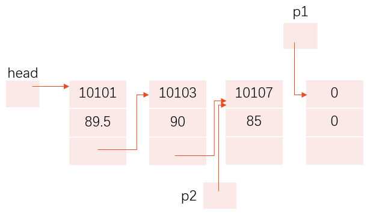

# 第 9 章 用户自己建立数据类型

## 9.1 定义和使用结构体变量

### 9.1.1 自己建立结构体类型

C语言允许用户自己建立由不同类型数据组成的组合型的数据结构，它称为**结构体**（structure）。

```text
struct 结构体名
{
   成员表列
}
```

1. 结构体类型的名字是由一个关键字**struct和结构体名组合**而成的。结构体名由用户指定，又称“结构体标记”(structure tag) 。
2. 花括号内是该结构体所包括的子项，称为结构体的成员(member)。对各成员都应进行类型声明，即**类型名 成员名**
3. “成员表列”(member list)也称为“域表”(field list)，每一个成员是结构体中的一个域。成员名命名规则与变量名相同。
4. 在程序中建立一个结构体类型：

   

   ```c
   struct Student
   {
      int num;          //学号为整型
      char name[20];    //姓名为字符串
      char sex;         //性别为字符型
      int age;          //年龄为整型
      float score;      //成绩为实型
      char addr[30];    //地址为字符串
   };                   //注意最后有一个分号
   ```

5. 说明：
   * 结构体类型并非只有一种，而是可以设计出许多种结构体类型，各自包含不同的成员。
   * 成员可以属于另一个结构体类型。

     

     ```c
     // 声明一个结构体类型struct Date
     struct Date                 
     {
         int month;
         int day;
         int year;
     };

     // 声明一个结构体类型struct Student
     struct Student
     {
         int num;
         char name[20];
         char sex;
         int age;
         struct Date birthday;   // 成员birthday属于struct Date类型
         char addr[30];
     };
     ```

### 9.1.2 定义结构体类型变量


1. 定义结构体变量的3种方式：
   1. 先声明结构体类型，再定义该类型的变量

      ```c
      struct Student
      {
         int num;
         char name[20];
         char sex;
         int age;
         float score;
         char addr[30];
      };                      //注意最后有一个分号

      struct Student student1,student2;
      ```

      

   2. 在声明类型的同时定义变量

      ```text
      struct 结构体名
      {
         成员表列
      }变量名表列；
      ```

      ```c
      struct Student
      {
         int num;
         char name[20];
         char sex;
         int age;
         float score;
         char addr[30];
      }student1,student2;
      ```

   3. 不指定类型名而直接定义结构体类型变量

      ```text
      struct
      {
         成员表列
      }变量名表列；
      ```

      ```c
      struct
      {
         int num;
         char name[20];
         char sex;
         int age;
         float score;
         char addr[30];
      }student1,student2;

      ```

2. 说明：
   * 结构体类型与结构体变量是不同的概念，不要混淆。只能对变量赋值、存取或运算，而不能对一个类型赋值、存取或运算。在编译时，对类型是不分配空间的，只对变量分配空间。
   * 结构体类型中的成员名可以与程序中的变量名相同，但二者不代表同一对象。
   * 对结构体变量中的成员（即“域”），可以单独使用，它的作用与地位相当于普通变量。

### 9.1.3 结构体变量的初始化和引用

1. 在定义结构体变量时可以对它的成员初始化。初始化列表是用花括号括起来的一些常量，这些常量依次赋给结构体变量中的各成员。
   * **注意**：对结构体变量初始化，不是对结构体类型初始化。
2. 可以引用结构体变量中成员的值，引用方式为

   ```text
   结构体变量名.成员名
   ```

   ```c
   /*已定义了student1为student类型的结构体变量，则student1.num表示student1变量中的num成员，即student1的num(学号)成员*/
   student1.num=10010;
   ```

   * `.`是成员运算符，它在所有的运算符中优先级最高，因此可以把结构体变量名.成员名作为一个整体来看待，相当于一个变量。
   * 不能企图通过输出结构体变量名来达到输出结构体变量所有成员的值。只能对结构体变量中的各个成员分别进行输入和输出。

     ```c
     printf(″%s\n″,student1);   //企图用结构体变量名输出所有成员的值 ×
     ```

3. 如果成员本身又属一个结构体类型，则要用若干个成员运算符，一级一级地找到最低的一级的成员。只能对最低级的成员进行赋值或存取以及运算。

   ```c
   student1.num=10010;           //结构体变量student1中的成员num
   student1.birthday.month=6;    //结构体变量student1中的成员birthday中的成员month

   ```

4. 对结构体变量的成员可以像普通变量一样进行各种运算（根据其类型决定可以进行的运算）。

   ```c
   student2.score＝student1.score;        //赋值运算
   sum=student1.score+student2.score;     //加法运算
   student1.age++;                        //自加运算
   ```

5. 同类的结构体变量可以互相赋值。

   ```c
   student1=student2;      //假设student1和student2已定义为同类型的结构体变量
   ```

6. 可以引用结构体变量成员的地址，也可以引用结构体变量的地址(结构体变量的地址主要用作函数参数，传递结构体变量的地址)。

   ```c
   scanf(″%d″,&student1.num);    //输入student1.num的值
   printf(″%o″,&student1);       //输出结构体变量student1的起始地址
   ```

   但不能用以下语句整体读入结构体变量。

   ```c
   scanf(″%d,%s,%c,%d,%f,%s\n″,&student1);   // 错误
   ```

## 9.2 使用结构体数组

### 9.2.1 定义结构体数组

1. 定义结构体数组一般形式:

   ```text
   struct 结构体名
   {
      成员表列
   }数组名[数组长度];
   ```

   ```c
   struct Person
   {
      char name[20];
      int count;
   }leader[3];
   ```

   先声明一个结构体类型，然后再用此类型定义结构体数组

   ```text
   结构体类型数组名[数组长度];
   ```

   ```c
   struct Person
   {
      char name[20];
      int count;
   };

   struct Person leader[3];
   ```

2. 对结构体数组初始化的形式是在定义数组的后面加上：`={初值表列}`

   ```c
   struct Person leader[3]={"Li",0,"Zhang",0,"Sun",0};
   ```

## 9.3 结构体指针

所谓结构体指针就是指向结构体变量的指针，一个结构体变量的起始地址就是这个结构体变量的指针。如果把一个结构体变量的起始地址存放在一个指针变量中，那么，这个指针变量就指向该结构体变量。

### 9.3.1 指向结构体变量的指针

1. `(*p).成员名`也可以表示为`p->成员名`
2. 如果p指向一个结构体变量stu，以下3种用法等价：
     * stu.成员名
     * (*p).成员名
     * p->成员名

### 9.3.2 指向结构体数组的指针

### 9.3.3 用结构体变量和结构体变量的指针作函数参数

将一个结构体变量的值传递给另一个函数，有3个方法：

1. 用结构体变量的成员作参数。
例如，用`stu[1].num`或`stu[2].name`作函数实参，将实参值传给形参。用法和用普通变量作实参是一样的，属于“值传递”方式。应当注意实参与形参的类型保持一致。
2. 用结构体变量作实参。
用结构体变量作实参时，采取的也是“值传递”的方式，将结构体变量所占的内存单元的内容全部按顺序传递给形参，形参也必须是同类型的结构体变量。在函数调用期间形参也要占用内存单元。这种传递方式在空间和时间上开销较大，如果结构体的规模很大时，开销是很可观的。此外，由于采用值传递方式，如果在执行被调用函数期间改变了形参（也是结构体变量）的值，该值不能返回主调函数，这往往造成使用上的不便。因此一般较少用这种方法。
3. 用指向结构体变量（或数组元素）的指针作实参，将结构体变量（或数组元素）的地址传给形参。

## 9.4 用指针处理链表

### 9.4.1 什么是链表

1. 链表是一种常见的重要的数据结构。它是动态地进行存储分配的一种结构。

   

2. 链表有一个“头指针”变量，通常以head表示，它存放一个地址，该地址指向一个元素。
3. 链表中每一个元素称为“结点”，每个结点都应包括两个部分：
   1. 用户需要用的实际数据；
   2. 下一个结点的地址。
4. head指向第1个元素，第1个元素又指向第2个元素……直到最后一个元素，该元素不再指向其他元素，它称为“表尾”，它的地址部分放一个“NULL”（表示“空地址”），链表到此结束。

### 9.4.2 建立链表

可以用**结构体变量**建立链表。一个结构体变量包含若干成员，这些成员可以是数值类型、字符类型、数组类型，也可以是指针类型。用指针类型成员来存放下一个结点的地址。

```c
struct Student
{
   int num;
   double score;
   struct Student *next;   // next是指针变量，指向结构体变量
};
```

* 成员num和score用来存放结点中的有用数据（用户需要用到的数据）。
* next是指针类型的成员，它指向struct Student类型数据（就是next所在的结构体类型）


**注意**：上面只是定义了一个struct Student类型，并未实际分配存储空间，只有定义了变量才分配存储单元。

### 9.4.3 建立简单的静态链表

所有结点都在程序中定义，不是临时开辟的，也不能用完后释放，这种链表称为“静态链表”。

### 9.4.4 建立简单的动态链表

所谓建立动态链表是指在程序执行过程中从无到有地建立起一个链表，即一个一个地开辟结点和输入各结点数据，并建立起前后相链的关系。

建立动态链表要用到动态内存分配的有关函数（malloc、calloc、realloc、free函数）。

1. 思路：

   1. 建立第1个结点和“头指针”
      * 定义3个指针变量：head、p1和p2，它们都是用来指向struct Student类型数据的。
      * 先用malloc函数开辟第1个结点，并使p1和p2指向它。然后从键盘读入一个学生的数据给p1所指的第一个结点。
      * 在此约定学号不为0，如果输入的学号为0，则表示建立链表的过程完成，该结点不应连接在链表中。
      * 先使head的值为NULL（即等于0），这是链表为“空”时的情况（即head不指向任何结点，链表中无结点），当建立第1个结点就使head指向该结点。
   2. 连接第1个结点和第2个结点
      * 如输入的p->num不等于0，则输入的是第1个结点的数据（n=1），令head=p1，即把p1的值赋给head，也就是使head指向新开辟的结点。

      

      p1所指向的新开辟的结点将成为链表的第1个结点。
      * 然后再开辟另一个结点并使p1指向它，接着输入该结点的数据。

      

   3. 连接新结点
      * 如果输入的p->num不等于0，则应链入第2个结点（n=2），由于n不等于1，则将p1的值赋给p2->next，此时p2指向第1个结点，因此执行p2->next=p1就将新结点的地址赋给第1个结点的next成员，使第1个结点的next成员指向第2个结点。

      

      接着使p2=p1，也就是使p2指向刚才建立的结点。

      

      * 接着再开辟1个结点并使p1指向它，并输入该结点数据

      

      在第3次循环中，由于n=3（n不等于1），又将p1的值赋给p2->next，也就是将第3个结点连接到第2个结点之后，并使p2=p1，使p2指向最后一个结点。

      

      * 再开辟一个新结点，并使p1指向它，并输入该结点的数据。

      

      由于p1->num的值为0，不再执行循环，此新结点不应被连接到链表中。此时将NULL赋给p2->next,

      

      建立链表过程至此结束，p1最后所指的结点为连入链表中，第3个结点的next成员的值为NULL，它不指向任何结点。虽然p1指向新开辟的结点，但从链表中无法找到该结点。

2. 算法：

   1. 开辟一个新结点，并使p1、p2指向它;
   2. 读入一个结构体变量的数据给p1所指的结点;
   3. `head=NULL, n=0;`
   4. 当读入的`p1*>成员名`不满足输入结束的条件:
      1. `n=n+1;`
      2. `n等于1?`
         * 真：
            * `head=p1`(把p1所指的结点作为第一个结点)
         * 假：
            * `p2*>next=p1`(把p1所指的结点连接到表尾)
      3. `p2=p1`(p2移到表尾)
      4. 再开辟一个新结点，使p1指向它;
      5. 读入一个结构体变量的数据给p1所指结点;
   5. 表尾结点的指针变量置`NULL`。

3. N-S图：

   

### 9.4.5 输出链表


## 9.5 共用体类型

### 9.5.1 什么是共用体类型

使几个不同类型的变量共享同一段内存的结构，称为 **“共用体”类型的结构**。
这些变量都放在同一地址开始的内存单元中，但不同变量在内存中所占的字节数不同，所以使用覆盖技术，使后一个数据覆盖前面的数据。

1. 一般形式

   ```text
   union 共用体名
   {
      成员表列
   }变量表列;
   ```

   ```c
   union Data
   {
      int i;
      char ch;
      float f;
   }a,b,c;        // 在声明类型同时定义变量
   ```

   ```c
   union          // 没有定义共用体类型名
   {
      int i;
      char ch;
      float f;
   }a,b,c;
   ```

   ```c
   union Data
   {
      int i;
      char ch;
      float f;
   };
   union Data a,b,c;       // 用共用体类型定义变量
   ```

2. “共用体”与“结构体”的定义形式相似。但它们的含义是不同的。

   结构体变量所占内存长度是各成员占的内存长度之和。每个成员分别占有其自己的内存单元。而共用体变量所占的内存长度等于最长的成员的长度。几个成员共用一个内存区。

### 9.5.2 引用共用体变量的方式

只有先定义了共用体变量才能引用它，但应注意，**不能引用共用体变量**，而只能引用共用体变量中的成员。

```c
union Data
{
   int i;
   char ch;
   float f;
}a,b,c;

a.i;
a.ch;
a.f;

printf("%d",a);❌
printf("%d",a.i);
```

### 9.5.3 共用体类型数据的特点

1. 同一个内存段可以用来存放几种不同类型的成员，但在每一瞬时只能存放其中一个成员，而不是同时存放几个。

   ```c
   union Data
   {
      int i;
      char ch;
      float f;
   }a;
   a.i=97;
   /*
   假设此时97存放在32位内存中
   则二进制形式：00000000 00000000 00000000 01100001
   %d格式输出为97
   %c格式输出时发生截断，取低字节01100001，即ASCII码97对应的字符‘a'
   %f格式输出时：
      符号位为0，为整数
      指数位全为0,为非规格数，指数为-126
      尾数位0000000 00000000 01100001
      即表示实数0.000000 00000000 01100001×2^(-126)
      %f格式默认输出6位小数，所以输出0.000000
   */
   printf("%d",a.i);       // 输出整数97
   printf("%c",a.ch);      // 输出字符'a'
   printf("%f",a.f);       // 输出实数0.000000
   ```

2. 可以对共用体变量初始化，但初始化表中只能有一个常量。

   ```c
   union Data
   {
      int i;
      char ch;
      float f;
   }a={1,'a',1.5};❌
   ```

3. 共用体变量中起作用的成员是最后一次被赋值的成员，在对共用体变量中的一个成员赋值后，原有变量存储单元中的值就被取代。
4. 共用体变量的地址和它的各成员的地址都是同一地址。
5. 不能对共用体变量名赋值，也不能企图引用变量名来得到一个值。
   * C 99允许同类型的共用体变量互相赋值。

   ```c
   union Data
   {
      int i;
      char ch;
      float f;
   }a,b;
   a=1;           // ❌，不能对共用体变量赋值，赋给谁？
   int m=a;       // ❌，//企图引用共用体变量名以得到一个值赋给整型变量m

   b=a;           // a和b是同类型的共用体变量，合法。
   ```

6. C 99允许用共用体变量作为函数参数。
7. 共用体类型可以出现在结构体类型定义中，也可以定义共用体数组。反之，结构体也可以出现在共用体类型定义中，数组也可以作为共用体的成员。

### 9.5.4 共用体类型数据的特点

## 9.6 使用枚举类型

如果一个变量只有几种可能的值，则可以定义为枚举(enumeration)类型，所谓“枚举”就是指把可能的值一一列举出来，变量的值只限于列举出来的值的范围内。

### 9.6.1 声明枚举类型

1. 形式：`enum [枚举名]{枚举元素列表}`

   ```c
   enum Weekday{sun,mon,tue,wed,thu,fri,sat};
   ```

   声明枚举类型用enum开头。花括号中的值称为枚举元素或枚举常量。

   定义枚举变量：

   
2. 也可以不声明有名字的枚举类型，而直接定义枚举变量。

   ```c
   enum {sun,mon,tue,wed,thu,fri,sat};
   ```

   * C编译对枚举类型的枚举元素按常量处理，故称枚举常量。不要因为它们是标识符(有名字)而把它们看作变量，不能对它们赋值。
   * 每一个枚举元素都代表一个整数，C语言编译按定义时的顺序默认它们的值为0,1,2,3,4,5…。也可以在定义枚举类型时显式地指定枚举元素的数值。
   * 枚举元素可以用来作判断比较。枚举元素的比较规则是按其在初始化时指定的整数来进行比较的。

### 9.6.2 使用枚举类型

## 9.7 用typedef声明新类型名

1. 简单地用一个新的类型名代替原有的类型名:

   ```c
      typedef int Integer;    //指定用Integer为类型名，作用与int相同
      typedef float Real;     //指定用Real为类型名，作用与float相同
   ```

2. 命名一个简单的类型名代替复杂的类型表示方法:
   1. 命名一个新的类型名代表结构体类型

      ```c
      typedef struct
      {
         int month;
         int day;
         int year;
      }Date;            // 声明了一个新类型名Date，代表结构体类型
      Date birthday;    // 定义结构体类型变量birthday，不要写成struct Date birthday; 
      Date*p;           // 定义结构体指针变量p，指向此结构体类型数据
      ```

   2. 命名一个新的类型名代表数组类型

      ```c
      typedef int Num[100];   // 声明Num为整型数组类型名
      Num a;                  // 定义a为整型数组名，它有100个元素
      ```

   3. 命名一个新的类型名代表指针类型

      ```c
      typedef char *String;   // 声明String为字符指针类型
      String p,s[10];         // 定义p为字符指针变量，s为字符指针数组
      ```

   4. 命名一个新的类型名代表指向函数的指针类型

      ```c
      typedef int (*Pointer)(int,int)  // 声明Pointer为指向函数的指针类型，该函数返回整型值
      Pointer p1,p2;       // p1,p2为Pointer类型的指针变量

      ```

   归纳起来，声明一个新的类型名的方法是：
      1. 先按定义变量的方法写出定义体;
         `int i;`
      2. 将变量名换成新类型名（例如： 将i换成Count）;
            `int Count;`
      3. 在最前面加typedef;
            `typedef int Count;`
      4. 然后可以用新类型名去定义变量
            `Count i;`
      简单地说，就是按定义变量的方式把变量名换上新类型名，并在最前面加typedef，就声明了新类型名代表原来的类型。

习惯上，常把用typedef声明的类型名的第1个字母用大写表示，以便与系统提供的标准类型标识符相区别。

* 以上typedef的方法实际上是为特定的类型指定了一个同义字(synonyms)。
* 用typedef只是对已经存在的类型指定一个新的类型名，而没有创造新的类型。
* 用typedef声明数组类型、指针类型，结构体类型、共用体类型、枚举类型等，使得编程更加方便。
* typedef与#define表面实质不同的。#define是在预编译时处理的，它只能作简单的字符串替换，而typedef是在编译阶段处理的，且并非简单的字符串替换。
* 当不同源文件中用到同一类型数据（尤其是像数组、指针、结构体、共用体等类型数据）时，常用typedef声明一些数据类型。可以把所有的typedef名称声明单独放在一个头文件中，然后在需要用到它们的文件中用#include指令把它们包含到文件中。这样编程者就不需要在各文件中自己定义typedef名称了。
* 使用typedef名称有利于程序的通用与移植。有时程序会依赖于硬件特性，用typedef类型就便于移植。
