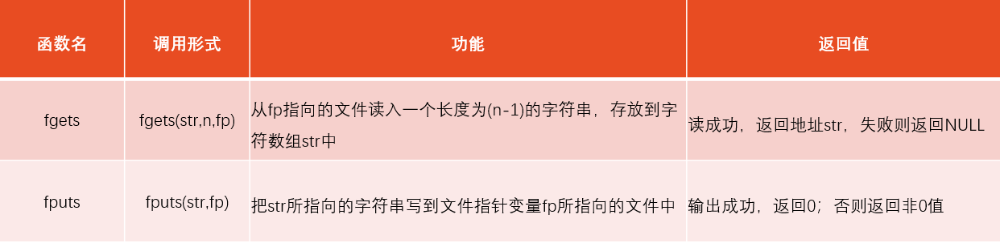

# 第10章 对文件的输入输出

## 10.1 C文件的有关基础知识

### 10.1.1 什么是文件

文件有不同的类型，在程序设计中，主要用到两种文件：

1. 程序文件。包括源程序文件(后缀为.c)、目标文件(后缀为.obj)、可执行文件(后缀为.exe)等。这种文件的内容是程序代码。
2. 数据文件。文件的内容不是程序，而是供程序运行时读写的数据，如在程序运行过程中输出到磁盘(或其他外部设备)的数据，或在程序运行过程中供读入的数据。如一批学生的成绩数据、货物交易的数据等。

为了简化用户对输入输出设备的操作，使用户不必去区分各种输入输出设备之间的区别，操作系统把各种设备都统一作为文件来处理。**从操作系统的角度看**，每一个与主机相连的输入输出设备都看作一个文件。例如，终端键盘是输入文件，显示屏和打印机是输出文件。

文件（file）一般指存储在外部介质上的数据的集合。操作系统是以文件为单位对数据进行管理的。

输入输出是数据传送的过程，数据如流水一样从一处流向另一处，因此常将输入输出形象地称为流(stream)，即数据流。流表示了信息从源到目的端的流动。在输入操作时，数据从文件流向计算机内存，在输出操作时，数据从计算机流向文件(如打印机、磁盘文件)。

**C语言把文件看作一个字符(或字节)的序列，即由一个一个字符（或字节）的数据顺序组成。一个输入输出流就是一个字符流或字节(内容为二进制数据)流。**

C的数据文件由一连串的字符（或字节）组成，而不考虑行的界限，两行数据间不会自动加分隔符，对文件的存取是以字符（字节）为单位的。输入输出数据流的开始和结束仅受程序控制而不受物理符号（如回车换行符）控制，这就增加了处理的灵活性。这种文件称为流式文件。

### 10.1.2 文件名

一个文件要有一个唯一的文件标识，以便用户识别和引用。

文件标识包括3部分：


* 文件路径表示文件在外部存储设备中的位置。
* 文件名主干的命名规则遵循标识符的命名规则。
* 文件后缀用来表示文件的性质。

为方便起见，文件标识常被称为文件名，但应了解此时所称的文件名，实际上包括以上3部分内容，而不仅是文件名主干。

### 10.1.3 文件分类

根据数据的组织形式，数据文件可分为ASCII文件和二进制文件。

数据在内存中是以二进制形式存储的，如果不加转换地输出到外存，就是二进制文件，可以认为它就是存储在内存的数据的映像，所以也称之为**映像文件**(image file)。如果要求在外存上以ASCII代码形式存储，则需要在存储前进行转换。ASCII文件又称**文本文件**（text file），每一个字节存放一个字符的ASCII代码。

字符一律以ASCII形式存储，数值型数据既可以用ASCII形式存储，也可以用二进制形式存储。


用ASCII码形式输出时字节与字符一一对应，一个字节代表一个字符，因而便于对字符进行逐个处理，也便于输出字符。但一般占存储空间较多，而且要花费转换时间（二进制形式与ASCII码间的转换）。用二进制形式输出数值，可以节省外存空间和转换时间，把内存中的存储单元中的内容原封不动地输出到磁盘(或其他外部介质)上，此时每一个字节并不一定代表一个字符。

### 10.1.4 文件缓冲区

ANSI C标准采用“缓冲文件系统”处理数据文件，所谓缓冲文件系统是指系统自动地在内存区为程序中每一个正在使用的文件开辟一个文件缓冲区。从内存向磁盘输出数据必须先送到内存中的缓冲区，装满缓冲区后才一起送到磁盘去。如果从磁盘向计算机读入数据，则一次从磁盘文件将一批数据输入到内存缓冲区（充满缓冲区），然后再从缓冲区逐个地将数据送到程序数据区（给程序变量）。这样做是为了节省存取时间，提高效率，缓冲区的大小由各个具体的C编译系统确定。


说明: 每一个文件在内存中只有一个缓冲区，在向文件输出数据时，它就作为输出缓冲区，在从文件输入数据时，它就作为输入缓冲区。

### 10.1.5 文件类型指针

缓冲文件系统中，关键的概念是“文件类型指针”，简称“文件指针”。每个被使用的文件都在内存中开辟一个相应的文件信息区，用来存放文件的有关信息（如文件的名字、文件状态及文件当前位置等）。这些信息是保存在一个结构体变量中的。该结构体类型是由系统声明的，取名为FILE。

```c
//一种C编译环境提供的stdio.h头文件中有以下的文件类型声明
typedef struct
{    
    short level;                //缓冲区“满”或“空”的程度
    unsigned flags;             //文件状态标志
    char fd;                    //文件描述符
    unsigned char hold;         //如缓冲区无内容不读取字符
    short bsize;                //缓冲区的大小
    unsigned char*buffer;       //数据缓冲区的位置
    unsigned char*curp;         //文件位置标记指针当前的指向
    unsigned istemp;            //临时文件指示器
    short token;                //用于有效性检查
}FILE;

//定义一个指向FILE类型数据的指针变量
FILE *fp;
```

可以使fp指向某一个文件的文件信息区(是一个结构体变量)，通过该文件信息区中的信息就能够访问该文件。也就是说，通过文件指针变量能够找到与它关联的文件。如果有n个文件，应设n个指针变量，分别指向n个FILE类型变量，以实现对n个文件的访问。为方便起见，通常将这种指向文件信息区的指针变量简称为指向文件的指针变量。


注意:指向文件的指针变量并不是指向外部介质上的数据文件的开头，而是指向内存中的文件信息区的开头。

## 10.2 打开与关闭文件

### 10.2.1 打开与关闭文件

对文件读写之前应该“打开”该文件，在使用结束之后应“关闭”该文件。

所谓“打开”是指为文件建立相应的信息区(用来存放有关文件的信息)和文件缓冲区(用来暂时存放输入输出的数据)。

在编写程序时，打开文件的同时，一般都指定一个指针变量指向该文件的文件信息，也就是建立起指针变量与文件之间的联系，这样，就可以通过该指针变量对文件进行读写了。

所谓“关闭”是指撤销文件信息区和文件缓冲区，使文件指针变量不再指向该文件，显然就无法进行对文件的读写了。

### 10.2.2 用fopen函数打开数据文件

`fopen(文件名，使用文件方式)；`

```c
    FILE*fp;                //定义一个指向文件的指针变量fp
    fp=fopen(″a1″,″r″);    //将fopen函数的返回值赋给指针变量fp
    //表示以“读入”方式打开名字为a1的文件
```

在打开一个文件时，程序会通知编译系统以下3个信息：

1. 需要打开文件的名字，也就是准备访问的文件的名字；
2. 使用文件的方式（“读”还是“写”等）；
3. 让哪一个指针变量指向被打开的文件。

使用文件的方式


   1. 用“r”方式打开的文件只能用于向计算机输入而不能用作向该文件输出数据，而且该文件应该已经存在，并存有数据，这样程序才能从文件中读数据。不能用“r”方式打开一个并不存在的文件，否则出错。
   2. 用“w”方式打开的文件只能用于向该文件写数据（即输出文件），而不能用来向计算机输入。如果原来不存在该文件，则在打开文件前新建立一个以指定的名字命名的文件。如果原来已存在一个以该文件名命名的文件，则在打开文件前先将该文件删去，然后重新建立一个新文件。
   3. 如果希望向文件末尾添加新的数据（不希望删除原有数据），则应该用“a”方式打开。但此时应保证该文件已存在；否则将得到出错信息。在每个数据文件中自动设置了一个隐式的“文件读写位置标记”，它指向的位置就是当前进行读写的位置。如果“文件读写位置标记”在文件开头，则下一次的读写就是文件开头的数据。然后“文件读写位置标记”自动移到下一个读写位置，以便读写下一个数据。以添加方式打开文件时，文件读写位置标记移到文件末尾。
   4. 用“r+”“w+”“a+”方式打开的文件既可用来输入数据，也可用来输出数据。
   5. 如果不能实现“打开”的任务，fopen函数将会带回一个空指针值NULL。

      ```c
        //打开一个文件的常用方法
        if ((fp=fopen(″file1″,″r″))==NULL)
        {
            printf(″cannot open this file\n″);
            exit(0);
        }
      ```

   6. C标准建议用表10.1列出的文件使用方式打开文本文件或二进制文件，但目前使用的有些C编译系统可能不完全提供所有这些功能，需要注意所用系统的规定。
   7. 有12种文件使用方式，其中有6种是在第一个字母后面加了字母b的(如rb,wb,ab,rb+,wb+,ab+)，b表示二进制方式。其实，带b和不带b只有一个区别，即对换行的处理。由于在C语言用一个′\n′即可实现换行，而在Windows系统中为实现换行必须要用 “回车”和“换行”两个字符，即′\r′和′\n′。因此，如果使用的是文本文件并且用“w”方式打开，在向文件输出时，遇到换行符′\n′时，系统就把它转换为′\r′和′\n′两个字符，否则在Windows系统中查看文件时，各行连成一片，无法阅读。同样，如果有文本文件且用“r”方式打开，从文件读入时，遇到′\r′和′\n′两个连续的字符，就把它们转换为′\n′一个字符。如果使用的是二进制文件，在向文件读写时，不需要这种转换。加b表示使用的是二进制文件，系统就不进行转换。
   8. 如果用“wb”的文件使用方式，并不意味着在文件输出时把内存中按ASCII形式保存的数据自动转换成二进制形式存储。输出的数据形式是由程序中采用什么读写语句决定的。例如，用 fscanf和 fprintf函数是按ASCII方式进行输入输出，而 fread和 fwrite函数是按二进制进行输入输出。
   9. 程序中可以使用3个标准的流文件——标准输入流、标准输出流和标准出错输出流。系统定义了3个文件指针变量stdin,stdout,stderr,分别指向标准输入流、标准输出流和标准出错输出流，即对这3个文件指定了与终端的对应关系。标准输入流是从终端的输入，标准输出流是向终端的输出，标准出错输出流是当程序出错时将出错信息发送到终端。程序开始运行时系统自动打开这3个标准流文件。

### 10.2.3 用fclose函数关闭数据文件

在使用完一个文件后应该关闭它，以防止它再被误用。“关闭”就是撤销文件信息区和文件缓冲区，使文件指针变量不再指向该文件，也就是文件指针变量与文件“脱钩”，此后不能再通过该指针对原来与其相联系的文件进行读写操作，除非再次打开，使该指针变量重新指向该文件。

关闭文件用fclose函数，fclose函数调用的一般形式为：**fclose(文件指针);**
例如：

```c
    fclose(fp);
```

如果不关闭文件就结束程序运行将会丢失数据。因为，在向文件写数据时，是先将数据输出到缓冲区，待缓冲区充满后才正式输出给文件。如果当数据未充满缓冲区时程序结束运行，就有可能使缓冲区中的数据丢失。用fclose函数关闭文件时，先把缓冲区中的数据输出到磁盘文件，然后才撤销文件信息区。有的编译系统在程序结朿前会自动先将缓冲区中的数据写到文件，从而避免了这个问题，但还是应当养成在程序终止之前关闭所有文件的习惯。

fclose函数也带回一个值，当成功地执行了关闭操作，则返回值为0；否则返回EOF(-1)。

## 10.3 顺序读写数据文件

### 10.3.1 怎样向文件读写字符

读写一个字符的函数：


### 10.3.2 怎样向文件读写一个字符串

读写一个字符串的函数：



fgets函数的函数原型：

`char *fgets(char*str, int n, FILE*fp);`

其作用是从文件读入一个字符串。调用时可以写成下面的形式:

```c
    fgets(str,n,fp);
```

其中,n是要求得到的字符个数，但实际上只从fp所指向的文件中读入n-1个字符，然后在最后加一个′\0′字符，这样得到的字符串共有n个字符，把它们放到字符数组str中。如果在读完n－1个字符之前遇到换行符“\n”或文件结束符EOF，读入即结束，但将所遇到的换行符“\n”也作为一个字符读入。若执行fgets函数成功，则返回值为str数组首元素的地址，如果一开始就遇到文件尾或读数据出错，则返回NULL。

fputs函数的函数原型为
`int fputs (char *str, FILE *fp);`
其作用是将str所指向的字符串输出到fp所指向的文件中。调用时可以写成:

```c
    fputs("China",fp); 
```

把字符串″China″输出到fp指向的文件中。fputs函数中第一个参数可以是字符串常量、字符数组名或字符型指针。字符串末尾的′\0′不输出。若输出成功，函数值为0;失败时，函数值为EOF(即-1)。

fgets和fputs这两个函数的功能类似于gets和puts函数，只是gets和puts以终端为读写对象，而fgets和fputs函数以指定的文件作为读写对象。

### 10.3.3 用格式化的方式读写文本文件

可以对文件进行格式化输入输出，这时就要用fprintf函数和fscanf函数，从函数名可以看到，它们只是在printf和scanf的前面加了一个字母f。它们的作用与printf函数和scanf函数相仿，都是格式化读写函数。只有一点不同： fprintf和fscanf函数的读写对象不是终端而是文件。它们的一般调用方式为：
fprintf(文件指针, 格式字符串, 输出表列);
fscanf(文件指针, 格式字符串, 输出表列);

```c
    fprintf (fp,″%d,%6.2f″,i,f);    //将int型变量i和float型变量f的值按%d和%6.2f的格式输出到fp指向的文件中
    fscanf (fp,″%d,%f″,&i,&f);        //磁盘文件上如果有字符“3,4.5”，则从中读取整数3送给整型变量i，读取实数4.5送给float型变量f
```

### 10.3.4 用二进制方式向文件读写一组数据

C语言允许用fread函数从文件中读一个数据块，用fwrite函数向文件写一个数据块。在读写时是以二进制形式进行的。在向磁盘写数据时，直接将内存中一组数据原封不动、不加转换地复制到磁盘文件上，在读入时也是将磁盘文件中若干字节的内容一批读入内存。

`fread(buffer, size, count, fp);`
`fwrite(buffer, size, count, fp);`

* buffer：是一个地址。
  对fread，它是用来存放从文件读入的数据的内存存储区的地址。
  对fwrite，是要把此地址开始的内存存储区中的数据向文件输出
  （以上指的是起始地址）。
* size：要读写的字节数。
* count：要读写多少个数据项(每个数据项长度为size)。
* fp：FILE类型指针。

```c
    float f[10];
    fread(f,4,10,fp);    //从fp所指向的文件读入10个4个字节的数据，存储到数组f中
```

### 10.3.5 怎样向文件读写一个字符串

1. 数据的存储方式
   * 文本方式:
   数据以字符方式(ASCII代码)存储到文件中。如整数12，送到文件时占2个字节，而不是4个字节。以文本方式保存的数据便于阅读。
   * 二进制方式:
   数据按在内存的存储状态原封不动地复制到文件。如整数12，送到文件时和在内存中一样占4个字节。
2. 文件的分类
   * 文本文件(ASCII文件)：文件中全部为ASCII字符。
   * 二进制文件: 按二进制方式把在内存中的数据复制到文件的，称为二进制文件，即映像文件。
3. 文件的打开方式
   * 文本方式: 不带b的方式，读写文件时对换行符进行转换。
   * 二进制方式: 带b的方式，读写文件时对换行符不进行转换。
4. 文件读写函数
   * 文本读写函数: 用来向文本文件读写字符数据的函数（如fgetc，fgets,fputc,fputs,fscanf,fprintf等）。
   * 二进制读写函数: 用来向二进制文件读写二进制数据的函数（如getw,putw,fread,fwrite等）。

## 10.4 随机读写数据文件

对文件进行顺序读写比较容易理解，也容易操作，但有时效率不高。而随机访问不是按数据在文件中的物理位置次序进行读写，而是可以对任何位置上的数据进行访问，显然这种方法比顺序访问效率高得多。

### 10.4.1 文件位置标记及其定位

1. 文件位置标记
    为了对读写进行控制，系统为每个文件设置了一个文件读写位置标记(简称文件位置标记或文件标记)，用来指示“接下来要读写的下一个字符的位置”。
    一般情况下，在对字符文件进行顺序读写时，文件位置标记指向文件开头，这时如果对文件进行读/写的操作，就读/写完第1个字符后，文件位置标记顺序向后移一个位置，在下一次执行读/写操作时，就将位置标记指向的第2个字符进行读出或写入。依此类推，直到遇文件尾，此时文件位置标记在最后一个数据之后。
    对流式文件既可以进行顺序读写，也可以进行随机读写。关键在于控制文件的位置标记。如果文件位置标记是按字节位置顺序移动的，就是顺序读写。如果能将文件位置标记按需要移动到任意位置，就可以实现随机读写。所谓随机读写，是指读写完上一个字符（字节）后，并不一定要读写其后续的字符（字节），而可以读写文件中任意位置上所需要的字符（字节）。即对文件读写数据的顺序和数据在文件中的物理顺序一般是不一致的。可以在任何位置写入数据，在任何位置读取数据。
2. 文件位置标记的定位
    * 用rewind函数使文件位置标记指向文件开头
    **rewind(文件指针);**
    rewind函数的作用是使文件位置标记重新返回文件的开头，此函数没有返回值。
    * 用fseek函数改变文件位置标记
    **fseek(文件类型指针, 位移量, 起始点);**
        * “起始点”：用0，1或2代替，0代表“文件开始位置”，1为“当前位置”，2为“文件末尾位置”
        * “位移量”：指以“起始点”为基点，向前移动的字节数（长整型）

        fseek函数一般用于二进制文件。

        ```c
            fseek (fp,100L,0);        //将文件位置标记向前移到离文件开头100个字节处
            fseek (fp,50L,1);         //将文件位置标记向前移到离当前位置50个字节处
            fseek (fp,-10L,2);        //将文件位置标记从文件末尾处向后退10个字节
        ```

3. 用ftell函数测定文件位置标记的当前位置
ftell函数的作用是得到流式文件中文件位置标记的当前位置，用相对于文件开头的位移量来表示。如果调用函数时出错（如不存在fp指向的文件），ftell函数返回值为-1L。

    ```c
        i=ftell(fp);             //变量i存放文件当前位置
        if(i==-1L) printf(″error\n″);     //如果调用函数时出错，输出″error″
    ```

## 10.5 文件读写的出错检测

1. ferror函数

    在调用各种输入输出函数（如putc,getc,fread,fwrite等）时，如果出现错误，除了函数返回值有所反映外，还可以用ferror函数检查。

   * 如果ferror返回值为0（假），表示未出错；
   * 如果返回一个非零值，表示出错。

    **注意：**

    * 对同一个文件每一次调用输入输出函数，都会产生一个新的ferror函数值，因此，应当在调用一个输入输出函数后立即检查ferror函数的值，否则信息会丢失。
    * 在执行fopen函数时，ferror函数的初始值自动置为0。

2. clearerr函数

    clearerr的作用是使文件出错标志（ferror函数值）和文件结束标志置为0。
        假设在调用一个输入输出函数时出现错误，ferror函数值为一个非零值。应该立即调用clearerr(fp)，使ferror(fp)的值变成0，以便再进行下一次的检测。只要出现文件读写出错标志，它就一直保留，直到对同一文件调用clearerr函数或rewind函数，或任何其他一个输入输出函数。
